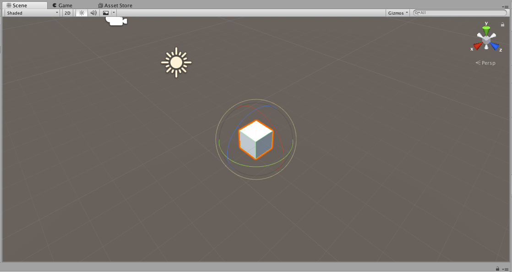
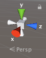
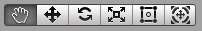
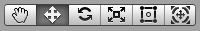
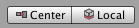
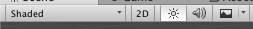

# Scene视图

场景视图中我们编辑的就是我们的游戏世界。在Scene视图中，我们可以选中游戏对象，比如相机，光源，模型等，并进行一些直观的调整操作。

## 改变观察的视角

### Gizmo

Scene视图右上角的坐标轴（这里把Gizmo翻译成坐标轴不知道准不准确，知道那个意思就行）中，我们可以点击某个控制杆，将我们观察游戏世界的视角调整到指定的角度。右键点击坐标轴，可以看到几个预置的选项，我们默认的观察方式是`Free`，即自由视角。下方的按钮可以调整透视图和正交视图，即`Persp`和`Iso`。在正交视图中，是不会有透视效果的。

### 抓手工具

这排工具中，第一个按钮的作用是从当前视角出发，改变观察游戏世界的视角。

* 平移：选中第一个按钮，拖动鼠标左键
* 旋转：选中第一个按钮按住`Alt`，拖动鼠标左键
* 缩放：选中第一个按钮按住`Alt`，拖动鼠标右键

### Flythrough模式

在透视图中，按住鼠标右键，`W`、`A`、`S`、`D`控制当前视角的左右前后移动，`Q`、`E`控制上下移动，同时，拖动鼠标右键可以旋转观察视角，就像FPS游戏里那样，相当好用。

在正交模式中，没有Flythrough模式，只有按住并拖动鼠标右键，是旋转观察视角的功能。

### 观察某个特定Object

在hierarchy中，双击Object，Scene视图就会改变视角到观察此对象的合适位置。

## 在Scene视图中摆放对象

抓手工具后面是Move Tool（移动工具），Rotate Tool（旋转工具），Scale Tool（缩放工具），Rect Tool，以及一个结合前三个工具的复合工具。

* Rect Tool：该工具主要用于2D对象的操作（精灵、UI等）
	* 点击对象并拖动，可以移动该对象
	* 点击角或边，可以进行缩放和变形
* 复合工具：该工具结合了Move，Rotate和Scale，会显示三组拉杆。

### center/pivot

pivot是模型坐标轴的真实位置，center是根据模型计算的物理位置。在pivot模式下，Rect Tool里的坐标轴点可以拖拽移动，移动旋转等操作都是基于这个可设置的中心点的。

在选择两个Cube或父子物体时，center/pivot有明显的不同。

比如Cube2是Cube1的子物体，此时选中Cube1，使用Rotate工具：

* center：两个Cube绕物理中心旋转
* pivot：两个Cube绕Cube1中心旋转

另外一种情况，此时选择了两个Cube（并列的关系），然后使用Rotate工具：

* center：此时坐标轴出现在两个Cube的中间，两个Cube会沿着物理中心旋转
* pivot：坐标轴会出现在一个Cube上，两个Cube会分别绕着自己的中心旋转

### local/global

如果存在父子物体的情况，子物体除了在世界坐标系中有一个位置表示，还靠本地坐标确定相对于父物体的位置。local就是“对齐”本地坐标系进行编辑，global就是“对齐”世界坐标系进行编辑，这个按钮效果不太明显，总之我们在Unity编辑器里都是要直观的把游戏对象摆放到合适的位置。

### Scene视图控制按钮

这排按钮用于控制Scene视图的显示效果，比如游戏物体在Scene视图李渲染到什么程度（线框，还是带上贴图材质），开关光源，声音，天空盒，雾气等功能。该选项不会影响到最终的游戏效果，只是为了方便开发者操作Scene视图。
