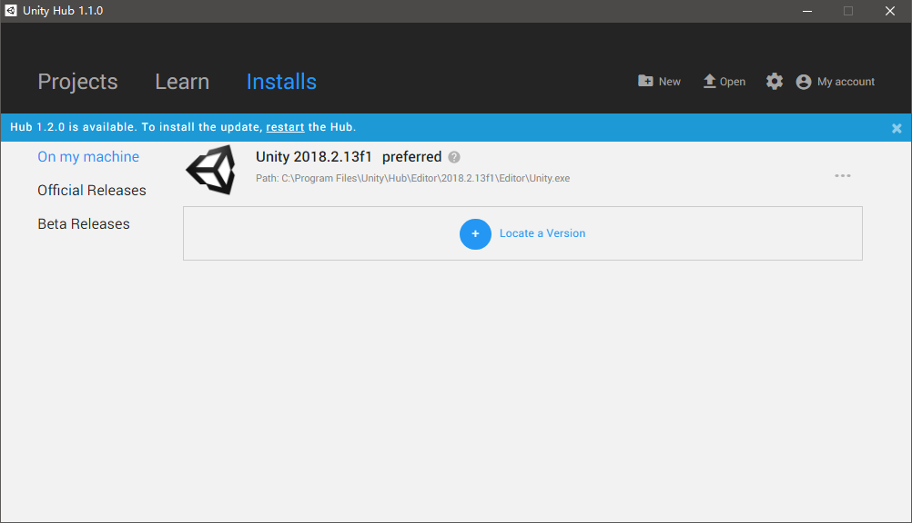
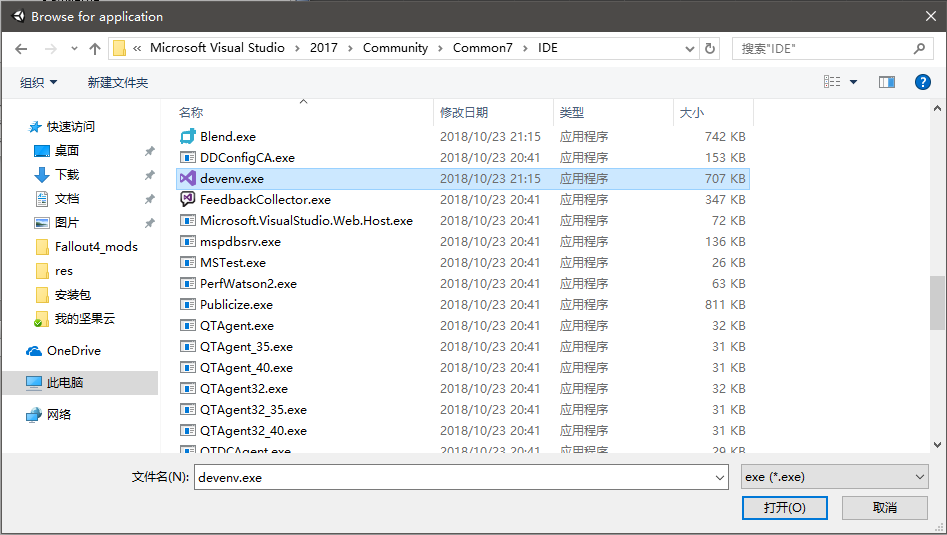
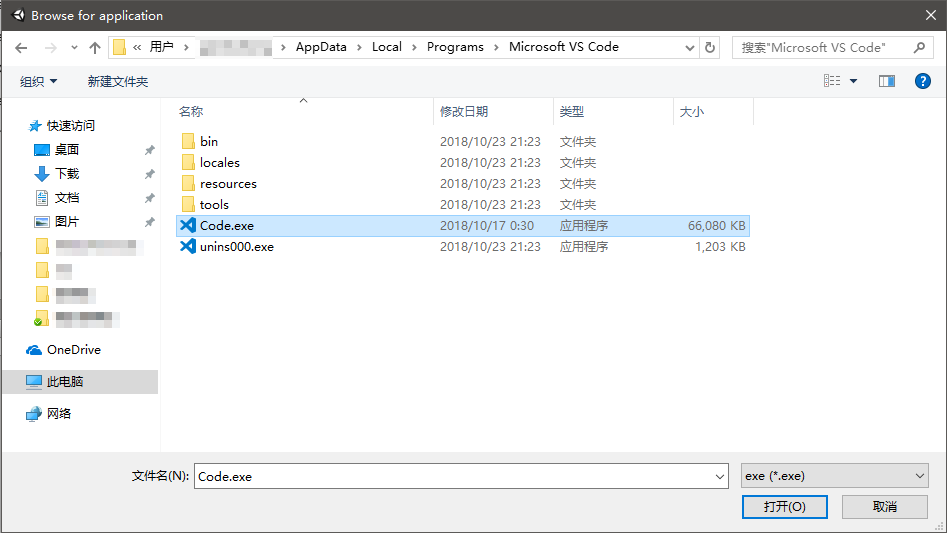
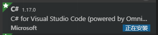

# Unity环境搭建

## 安装Unity编辑器

现在建议通过Unity Hub下载、管理各个版本的Unity编辑器版本。

个人版下载地址：[https://store.unity.com/cn/download?ref=personal](https://store.unity.com/cn/download?ref=personal)

打开Unity Hub，点击`Install`，选择我们需要的版本，就能自动安装好了。

## 配置代码编辑器

Windows系统下，新版本的Unity中已经不再支持MonoDevelop了，也不自带这个软件了。我们可以选择Visual Studio或Visual Studio Code作为代码编辑器。

编辑器设置在`Edit->Preference->External Editor`中可以找到，VS和VSCode的路径都不太好找，这里特此记录一下。

### 配置Visual Studio（推荐）

配置路径：

### 配置Visual Studio Code（推荐）

配置路径：

安装C#扩展：

