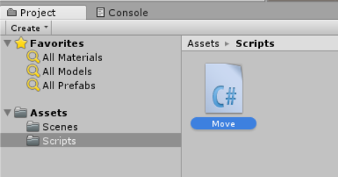
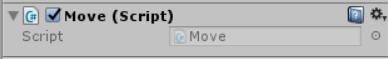

# 01-游戏脚本简介

我们在Unity Editor中创建一个Cude，或者导入了一个模型，并为其添加了一堆组件，或者直接拖进一个prefab，实际上我们操作的都是游戏对象。Unity3D中，GameObject是所有游戏对象的基类。而游戏对象上，我们可以指定Transform，RigidBody等，这些对象是游戏对象的组件。脚本也是一种组件，它可以指定到一个游戏对象上。

游戏对象的脚本用来控制游戏对象的行为，比如键盘WASD控制人物模型移动，实际上就是人物对象有一个移动控制的脚本，它通过读取键盘输入，调整人物对象的Transform组件实现的。

## 创建脚本并添加到物体上

首先，我们最好在`Assets`文件夹中创建一个目录用来专门存放脚本，这样不至于各种文件混到一块。这里，我们创建一个文件夹`Scripts`，然后新建一个C#脚本，叫做`Move.cs`。



为了把脚本组件添加到一个游戏对象上，选中游戏对象，直接将它拖到Inspector面板中即可。



## 编辑脚本

我们在脚本图标上双击就可以打开编辑器了。Unity3D自带了MonoDevelop作为C#编辑器，同时我们也可以指定Visual Studio作为编辑器。

调整默认脚本编辑器：Edit -> Preferences -> Esternal Tools -> External Script Editor，如果需要使用Visual Studio，里面会有对应选项。


## 默认的脚本内容

新建脚本后，里面的默认内容如下：

```csharp
using System.Collections;
using System.Collections.Generic;
using UnityEngine;

public class Move : MonoBehaviour {

	// Use this for initialization
	void Start () {

	}

	// Update is called once per frame
	void Update () {

	}
}
```

实际上，`MonoBehaviour`是所有脚本对象的基类，里面定义了一些成员变量和函数供我们使用，我们创建的脚本必须继承这个对象。

`Start()`和`Update()`是两个回调函数，Unity3D中称为`Certain Events 必然事件`，这个叫法比较奇怪，我们知道它是干什么用的就行了。常用的必然事件：

* Start() Update()函数第一次运行之前调用，用于游戏对象的初始化
* Update() 每一帧调用一次，用于游戏对象状态更新
* Awake() 脚本实例化时调用，早于Start()
* FixedUpdate() 每个物理时间间隔调用一次，用于物理状态更新
* LateUpdate() 每帧调用一次，在Update()之后，一般用于和相机有关的更新

注：Unity3D中每一帧的时间间隔是不固定的，物理时间间隔则是固定的，打开Edit -> Project Settings -> Time，可以看到TimeManager面板，默认的物理时间间隔是0.02s，也就是说FixedUpdate()会严格的每0.02s回调一次。

除了必然事件函数，`MonoBehaviour`还定义了响应用户输入的回调函数，以及定义了一些常用组件的成员变量。
