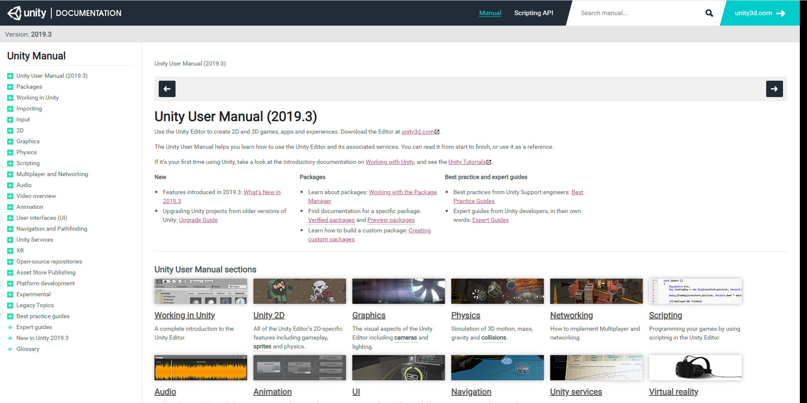

# 脚本创建与调试

Unity的游戏内容，是通过游戏对象（GameObject）和组件（Component）这两个基本单元构成的。除了Unity内置的组件之外，游戏脚本其实就是我们自定义的组件。我们的游戏逻辑，比如角色移动、按钮按下后的动作等，都是通过脚本代码实现的。

Unity脚本只能使用C#语言编写（新版本中已经移除了JavaScript和Boo语言的支持），经过一个Unity定制的编译器编译成IL后，运行在Mono运行时上，和C++编写的引擎整合在一起（另一种方式是IL2CPP）。

## 创建脚本

在Unity编辑器中，我们可以在项目资源面板里新建一个`Scripts`文件夹，便于存放我们所有的游戏脚本。在文件夹上右键`Create -> C# Script`，可以创建一个C#脚本。创建完成后，将其拖放到我们需要操作的游戏对象上即可。


在脚本资源上双击，即可打开我们配置好的集成开发环境，我这里使用的是微软的`Visual Studio`（社区版免费，推荐），当然Unity同时也支持`Jetbrains Rider`（139$/year，功能不成熟，不推荐）和`VSCode`（完全免费，推荐），我们可以根据自己的习惯选择。


注意：

1. 创建、删除脚本的操作，都需要在Unity编辑器的资源面板中进行，因为Unity需要对项目中的各种文件生成相应的`meta`信息，以便管理整个工程的所有文件。
2. 脚本文件名需要和脚本类同名，否则会报一个找不到脚本类的错误，这里修改脚本文件名时需要注意。

## 编写脚本

以下是创建脚本文件后，Unity自动生成的内容：

```csharp
using System.Collections;
using System.Collections.Generic;
using UnityEngine;

public class MyTest : MonoBehaviour
{
    // Start is called before the first frame update
    void Start()
    {
        
    }

    // Update is called once per frame
    void Update()
    {
        
    }
}
```

这里我们引用了命名空间`UnityEngine`，Unity的核心功能都是在这个命名空间下的，除此之外，常用的还有比如UI系统需要的`UnityEngine.UI`等，用到时我们再详细介绍。

我们的脚本需要继承`MonoBehaviour`，实际上，我们的脚本编写也是基于这个类展开的。`MonoBehaviour`除了作为脚本组件的基类，还为我们封装了很多功能，比如一些输入处理函数，组件获取功能等。

`Start()`和`Update()`是`MonoBehaviour`的两个生命周期回调函数，顾名思义，`Start`就是该脚本组件初始化时的回调，`Update`则是游戏每一帧刷新时，对脚本组件的回调。在后续笔记中，我们还会详细了解脚本组件的生命周期。

我们在`Update()`中，编写一个简单的输出调试信息的代码：
```csharp
void Update()
{
    Debug.Log("Hello, world!");
}
```

在Unity中运行我们的游戏（注意脚本需要已经挂载到一个游戏对象上）：


控制台中可以看到输出的调试信息：


## 断点调试

使用Visual Studio断点调试Unity程序非常简单，点击上方`附加到Unity`按钮，即可进入调试状态，我们可以在编辑器中设置断点。


此时再启动Unity的游戏预览功能，代码就会在我们的断点处暂停：


这里游戏逻辑停在了一个`Update()`函数中，Unity的游戏预览也停在了上一帧，我们这里就可以很方便的进行脚本的单步调试了。

## 查阅文档

Unity官网的文档相当详细，同时，我们安装Unity编辑器后，本地也会附带一份当前版本的文档。


Unity编辑器中点击图中选项即可打开本地文档。


