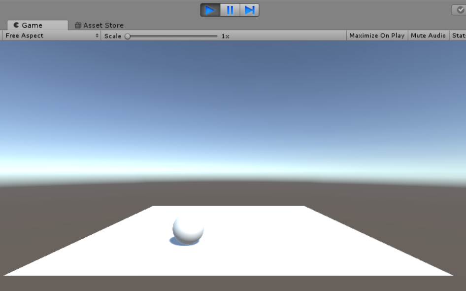
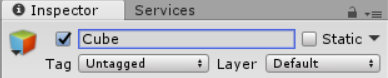
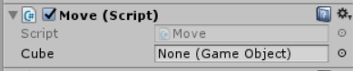
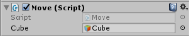

# 访问组件和游戏对象

我们知道一个场景中有很多游戏对象，一个游戏对象可以包含许多组件，这里介绍一下如何从脚本中，获得游戏对象组件的引用，以及获得其他游戏对象的引用。

## 访问游戏对象的组件

一些系统内置的常用组件，直接定义在了`MonoBehaviour`中并被脚本对象继承了下来，我们直接使用就行了，比如`Transform`等，具体情况请参考文档。比较通用的方法是使用`GetComponent()`函数，获取组件的引用。

我们这里写一个例子，通过WASD控制一个小球的滚动。

```csharp
using System.Collections;
using System.Collections.Generic;
using UnityEngine;

public class Move : MonoBehaviour {

    //刚体组件
    Rigidbody rd;
    //力的大小
    int force = 10;

	void Start () {
        this.rd = GetComponent<Rigidbody>();
    }

	void Update () {
        //获取WASD键输入
        float h = Input.GetAxis("Horizontal");
        float v = Input.GetAxis("Vertical");

        rd.AddForce(new Vector3(h * force, 0, v * force));

    }
}
```

代码中首先获取了Rigidbody组件，`GetComponent()`函数的类型参数是通过泛型传入的。除此之外，我们通过`Input.GetAxis()`获取用户输入，移动则是通过物理引擎的力实现的。有关用户输入和组件详细的问题将在其他章节讲述。

除了脚本，我们需要在场景中新建一个Sphere，然后为其添加一个Rigidbody组件，这样物理引擎才会在Sphere上起作用。



* `GetComponent()` 获取游戏对象的组件
* `GetComponents()` 获取组件数组（可能一个对象有多个相同类型的组件）
* `GetComponentInChilden()` 获取该对象和子对象的组件
* `GetComponentsInChilden()` 获取该对象和子对象的组件数组

要注意，脚本也是一个组件，因此在其他脚本中，我们传入脚本类型也能获得脚本对象的引用，因此也就能够访问其他脚本中的方法或成员变量。

## 根据对象名访问游戏对象

### GameObject.Find()

我们可以通过`GameObject.Find()`函数，通过游戏对象的名字进行查找，获取游戏对象的引用。

```csharp
GameObject cube = GameObject.Find("cube");
```

除了名字之外，还可以通过Tag进行查找。此时需要使用`GameObject.FindWithTag()`函数，参数是Tag字符串。



`GameObject.Find()`适用场景：该函数适用于在整个游戏场景中查找对象，且要求该对象不能有重名的，而且处于可见状态。

### Transform.Find()

```csharp
Transform child = transform.Find("ChildObject1");
Debug.Log(child.name);
```

`Transform.Find()`适用场景：该函数用于查找一个对象的子对象，无论对象是否可见都可以查到。

## 父子组件之间的访问

根据对象名查找对象并不是万能的，比如打出去的子弹，一般都是通过prefab自动生成的，自动生成的游戏对象通常会挂载到某一个父节点上进行统一管理，此时我们可以通过父子组件访问的形式，访问这些游戏对象。这些操作是通过当前对象的`Transform`组件实现的。

获取当前组件的父组件：

```csharp
Transform parent = transform.parent;
Debug.Log(parent.name);
```

遍历当前组件的子组件：

```csharp
foreach (Transform child in transform)
{
    Debug.Log(child.name);
}
```

通过名字查找子对象：

这个可以通过前文介绍的`Transform.Find()`实现。

## 直接赋予脚本public成员变量

Unity3D中，有一种十分简单的组件或对象访问方式，十分常用。脚本中，定义为public的成员变量，在Unity Editor中，可以直接通过拖拽的方式赋值。

首先在脚本中我们创建了一个`GameObject`成员变量，设置其访问权限为public，在Unity Editor中的Inspector面板就能看到。



我们直接将一个游戏对象拖进去，脚本实例化时，就会自动为这个成员变量赋值。



显然这种方式非常方便，因此也是最常用的。不过，对于随机生成的游戏对象，可能还得使用比较麻烦的方法。因为拖拽要求游戏对象在编辑场景时就存在于场景中。

这个方法对于组件，也是同样适用的。
