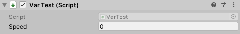
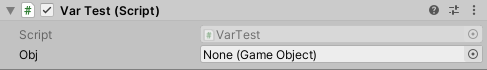
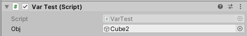
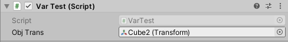
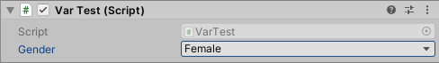
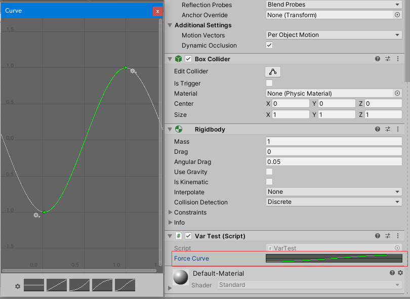
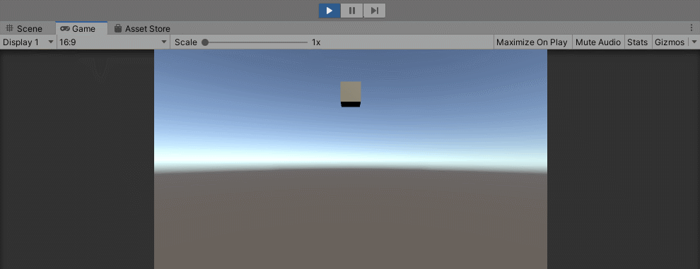

# 变量定义和参数展示

脚本组件作为控制游戏对象的逻辑组件，其中肯定会有很多可调整的参数。如果我们每次修改这些参数，都要重新编译运行游戏以进行测试，那效率就太低了。Unity中一个相当有创新性的功能，就是脚本中定义的变量能够直接显示在Unity编辑器的`Inspector`面板中，我们不仅能很容易的修改这些参数，还可以在运行时调整参数查看效果。

## 基本脚本变量类型

下面代码，我们在游戏脚本中定义了一个`int`型变量`speed`，注意它的访问修饰符是`public`，只有公开的属性才能显示在编辑器中。

```csharp
public class VarTest : MonoBehaviour
{
    public int speed = 0;
    // ...
}
```

在编辑器中显示如下：



注意：代码中我们对该脚本变量设置了初始值`0`，因此编辑器中也生成了默认值`0`。当然，我们也可以在编辑器中对其进行修改。

与`int`类似，常用的`float`，`string`等也都是差不多的效果。

## 游戏对象和游戏组件

除了基本的能直接通过字面值定义的类型，Unity中的游戏对象、游戏组件、各种资源类型，也都可以定义为脚本变量，并在编辑器中赋值。

### 游戏对象

我们如下定义一个游戏对象：
```csharp
public GameObject obj;
```

在编辑器中显示如下：



如图，其默认值为空。



我们可以将一个对象拖到其上为其赋值。

### 对象组件

我们如下定义一个`Transform`组件：
```csharp
public Transform objTrans;
```

这里我们再把`cube2`物体拖到上面，显示如下：



这里你会发现Unity很神奇的自动将`cube2`物体的`Transform`组件赋值到了我们定义的`objTrans`上。

## 枚举

对于一些取值范围是有限选项的变量，我们可以使用枚举进行定义，比如性别：只有男、女等，那么我们定义如下：

```csharp
public enum Gender
{
    female,male, futanari
}

public Gender gender;
```

在编辑器中，枚举变量会以一个下拉框的形式展示：



## AnimationCurve 曲线编辑器

Unity有一个相当好用的`AnimationCurve`，它相当于能够定义一个映射函数，而且是图形化操作曲线来定义的，非常方便。

```csharp
public AnimationCurve forceCurve;
```

Unity编辑器中，我们可以打开曲线编辑面板来定义我们的`forceCurve`：



下面代码中，我们使用上面编辑的曲线，实现了一个在Y轴上来回晃动的`cube`：

```csharp
public class VarTest : MonoBehaviour
{
    private Rigidbody rb;
    private float curTime = 0;

    public AnimationCurve forceCurve;
    public float forceScale = 1f;

    void Start()
    {
        this.rb = GetComponent<Rigidbody>();
    }

    void FixedUpdate()
    {
        // 获取曲线函数的入参（也就是时间）
        curTime += Time.deltaTime;
        // 施加一个沿Y轴的力
        Vector3 force = new Vector3(0, forceCurve.Evaluate(curTime) * forceScale, 0);
        this.rb.AddForce(force, ForceMode.Impulse);
    }
}
```

代码中，曲线函数的输出值被我们作为了刚体在Y轴上的受力。



警告：`AnimationCurve`确实很好用，但要注意一个坑，我们编辑好曲线后就不要改变量名了，否则编辑好的曲线就会丢失！