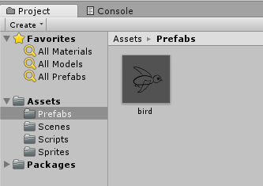
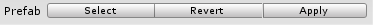

# 对象的实例化和销毁

Unity是基于组件和游戏对象的架构设计，因此这里所说的实例化和销毁，和基于继承的面向对象系统不太一样。这里的实例化和销毁，是指基于一个预制体（prefab）模板，实例化和销毁游戏对象。

## 在编辑器中使用预制体

把场景中的一个游戏对象拖进Project视图就会自动创建一个预制体，通常我们会单独建一个目录保存预制体，预制体文件会以`.prefab`文件扩展名结尾。



把预制体拖进Scene，我们就手动“实例化”了一个预制对象。我们在此对象上做出的修改，如果点击`Apply`就可以将修改保存到预制体上，所有基于该预制体的对象都会被修改。



## 使用脚本实例化预制体

```csharp
Object Object.Instantiate(Object original, Vector3 position, Quaternion rotation, Transform parent)
```

* original：prefab对象，一般都是通过Unity编辑器拖进来的
* position：初始位置
* rotation：初始旋转参数
* parent：父对象的transform组件

例子：

```csharp
using System.Collections;
using System.Collections.Generic;
using UnityEngine;

public class Parent : MonoBehaviour
{
	public Object birdPrefab;

    void Start()
    {
		    Instantiate(birdPrefab, new Vector3(), new Quaternion(), transform);
    }
}
```

## 使用脚本销毁预制体

```csharp
void Object.Destroy(Object obj)
```

* obj：要销毁的游戏对象
* t 可选参数：单位为秒，延迟t秒后销毁对象

例子：

```csharp
using System.Collections;
using System.Collections.Generic;
using UnityEngine;

public class Parent : MonoBehaviour
{
    void Update()
    {
        Transform child = transform.Find("ChildObject1");
        if (child != null)
        {
            Destroy(child.gameObject);
        }
    }
}
```
