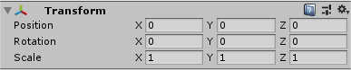
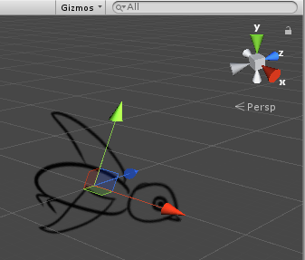

# Transform组件

Transform组件用于设置一个游戏对象的位置（position）、旋转参数（rotation）、缩放参数（scale），除此之外，还用于保存对象之间的父子关系，Transform是一个可遍历对象，遍历一个对象的Transform会获得该对象的子组件Transform。

每一个游戏对象（包括新创建的空对象）都必须有一个Transform组件：



## 脚本中获取Transform组件

脚本中，我们不需要使用`GetComponent<Transform>()`，直接使用`this.transform`就能获得当前游戏对象的Transform组件。

例子代码：
```csharp
this.transform.position = new Vector3(1, 1, 0);
```

## 位置参数设置

参数：Vector3

获取或设置：
```csharp
this.transform.position
```

## 旋转参数

参数：Quaternion

获取或设置：
```csharp
this.transform.rotation
```

四元数（Quaternion）这个旋转参数使用起来不太直观，我们可以通过和欧拉角（Vector3）之间相互转换来进行设置。

例子，绕z轴正方向旋转90度：
```csharp
Vector3 rotateAngle = new Vector3(0, 0, 90);
this.transform.rotation = Quaternion.Euler(rotateAngle);
```

如何判断旋转的正方向：Unity使用的是左手坐标系，因此可以使用左手法则，大拇指指向坐标轴，其余手指握拳，指向的方向就是旋转的正方向。

旋转前（使用透视相机查看三维空间中的2D工程）：



旋转后：


四元数转欧拉角：

```csharp
Quaternion.eulerAngles
```

例子：
```csharp
Quaternion rotateQuaternion = Quaternion.Euler(0, 0, 90);
Vector3 rotateAngle = rotateQuaternion.eulerAngles;
Debug.Log(rotateAngle);
```

## 缩放参数

参数：Vector3

获取或设置：
```csharp
this.transform.localScale
```
