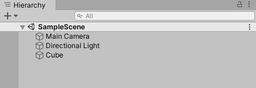
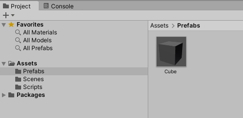
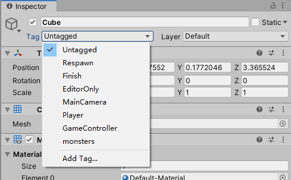

# 游戏对象

Unity引擎本身就是面向对象的，我们的场景，包括静态的地面、房子，还有动态的主角、怪物，都是游戏对象（GameObject），我们的游戏其实就是通过各种游戏对象搭建起来的。

在Unity编辑器的`Hierarchy`视图中，其实就是罗列了当前场景中的所有游戏对象。



## 创建游戏对象

实际开发中，我们创建游戏对象主要分为三种方式：

1. 直接在编辑器中创建、编辑游戏对象
2. 使用预制体（prefab）创建对象
3. 使用代码创建对象

第一种自然不必多说，我们这里介绍下预制体和使用代码创建游戏对象。

### 使用预制体创建对象

预制体（Prefab）可以理解为创建一个实例的模板，Unity编辑器中，我们将场景中的对象拖进`Project`工程资源视图，就可以创建一个预制体。



这里我们创建了一个名为`Cube`的预制体。

下面代码中，我们实现了按下`Space`键，就实例化一个`Cube`的功能：

```csharp
using System.Collections;
using System.Collections.Generic;
using UnityEngine;

public class AddCubes : MonoBehaviour
{
    public GameObject cubePrefab;

    void Update()
    {
        if (Input.GetKeyDown(KeyCode.Space))
        {
            GameObject obj = Instantiate(cubePrefab);
            // 获取obj上的组件，设置参数等操作
            // ...
        }
    }
}
```

代码中，我们调用了`Instantiate()`实现实例化一个预制体，它的返回值是新实例化的游戏对象。

`Instantiate()`还有若干重载，可以设定对象的初始位置、初始空间变换参数等功能，这里就不多说了。

注意：脚本变量`cubePrefab`需要在Unity编辑器中赋值。

### 使用代码手动创建对象

其实在早先的游戏开发中，虽然没有Unity这种强大的图形化游戏编辑器，但这并不影响我们游戏的逻辑层架构是组件化的，无非就是需要我们手动`new`游戏对象，手动初始化、挂载游戏组件，再手动摆放游戏对象的位置。如果你不打算使用Unity规定的这些开发工作流，而仅仅是将Unity当做一个图形渲染框架，也是完全可以的，只不过非常麻烦，这里就不多介绍了。

## 销毁游戏对象

类似`Instantiate()`，Unity也提供了`Destroy()`，用来销毁对象，也能够支持延迟销毁。

这个函数有两个很实用的重载：

```
Destroy(Object obj)
```

* `obj`：要销毁的游戏对象

```
Destroy(Object obj, float t)
```

* `obj`：要销毁的游戏对象
* `t`：销毁的延迟时间

## 获取游戏对象上的组件

游戏对象的各种参数都是存储在组件（Component）上的，我们可以通过`GetComponent<T>()`函数来获取一个游戏对象上的组件。

下面例子代码中，获取了当前游戏对象上的`Rigidbody`刚体组件。

```csharp
Rigidbody rb = this.GetComponent<Rigidbody>();
```

对于一些常用组件，比如`Transform`，Unity为我们直接将其设为了游戏对象的属性，我们直接引用就可以了，不需要再调用`GetComponent<T>()`。

```csharp
Transform trans = this.transform;
```

注意：`GetComponent<T>()`是一个比较消耗性能的操作，如非必要，尽量避免在`Update()`中每帧循环调用。

## 查找游戏对象

我们的游戏对象都有一个名字，这个名字不是没意义的，我们可以通过这个名字进行搜索。下面代码中，我们全局搜索了一个名为`Cube`的游戏对象：

```csharp
GameObject obj = GameObject.Find("Cube");
```

当然，实际开发中更常用的方法是从某一根节点进行搜索。对于对象树结构，它是通过`Transform`组件来保存父子关系的，因此`tranaform.Find()`的返回值是子游戏对象的`Transform`。后面在介绍`Transform`组件时，我们再详细介绍这部分内容。

```csharp
Transform trans = this.transform.Find("Cube");
```

注意：如果有多个同名的游戏对象，`Find()`函数也会返回一个对象，但这就没有意义了，要尽量避免同一对象树层级下，对象重名的情况。

## Tag 标签

Unity中，除了可以根据对象名搜索，也支持根据对象标签搜索。



在`Inspector`面板中，我们可以为一类对象设定一个标签。下面代码中，我们通过标签搜索，返回持有该标签的所有对象。

```csharp
GameObject[] objs =  GameObject.FindGameObjectsWithTag("monsters");
```
