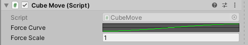

# 组件使用

Unity中，我们的游戏逻辑总是围绕着游戏对象和组件展开的，上一节介绍了游戏对象，这里我们介绍一下如何获取组件，以及如何访问组件的属性和方法。

## 获取组件

### 使用代码访问组件

上一节中，我们介绍了`GetComponent<T>()`方法，它支持一个泛型参数，返回组件实例。

之前我们说过，我们编写的脚本其实也是一种组件，因此获取一个对象的脚本组件也是可行的。

下面代码中，`CubeMove`是我们之前自定义的一个脚本，用来让方块来回震动（代码详见`03-变量定义和参数展示`）：



```csharp
CubeMove cubeMove = obj.GetComponent<CubeMove>();
```

### 使用Unity编辑器赋值

实际上，我们可以还可以用拖拽的方式进行组件实例的赋值。如下我们定义了一个脚本变量，`CubeMove`是我们之前自定义的一个脚本：

```csharp
public CubeMove cubeMove;
```

在Unity编辑器中，我们直接将带有该组件的游戏对象拖进去即可：


如果拖拽的游戏对象不包含该组件，是无法拖进去的，光标会显示一个禁止符号。

## 访问组件属性和方法

既然我们能够拿到组件实例，那么自然也就能访问组件中的公有属性和方法。

下面代码中，我们基于Prefab初始化了一个游戏对象，然后获取其`cubeMove`组件，最后调用了其中的`ScaleForce()`：

```csharp
GameObject obj = Instantiate(cubePrefab);
CubeMove cubeMove = obj.GetComponent<CubeMove>();
cubeMove.ScaleForce(10);
```

对于Unity各种内置组件，引入的插件包含的其他人写的脚本组件，还有我们自己编写的脚本组件之间相互调用，其实都是如上述实现的。
