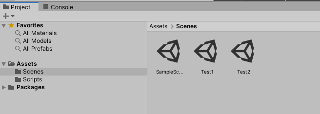

# 场景管理

Unity编辑器中，我们放置各种游戏对象，搭建一个玩法区域的地方是场景（Scene）。例如RPG游戏中，游戏的起始界面、各张小地图、战斗场景等都是Scene。这里我们介绍如何加载和切换Scene，以及Scene使用中需要了解的相关知识。

## 创建场景

创建场景很简单，在Unity编辑器的Project工程资源视图中，右键`Create -> Scene`即可。



创建好的空场景中，默认只有一个摄像机（Camera）。

## 切换场景

在了解切换场景的API前，我们需要将能互相切换的场景加入到工程的`Scenes In Build`中。切换到我们需要添加的场景，在Unity编辑器里点击`File -> Build Settings`，点击`Add Open Scenes`，即可将当前Scene加入构建场景中。


如果不将场景加入构建，切换场景时会报错。

切换场景需要使用`SceneManage`这个类。

```csharp
public static void LoadScene(int sceneBuildIndex, SceneManagement.LoadSceneMode mode = LoadSceneMode.Single);
public static void LoadScene(string sceneName, SceneManagement.LoadSceneMode mode = LoadSceneMode.Single);
```

上面两个函数可用于切换场景，其中第一个参数分别是Scene的构件序号（上图中有标注）或是Scene的名字（就是文件名）。

例子代码：

```csharp
using System.Collections.Generic;
using UnityEngine;
using UnityEngine.SceneManagement;

public class ChangeScene : MonoBehaviour
{
    public string sceneName;
    
    public void changeScene()
    {
        if (sceneName != null && sceneName != "")
        {
            SceneManager.LoadScene(sceneName);
        }
    }
}
```

## 异步加载场景

实际开发中，如果需要加载的场景数据量很大，同步加载就会造成程序卡死的状况，这时候就需要使用异步加载。。`SceneManager`还提供了`LoadSceneAsync()`函数，可以在不结束当前场景的情况下，异步加载另一个场景。

```csharp
public static AsyncOperation LoadSceneAsync(string sceneName, SceneManagement.LoadSceneMode mode = LoadSceneMode.Single);
public static AsyncOperation LoadSceneAsync(int sceneBuildIndex, SceneManagement.LoadSceneMode mode = LoadSceneMode.Single);
```

参数意义和之前`LoadScene()`一致。

例子代码：

```csharp
using System.Collections;
using System.Collections.Generic;
using UnityEngine;
using UnityEngine.SceneManagement;

public class AsyncChangeScene : MonoBehaviour
{
    public string sceneName;
    private AsyncOperation operation;

    void Update()
    {
        if (operation != null)
        {
            Debug.Log(operation.progress);
        }
    }

    public void AsyncLoad()
    {
        if (sceneName != null && sceneName != "")
        {
            operation = SceneManager.LoadSceneAsync(sceneName);
        }
    }
}
```

注意`LoadSceneAsync()`有一个返回值`AsyncOperation`，它包含了异步加载的进度，取值`0 ~ 1`。上面代码中，我们读取了进度值，并通过打印在了控制台上。

当异步加载完成后，场景将自动切换。

## 异步加载场景（但不自动切换）

上面我们实现的异步加载场景，场景加载完成后会自动切换，实际上，我们也可以指定不自动切换。这需要对`AsyncOperation`指定`allowSceneActivation`为`false`。指定该属性后，异步加载完成时也不会自动切换场景，而加载进度会停留在`0.9`。当设置该属性为`true`时，切换才会生效。

例子代码：

```csharp
using System.Collections;
using System.Collections.Generic;
using UnityEngine;
using UnityEngine.UI;
using UnityEngine.SceneManagement;

public class AsyncChangeScene : MonoBehaviour
{
    public string sceneName;
    // 一个提示信息，内容为 加载完成，按SPACE键继续
    public Text loadingFinishTip;

    private AsyncOperation operation;
    private bool isStartLoading = false;
    private bool isLoadingFinish = false;

    void Update()
    {
        if (isStartLoading && !isLoadingFinish && operation != null)
        {
            Debug.Log(operation.progress);
            if (operation.progress >= 0.9f)
            {
                loadingFinishTip.gameObject.SetActive(true);
                isLoadingFinish = true;
            }
        }

        if (isLoadingFinish)
        {
            if (Input.GetKeyDown(KeyCode.Space))
            {
                operation.allowSceneActivation = true;
            }
        }
    }

    public void AsyncLoad()
    {
        if (sceneName != null && sceneName != "" && !isStartLoading)
        {
            isStartLoading = true;
            operation = SceneManager.LoadSceneAsync(sceneName);
            operation.allowSceneActivation = false;
        }
    }
}
```

代码很简单，这里就不多说了，有一个需要注意的地方：判断进度是否为`0.9`时，不能使用`==`，因为浮点数不能精确比较相等，这属于编程常识性的问题了。

## DontDestroyOnLoad 跨场景游戏对象

在切换场景时，默认情况原来场景中的游戏对象都会被销毁，但有时我们不希望某些对象和数据被销毁，这时可以使用`DontDestroyOnLoad()`保存跨场景数据。

```csharp
public static void DontDestroyOnLoad(Object target);
```

例子代码：

```csharp
GameObject.DontDestroyOnLoad(mySprite);
```

但事情其实没有这么简单。如果包含`DontDestroyOnLoad()`的场景被重复加载，跨场景对象也会被实例化多个，这点需要注意。

## 跨场景数据的实现

实际上，跨场景游戏对象的局限性是比较大的，处理不好会引发很多问题。大部分时候，其实我们没必要使用跨场景游戏对象，使用跨场景数据就能够解决大部分问题。比如RPG游戏中切换地图，但是我们想要保留HUD，我们难道真的需要把UI对象做成跨场景对象吗？其实是不必要的，我们可以在某处暂存HUD的数据，然后通过Prefab重新加载HUD的UI对象。

那么在哪里保存全局数据呢？这个方式就有很多了，两种比较常用的方式是存档到磁盘和使用静态空间存储，这里我们介绍比较简单的后者。

下面代码中，我们创建了`GlobalData.data`来存储一些全局数据。注意这里我们的类没有也无需继承`MonoBehaviour`，这个类不需要挂载到游戏对象上。

```csharp
using System.Collections;
using System.Collections.Generic;
using UnityEngine;

public class GlobalData
{
    public static Dictionary<string, string> data = new Dictionary<string, string>();
}
```

在游戏脚本中直接引用即可，静态属性不会受到场景切换影响。
