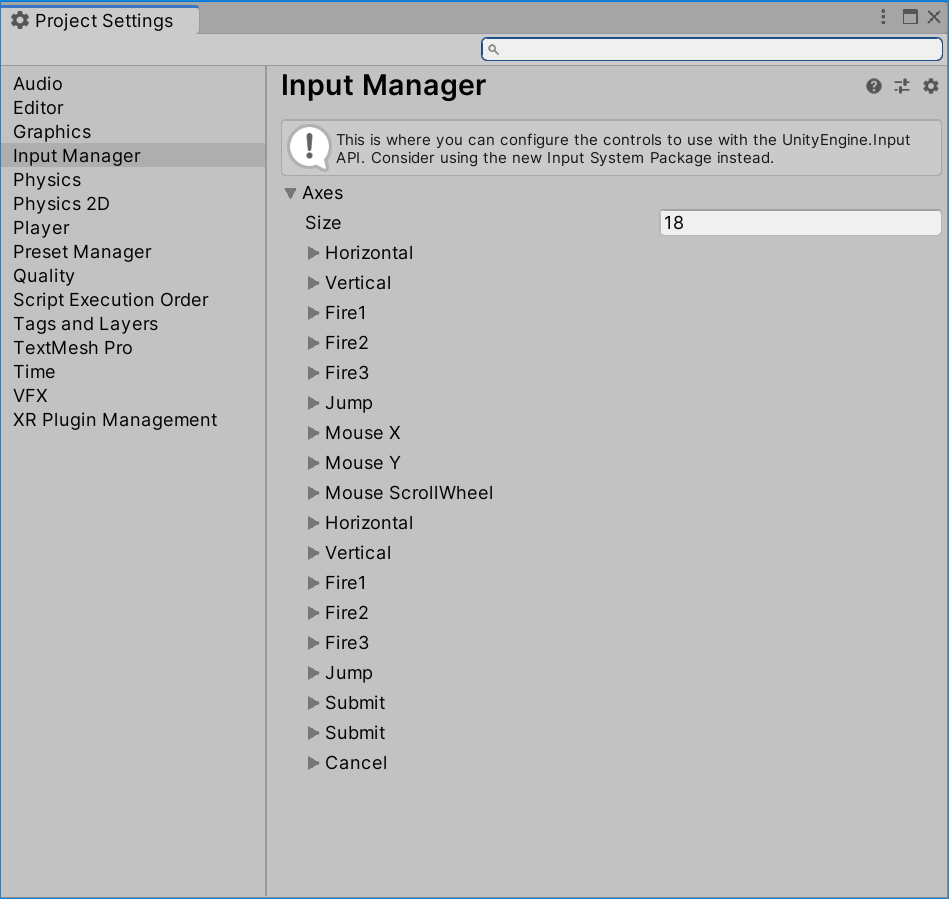

# 输入管理器

Unity中，对于PC平台，我们可以通过`Input`类封装的静态方法，来读取键盘和鼠标的输入。

除此之外，Unity还提供了输入管理器的概念，统一封装和解耦了各个不同平台的输入设备。

## 基础输入

如果我们的游戏只针对PC平台，处理输入是十分简单的。PC平台只可能有鼠标和键盘两种输入设备（除了PC上接手柄的奇葩玩家），我们只需要针对性的判断键盘事件和键码、鼠标事件即可。

### 读取键盘事件

下面例子代码中，我们按下键盘`A`键，输出一条调试信息。

```csharp
using System.Collections;
using System.Collections.Generic;
using UnityEngine;

public class InputTest : MonoBehaviour
{
    void Update()
    {
        if (Input.GetKeyDown(KeyCode.A))
        {
            Debug.Log("key A pressed");
        }
    }
}
```

* `GetKeyDown()`：键盘按下
* `GetKeyUp()`：键盘弹起
* `GetKey()`：键盘按住

### 读取鼠标事件

下面例子代码中，我们按下鼠标左键时，输出一条调试信息，包含点击位置的屏幕坐标：

```csharp
using System.Collections;
using System.Collections.Generic;
using UnityEngine;

public class InputTest : MonoBehaviour
{
    void Update()
    {
        if (Input.GetMouseButtonDown(0))
        {
            Vector3 pos = Input.mousePosition;
            Debug.Log("mouse left button clicked at " + pos);
        }
    }
}
```

注意：点击位置是以左下角为原点的二维坐标系（z=0）。

那么如何判断我们点击在了一个物体上呢？有了获取鼠标点击位置的方法，我们很容易想到使用方向朝向屏幕的射线检测，但这里我们介绍一种更简单的方法。设置了`Collider`的物体有一系列`OnMouse`方法供我们使用。

下面例子脚本附加在一个Cube上，该物体设置了`Box Collider`。代码实现了点击这个物体，输出一条调试信息：

```csharp
using System.Collections;
using System.Collections.Generic;
using UnityEngine;

public class ClickTest : MonoBehaviour
{
    void OnMouseDown()
    {
        Debug.Log("cube clicked");
    }
}
```

## 输入管理器

如果我们的游戏需要跨平台，比如《GTA5》不仅支持PC，也有PS3、XBOX360版本，这时就要考虑不同输入设备的问题。好在Unity有一个输入管理器功能，无论是键盘、还是游戏手柄，都可以对应到输入管理器这个抽象层上，我们调用输入管理器即可判断用户输入。

在Unity编辑器中，`Edit -> Project Settings...`中，即可看到输入管理器功能的配置界面：



比如`Horizontal`表示水平偏移，它既能对应键盘的`A`和`D`键，也能对应手柄的相关键位，我们只要调用`Input.GetAxis("Horizontal")`即可实现读取键盘或手柄两种方式。

```csharp
using System.Collections;
using System.Collections.Generic;
using UnityEngine;

public class InputTest : MonoBehaviour
{
    void Update()
    {
        float h = Input.GetAxis("Horizontal");
        Debug.Log("horizontal " + h);
    }
}
```

上面代码中，`Input.GetAxis("Horizontal")`输出是一个`float`值，这是因为有些输入设备和键盘不同，能够控制水平偏移的程度，Unity这里为我们做了一些处理，即使是键盘，`GetAxis`也会返回一个连续变化的值。

对于输入管理器中定义的其他控制抽象类型，都是类似的操作，具体使用时查阅文档即可，这里我们就不多介绍了。
