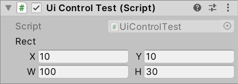
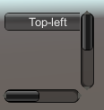
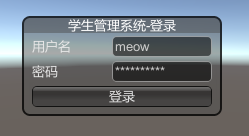

# OnGUI

这篇笔记我们介绍Unity中的老版OnGUI。

正如前一篇笔记所说，这套老GUI系统其实在开发中我们更多的是用它当做一个调试工具，因此我们选择性的掌握一些重点知识即可，不必深入研究。本笔记未涉及的内容，查阅相关API文档即可。

## OnGUI生命周期函数

Unity的OnGUI，绘制和响应判断都是编写在`MonoBehaviour`的`OnGUI`声明周期函数中，在游戏运行时，这个生命周期函数会被不停的回调。

这样设计的优点就是使用简便，逻辑简单。缺点就是写法很不优雅，而且性能很差。

## 常用控件

这里我们介绍下日常开发中最常用的各种控件。

### Label标签

Label用于显示一段文字或是图片。

```csharp
using System.Collections.Generic;
using UnityEngine;

public class UiControlTest : MonoBehaviour
{
    public Rect rect;
    void OnGUI()
    {
        GUI.Label(rect, "标签");
    }
}
```

这里`rect`参数代表UI组件的位置和长宽，我们将其设置为`public`，便于在Unity编辑器中调整。



显示效果：


`GUI.Label()`实现了若干重载，它不仅可以显示文字，也可以显示图片、组合内容等，这里就不多介绍了，使用时参考文档即可。

### Box盒子

Box作用和Label差不多，唯一的区别就是它有个背景框。

```csharp
using System.Collections.Generic;
using UnityEngine;

public class UiControlTest : MonoBehaviour
{
    public Rect rect;
    void OnGUI()
    {
        GUI.Box(rect, "盒子");
    }
}
```

显示效果：


### Button按钮 RepeatButton重复按钮

Button和RepeatButton外观是完全相同的，只不过区别是Button只有在鼠标抬起时触发一次，RepeatButton是鼠标按下就一直触发。

```csharp
using System.Collections;
using System.Collections.Generic;
using UnityEngine;

public class UiControlTest : MonoBehaviour
{
    public Rect rect1;
    public Rect rect2;
    void OnGUI()
    {
        bool btn = GUI.Button(rect1, "按钮");
        if (btn)
        {
            Debug.Log("按钮点击触发");
        }

        bool repeatBtn = GUI.RepeatButton(rect2, "重复按钮");
        if (repeatBtn)
        {
            Debug.Log("重复按钮点击触发");
        }
    }
}
```

显示效果：


### TextField输入框 PasswordField密码框 TextArea文本域

TextField、PasswordField、TextArea都是用来输入文本的，顾名思义，一个是单行文本，一个是密码框，一个是多行文本。

```csharp
using System.Collections;
using System.Collections.Generic;
using UnityEngine;

public class UiControlTest : MonoBehaviour
{
    public Rect rect1;
    public Rect rect2;
    public Rect rect3;

    private string txt1 = "";
    private string txt2 = "";
    private string txt3 = "";

    void OnGUI()
    {
        txt1 = GUI.TextField(rect1, txt1);
        txt2 = GUI.PasswordField(rect2, txt2, '*');
        txt3 = GUI.TextArea(rect3, txt3);
    }
}
```

注意：这个写法其实比较奇葩，比如TextField，它既需要一个变量来作为初始值，也需要同一个变量来作为返回值，这样才能正常工作。

显示效果：


### Toggle复选框

```csharp
using System.Collections;
using System.Collections.Generic;
using UnityEngine;

public class UiControlTest : MonoBehaviour
{
    public Rect rect;

    private bool toggled = false;

    void OnGUI()
    {
        toggled = GUI.Toggle(rect, toggled, "我已阅读EULA");
    }
}
```

其实Toggle并不仅仅是复选框，我们将其作为单选框，也是可以实现的。选择一个Toggle后，清空其他的Toggle就行了。

显示效果：


### Toolbar和SelectionGrid两种工具条

Toolbar或是SelectionGrid可以作为按钮组或是Tab标签页来使用。两者功能基本相同，只不过后者支持换行，这里我们就介绍比较简单的Toolbar。

```csharp
using System.Collections;
using System.Collections.Generic;
using UnityEngine;

public class UiControlTest : MonoBehaviour
{
    public Rect rect;

    private int selected = 0;

    void OnGUI()
    {
        selected = GUI.Toolbar(rect, selected, new string[] { "选项1", "选项2", "选项3" });
        Debug.Log(selected);
    }
}
```

代码中，我们通过一个字符串数组传入`Toolbar`的可选项，结果值`selected`是一个整数，其实就是选项数组的序号（从0开始）。

显示效果：


### Slider滑块

滑块比较好理解，就是一个可以滑动选择值的控件。

滑块分为两个：

* GUI.HorizontalSlider
* GUI.VerticalSlider

```csharp
using System.Collections;
using System.Collections.Generic;
using UnityEngine;

public class UiControlTest : MonoBehaviour
{
    public Rect rect;

    private float value = 0;

    void OnGUI()
    {
        value = GUI.HorizontalSlider(rect, value, 0, 100);
        Debug.Log(value);
    }
}
```

代码中，`GUI.HorizontalSlider()`后两个参数是滑块的最小值和最大值。

显示效果：


### Scrollbar滚动条

单独的滚动条组件我们通常不直接使用，而是配合ScrollView来使用的。

```csharp
using System.Collections;
using System.Collections.Generic;
using UnityEngine;

public class UiControlTest : MonoBehaviour
{
    private Vector2 scrollPosition = Vector2.zero;

    void OnGUI()
    {
        scrollPosition = GUI.BeginScrollView(new Rect(10, 300, 100, 100), scrollPosition, new Rect(0, 0, 220, 200));

        GUI.Button(new Rect(0, 0, 100, 20), "Top-left");
        GUI.Button(new Rect(120, 0, 100, 20), "Top-right");
        GUI.Button(new Rect(0, 180, 100, 20), "Bottom-left");
        GUI.Button(new Rect(120, 180, 100, 20), "Bottom-right");

        GUI.EndScrollView();
    }
}
```

代码中，`GUI.BeginScrollView()`和`GUI.EndScrollView()`需要成对出现。

`GUI.BeginScrollView()`参数：第一个参数是可视区域的大小，第二个参数是滚动条位置的初始值，第三个参数是容器区域的大小。

注意：ScrollView的子组件位置，是相对于ScrollView容器的。

显示效果：



### Window窗体

Window可以实现一个显示在游戏中的窗口。

下面例子代码中，我们绘制了一个登陆框：

```csharp
using System.Collections;
using System.Collections.Generic;
using UnityEngine;

public class GuiTest : MonoBehaviour
{

    public Rect rect;

    private string username = "";
    private string password = "";

    void OnGUI()
    {
        GUI.Window(0, rect, func, "学生管理系统-登录");
    }

    void func(int windowId)
    {
        GUILayout.BeginVertical();

        GUILayout.BeginHorizontal();
        GUILayout.Label("用户名");
        username = GUILayout.TextField(username, 10, GUILayout.Width(100));
        GUILayout.EndHorizontal();

        GUILayout.BeginHorizontal();
        GUILayout.Label("密码");
        password = GUILayout.PasswordField(password, '*', 10, GUILayout.Width(100));
        GUILayout.EndHorizontal();

        GUILayout.BeginHorizontal();
        bool btn = GUILayout.Button("登录");
        if (btn)
        {
            Debug.Log("username: " + username + ", password: " + password);
        }
        GUILayout.EndHorizontal();

        GUILayout.EndVertical();
    }
}
```

显示效果：



### DragWindow可拖拽窗体

上面我们编写的Window是不可拖拽的，不符合一般的使用习惯，我们这里额外介绍如何实现可拖拽的窗体。

我们基于上面例子代码修改而来：

```csharp
using System.Collections;
using System.Collections.Generic;
using UnityEngine;

public class GuiTest : MonoBehaviour
{

    public Rect rect;

    private string username = "";
    private string password = "";

    void OnGUI()
    {
        rect = GUI.Window(0, rect, func, "学生管理系统-登录");
    }

    void func(int windowId)
    {
        GUI.DragWindow(new Rect(0, 0, 10000, 20));

        GUILayout.BeginVertical();

        GUILayout.BeginHorizontal();
        GUILayout.Label("用户名");
        username = GUILayout.TextField(username, 10, GUILayout.Width(100));
        GUILayout.EndHorizontal();

        GUILayout.BeginHorizontal();
        GUILayout.Label("密码");
        password = GUILayout.PasswordField(password, '*', 10, GUILayout.Width(100));
        GUILayout.EndHorizontal();

        GUILayout.BeginHorizontal();
        bool btn = GUILayout.Button("登录");
        if (btn)
        {
            Debug.Log("username: " + username + ", password: " + password);
        }
        GUILayout.EndHorizontal();

        GUILayout.EndVertical();
    }
}
```

上面代码主要增加了两部分：一个是Window内部初始化了DragWindow，它能够自动响应拖拽事件。另一个是我们读取了外层Window的位置，并重新对其赋值，这样触发拖动时，窗体就会跟着移动了。

## GUILayout控件自动布局

上面登陆框的例子中，我们其实已经使用了`GUILayout`，这个组件能够通过组合`BeginVertical`、`BeginHorizontal`等操作，实现类似表格的功能。

当然也有一些其他可配置的参数，具体参考文档即可，这里就不多介绍了。

## 常见问题

```
Q：为什么输入域中输入内容不响应？为什么拖动窗体无效？
A：一定是未接收返回值或未赋值。
```

```
Q：绘制的组件不见了？？
A：有两种常犯的错误可能导致这种状况：1）未设置初始值导致报错 2）组件位置超出了屏幕。
```
