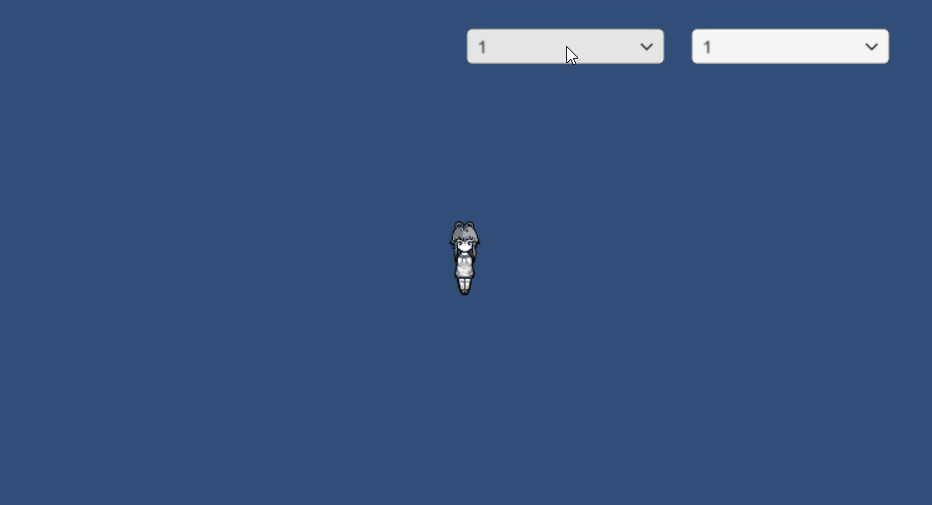

# 实现2D纸娃娃系统和行走图切换

这篇笔记简单实现一个能够更换衣服、发型的2D纸娃娃系统，素材来自于《rimworld》。虽然这里并没有使用动画，但是即使加上动画原理也是一样的，只不过多了一堆序列帧贴图，还要做动画状态机，稍微麻烦一点。（其实《rimworld》里角色就是没有动画的，但是在那种特别的画风下，没有动画飘来飘去的小人一点都不违和，我非常喜欢那种风格）

效果图：



## 关于素材的加载


我们的player对象时这样安排的，其中的body、clothes、hair、head分别分到了四个sorting layer，以实现正确的遮挡显示。玩家给角色更换装备时，对应层的图就会改变，这是通过更改Sprite Renderer的Sprite属性实现的。


我们的资源是如图所示安排的，代码中绘制到小人身上的图是通过`Resources.Load()`加载的。其中注意`defs`文件夹，我们在这个文件夹里定义了一些XML信息，指示脚本该加载哪些图片。这样做的好处是提高了程序的可扩展性。

```xml
<def>
	<clothes>
    <label>1</label>
		<name>LT</name>
		<texture>hair/LT</texture>
	</clothes>
	<clothes>
    <label>2</label>
		<name>MA</name>
		<texture>hair/MA</texture>
	</clothes>
</def>
```

```xml
<def>
	<clothes>
		<label>1</label>
		<name>shirt</name>
		<texture>clothes/Parka_Female</texture>
	</clothes>
	<clothes>
		<label>2</label>
		<name>power armor</name>
		<texture>clothes/PowerArmor_Female</texture>
	</clothes>
</def>
```

## 脚本代码

注：代码里有换头发颜色的部分，是后加上去的，GIF里没有截到图

TextureLoader.cs
```csharp
using System.Collections;
using System.Collections.Generic;
using UnityEngine;
using UnityEngine.UI;
using System.IO;
using System.Xml;

public class TextureLoader : MonoBehaviour
{
    public Text loading;            //用于在加载时显示"Loading字样"
    public bool loadOver = false;   //加载完成改为true，PaperDoll会开始下一阶段初始化

    public Sprite bodyFront;        //这里body和head只使用一种，因此就没放进dict里
    public Sprite bodyBack;
    public Sprite bodySide;

    public Sprite headFront;
    public Sprite headBack;
    public Sprite headSide;

    public Dictionary<string, Hair> hairDict = new Dictionary<string, Hair>();
    public Dictionary<string, Clothes> clothesDict = new Dictionary<string, Clothes>();

    private void Awake()
    {
        LoadHairSprites();
        LoadClothesSprites();
        LoadHeadSprites();
        LoadBodySprites();
        loadOver = true;
        loading.gameObject.SetActive(false);
    }

    private void LoadHairSprites()
    {
        //xml的定义文件就放在了defs文件夹里
        string hairDefs = File.ReadAllText(Application.dataPath + "/defs/hair.xml");
        //通过xml定义文件初始化所有Hair对象，并存放进dict
        XmlDocument doc = new XmlDocument();
        doc.LoadXml(hairDefs);
        XmlElement root = (XmlElement) doc.SelectSingleNode("def");
        XmlNodeList defs = root.ChildNodes;
        foreach(XmlNode node in defs)
        {
            XmlNode label = node.SelectSingleNode("label");
            XmlNode name = node.SelectSingleNode("name");
            XmlNode texture = node.SelectSingleNode("texture");

            Hair hair = new Hair(label.InnerText, name.InnerText, texture.InnerText);
            hairDict.Add(hair.Label, hair);
        }
    }

    private void LoadClothesSprites()
    {
        string clothesDefs = File.ReadAllText(Application.dataPath + "/defs/clothes.xml");

        XmlDocument doc = new XmlDocument();
        doc.LoadXml(clothesDefs);
        XmlElement root = (XmlElement)doc.SelectSingleNode("def");
        XmlNodeList defs = root.ChildNodes;
        foreach (XmlNode node in defs)
        {
            XmlNode label = node.SelectSingleNode("label");
            XmlNode name = node.SelectSingleNode("name");
            XmlNode texture = node.SelectSingleNode("texture");

            Clothes clothes = new Clothes(label.InnerText, name.InnerText, texture.InnerText);
            clothesDict.Add(clothes.Label, clothes);
        }
    }

    private void LoadHeadSprites()
    {
        //注意：Resources.Load()的参数，例如文件路径是Assets/Resources/face/a.png，那么参数写法就是"face/a"
        //Load()函数能加载的对象必须放在Assets/Resources下，否则会返回null
        headFront = Resources.Load<Sprite>("face/Female_Average_Normal_front");
        headBack = Resources.Load<Sprite>("face/Female_Average_Normal_back");
        headSide = Resources.Load<Sprite>("face/Female_Average_Normal_side");
    }

    private void LoadBodySprites()
    {
        bodyFront = Resources.Load<Sprite>("body/Naked_female_front");
        bodyBack = Resources.Load<Sprite>("body/Naked_female_back");
        bodySide = Resources.Load<Sprite>("body/Naked_female_side");
    }
}

public class Clothes
{
    public Clothes(string label, string name, string spritePath)
    {
        this.Label = label;
        this.Name = name;
        //例如spritePath="hair/LT"，那么加载front对应的其实就是Resources.Load<Sprite>("hair/LT_front")
        string spritePathFront = spritePath + "_front";
        this.SpriteFront = Resources.Load<Sprite>(spritePathFront);
        string spritePathBack = spritePath + "_back";
        this.SpriteBack = Resources.Load<Sprite>(spritePathBack);
        string spritePathSide = spritePath + "_side";
        this.SpriteSide = Resources.Load<Sprite>(spritePathSide);
    }
    public string Label { get; set; }
    public string Name { get; set; }
    public Sprite SpriteFront{ get; set; }
    public Sprite SpriteBack { get; set; }
    public Sprite SpriteSide { get; set; }
}

public class Hair
{
    public Hair(string label, string name, string spritePath)
    {
        this.Label = label;
        this.Name = name;
        string spritePathFront = spritePath + "_front";
        this.SpriteFront = Resources.Load<Sprite>(spritePathFront);
        string spritePathBack = spritePath + "_back";
        this.SpriteBack = Resources.Load<Sprite>(spritePathBack);
        string spritePathSide = spritePath + "_side";
        this.SpriteSide = Resources.Load<Sprite>(spritePathSide);
    }
    public string Label { get; set; }
    public string Name { get; set; }
    public Sprite SpriteFront { get; set; }
    public Sprite SpriteBack { get; set; }
    public Sprite SpriteSide { get; set; }
}
```

PaperDoll.cs
```csharp
using System.Collections;
using System.Collections.Generic;
using UnityEngine;
using UnityEngine.UI;

public class PaperDoll : MonoBehaviour
{
    //当前使用的发型编号和衣服编号
    private string currentHairIndexLabel;
    private string currentclothesIndexLabel;

    //两个下拉选择框
    public Dropdown hairSelect;
    public Dropdown clothesSelect;
    public Dropdown hairColorSelect;

    private Transform m_transform;
    private TextureLoader m_textureLoader;
    private SpriteRenderer bodySpriteRenderer;
    private SpriteRenderer headSpriteRenderer;
    private SpriteRenderer clothesSpriteRenderer;
    private SpriteRenderer hairSpriteRenderer;

    //当前渲染的player各层的sprite
    private Sprite currentBody;
    private Sprite currentHead;
    private Sprite currentClothes;
    private Sprite currentHair;
    private Color currentHairColor;

    //player有上下左右四个朝向，但图片里不需要把左右各画一遍，因为是镜像的，直接把sprite水平镜像反过来就可以了
    private int isFlipRender = 1;

    void Start()
    {
        m_transform = GetComponent<Transform>();
        m_textureLoader = GetComponent<TextureLoader>();

        bodySpriteRenderer = m_transform.Find("body").gameObject.GetComponent<SpriteRenderer>();
        headSpriteRenderer = m_transform.Find("head").gameObject.GetComponent<SpriteRenderer>();
        clothesSpriteRenderer = m_transform.Find("clothes").gameObject.GetComponent<SpriteRenderer>();
        hairSpriteRenderer = m_transform.Find("hair").gameObject.GetComponent<SpriteRenderer>();

        //等待直到TextureLoader加载完成
        StartCoroutine(InitUIUntileLoadOver());

        //开始时暂时将所有层初始化为正面
        currentBody = m_textureLoader.bodyFront;
        currentHead = m_textureLoader.headFront;
        currentclothesIndexLabel = new List<string>(m_textureLoader.clothesDict.Keys)[0];
        currentClothes = m_textureLoader.clothesDict[currentclothesIndexLabel].SpriteFront;
        currentHairIndexLabel = new List<string>(m_textureLoader.hairDict.Keys)[0];
        currentHair = m_textureLoader.hairDict[currentHairIndexLabel].SpriteFront;

        currentHairColor = Color.white;
    }

    IEnumerator InitUIUntileLoadOver()
    {
        //等待直到TextureLoader加载完成
        while (!m_textureLoader.loadOver)
        {
            yield return null;
        }
        //动态初始化dropdown控件的选项，以及选择事件
        List<string> hairDictKeyList = new List<string>(m_textureLoader.hairDict.Keys);
        hairSelect.AddOptions(hairDictKeyList);
        hairSelect.onValueChanged.AddListener((int i) =>
        {
            currentHairIndexLabel = hairDictKeyList[i];
            currentHair = m_textureLoader.hairDict[currentHairIndexLabel].SpriteFront;
        });

        List<string> clothesDictKeyList = new List<string>(m_textureLoader.clothesDict.Keys);
        clothesSelect.AddOptions(new List<string>(m_textureLoader.clothesDict.Keys));
        clothesSelect.onValueChanged.AddListener((int i) =>
        {
            currentclothesIndexLabel = clothesDictKeyList[i];
            currentClothes = m_textureLoader.clothesDict[currentclothesIndexLabel].SpriteFront;
        });
        hairColorSelect.onValueChanged.AddListener((int i) =>
        {
            switch (i)
            {
                case 0:
                    currentHairColor = Color.white;
                    break;
                case 1:
                    currentHairColor = Color.green;
                    break;
                case 2:
                    currentHairColor = Color.black;
                    break;
            }
        });
    }

    void Update()
    {
        if(m_textureLoader.loadOver)
        {
            if (Input.GetKey(KeyCode.W))//根据行走方向改变贴图
            {
                currentBody = m_textureLoader.bodyBack;
                currentHead = m_textureLoader.headBack;
                currentHair = m_textureLoader.hairDict[currentHairIndexLabel].SpriteBack;
                currentClothes = m_textureLoader.clothesDict[currentclothesIndexLabel].SpriteBack;
                isFlipRender = 1;
            }
            else if (Input.GetKey(KeyCode.A))
            {
                currentBody = m_textureLoader.bodySide;
                currentHead = m_textureLoader.headSide;
                currentHair = m_textureLoader.hairDict[currentHairIndexLabel].SpriteSide;
                currentClothes = m_textureLoader.clothesDict[currentclothesIndexLabel].SpriteSide;
                isFlipRender = -1;//贴图里只有向右的，向左右就水平翻转
            }
            else if (Input.GetKey(KeyCode.S))
            {
                currentBody = m_textureLoader.bodyFront;
                currentHead = m_textureLoader.headFront;
                currentHair = m_textureLoader.hairDict[currentHairIndexLabel].SpriteFront;
                currentClothes = m_textureLoader.clothesDict[currentclothesIndexLabel].SpriteFront;
                isFlipRender = 1;
            }
            else if (Input.GetKey(KeyCode.D))
            {
                currentBody = m_textureLoader.bodySide;
                currentHead = m_textureLoader.headSide;
                currentHair = m_textureLoader.hairDict[currentHairIndexLabel].SpriteSide;
                currentClothes = m_textureLoader.clothesDict[currentclothesIndexLabel].SpriteSide;
                isFlipRender = 1;
            }

            //重新指定renderer渲染当前的sprite
            bodySpriteRenderer.sprite = currentBody;
            headSpriteRenderer.sprite = currentHead;
            hairSpriteRenderer.sprite = currentHair;
            clothesSpriteRenderer.sprite = currentClothes;

            hairSpriteRenderer.color = currentHairColor;

            //水平镜像翻转
            transform.localScale = new Vector3(isFlipRender, 1, 1);

        }
    }
}
```
