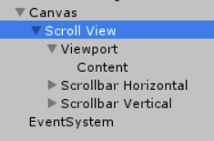

# 实现动态ListView

Unity提供的GUI系统中，并没有直接提供ListView（列表，因为好多GUI框架里都叫ListView，这里就沿用这个名字了）这个非常常用的控件，但是用基本的控件组合出一个ListView也十分简单。这里就简单实现下能动态添加删除的ListView。

## 在编辑器里拖一个ListView

注：这里不得不说Unity编辑器有点坑，因为操作都是在编辑器里拖拖拽拽完成的，这个“操作”就很难用文字描述，遇到问题极难解决，所以现代做软件的GUI框架都不是这么搞的，Unity这里弄GUI就比较恶心了。



首先创建个`ScrollView`，这个UI控件其实就是其他几个基本控件的预设组合，但是预设里给我们放好遮罩（mask），滚动条（Scroll Bar）之类的东西，省的我们自己弄了。

`content`就是我们要动态创建的组件的父容器。


大致摆下位置。然后把content拽成和Viewport一样大。


给content添加一个`Vertical Layout Group`和`Content Size Fitter`。注意里面的配置。

* child controls size：布局是否允许控制子对象的大小
* child force expand：布局是否自动拉伸子对象以适应父对象的大小
* content size fitter：用于强制约束子组件的大小

注：这里就比较迷惑了，因为这几个功能实际上是冲突的，举个例子：允许布局控制子组件大小，强制拉伸，content size fitter又强制约束一个大小，究竟听谁的？？反正这里设计的有点坑人，具体情况用的时候试一试就知道了。


在content里添加一个Button作为一条数据的显示控件，一会我们要把它做成prefab。给新加的Button一个`Layout Element`组件，并设置一个`prefered height`（对应上面content size fitter的设置）。我们最终的效果希望是按钮的长度填充父对象（content），宽度则是固定值。


结果如图，我们可以尝试`Ctrl+D`多复制一个Button，看看效果。content的长度会随着按钮数量自动增大。


运行。

## 用脚本控制添加和删除数据

这个就比较简单的实现了一下，并没有考虑性能、可扩展性之类的问题。要注意的就是不要搞混数据容器和界面上的控件容器，以及数据实体对象和动态添加的控件对象的对应关系。

content脚本 ListView.cs
```csharp
using System.Collections;
using System.Collections.Generic;
using UnityEngine;
using UnityEngine.UI;

public class Item//数据项对应的实体类
{
    public Item(string name)
    {
        this.Name = name;
    }
    public string Name { get; set; }
}

public class ListView : MonoBehaviour
{
    public GameObject itemButtonPrefab;//由Unity编辑器传入的prefab

    private Transform m_trans;

    private List<Item> itemList;//容纳所有数据的List

    void Start()
    {
        m_trans = GetComponent<Transform>();
        itemList = new List<Item>();
    }
    /*
    这里实现的功能时点击一个按钮，加一个数据项，本来参数应该是Item的，但是那边按钮传Item麻烦点，
    这里直接写成string的参数了
    */
    public void AddItem(string name)
    {
        itemList.Add(new Item(name));
        RefreshScrollView();
    }


    public void RemoveItem(Item it)
    {
        itemList.Remove(it);
        RefreshScrollView();
    }

    void RefreshScrollView()//刷新列表，先删除所有子对象再根据List内的数据重新填进去就行，数据量小的时候就不考虑性能了
    {
        for (int i = 0; i < m_trans.childCount; i++)
        {
            Destroy(m_trans.GetChild(i).gameObject);
        }
        for (int i = 0; i < itemList.Count; i++)
        {
            GameObject itemButton = Instantiate(itemButtonPrefab);
            itemButton.GetComponent<HandleButtonClick>().Item = itemList[i];
            itemButton.transform.SetParent(m_trans);
        }
    }
}
```

Button prefab脚本 HandleButtonClick.cs
```csharp
using System.Collections;
using System.Collections.Generic;
using UnityEngine;
using UnityEngine.UI;

public class HandleButtonClick : MonoBehaviour
{
    public Item Item { get; set; }//对应数据在ListView中的引用，由ListView实例化该对象时设置

    private Transform m_trans;//自己的Transform组件
    private Button m_btn;//自己的Button组件
    public Text m_text;//自己的子对象Text


    private ListView listView;//父对象（ListView的容器）的ListView组件（脚本ListView.cs）


    void Start()
    {
        m_trans = GetComponent<Transform>();
        listView = m_trans.parent.gameObject.GetComponent<ListView>();
        m_btn = GetComponent<Button>();

        m_btn.onClick.AddListener(RemoveSelfFromListView);
    }

    void RemoveSelfFromListView()
    {
        listView.RemoveItem(Item);
        Destroy(this.gameObject);
    }

    void Update()
    {
        m_text.text = Item.Name;
    }
}
```

最后搞了三个按钮去调用`AddItem()`方法。


