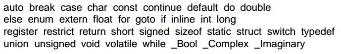

# 注释

* `/* */`：能够跨行，不能嵌套
* `//`：不能跨行，这是从C++借鉴的语法

# 常量

指代码中出现的字面值。

* 字符串：使用双引号引起来的一串字符。C语言规定了一些转义字符：
  * `\'`：单引号
  * `\"`：双引号
  * `\?`：问号
  * `\\`：反斜线
  * `\a`：响铃
  * `\b`：退格
  * `\f`：分页符，控制打印机打印源码时分页
  * `\n`：换行，Linux下`\n`即表示换行回车，没有`\r`
  * `\r`：回车
  * `\t`：水平制表符
  * `\v`：垂直制表符
* 字符常量：使用单引号括起来的一个字符。区别：'1'字符 "1"字符串 1整型
* 整数常量
* 浮点数常量
* 枚举常量

# 变量

计算机存储器中的一块命名空间。对应常量有char int float double类型，字符串是以\0结尾的char数组。

变量必须以下划线或字母开头，后面可以跟若干字母，下划线，数字。关键字和保留字不能用于定义变量。这个规则同样适用于函数，结构体，宏定义等命名。

C99规定的关键字和保留字

一般避免使用下划线开头命名标识符，可能被编译器识别为扩展功能造成混乱，不能乱用。

* 整数类型
  * short/unsigned short
  * int/unsigned int
  * long/unsigned long
  * 字符类型 char
* 浮点类型
  * float 单精度
  * double 双精度
  * long double

# 变量赋值

变量必须先声明后赋值，使用"="赋值，初始化和赋值可以一起完成，相同类型才能赋值。

# 表达式

表达式左边表示存储位置，称为左值，可以是变量。

整数除法，如果不螚整除，直接把小数截掉。但可以隐式类型转换。

字符类型本质上也是整数类型，但是表示范围比int小。整数值即ascii码。
