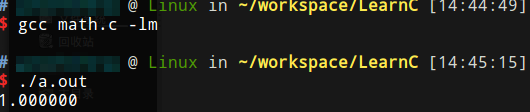
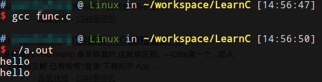
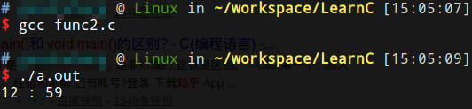

# 标准库函数

例如数学函数包含在math.h头文件中。

```c
#include <stdio.h>
#include <math.h>

int main(void)
{
	double pi = 3.1416;
	double result = sin(pi / 2);
	printf("%f\n", result);
	return 0;
}
```



注意：-lm：gcc中数学库在libm.so中，所以加上此项才能编译。有些头文件引用不需要-l参数，因为他们已经包含在libc.so中，gcc默认引入libc.so。

# 自定义函数

实际上`main(void)`就是自定义函数。不带参数的函数，参数列表写成void（这是c99的标准写法，什么都不写也是可以的，但不标准）。实际上main函数接收命令行参数，可以写成`main(int argc, char *argv[])`，但没有用到这些参数时可以写成void。main函数执行成功应该返回0，失败返回非0，可以再shell中用`$?`变量查看。

函数例子：

```c
#include <stdio.h>

void show(void);

int main(void)
{
	show();
	show();
	return 0;
}
void show(void)
{
	printf("hello\n");
}
```



* 同一个函数可以多次调用。
* 调用可以嵌套。
* 函数体现了封装性。
* 函数代码可以复用，比较简洁。
* 函数也应该遵循先声明后使用，也可以在main前直接定义，但先声明再定义更加规范。声明可以在另一个函数中，但不允许函数嵌套定义，gcc扩展支持嵌套定义。

# 参数

形参：例子中的h，m

实参：12，59

```c
#include <stdio.h>

void print_time(int h, int m);

int main(void)
{
	print_time(12,59);
	return 0;
}

void print_time(int h, int m)
{
	printf("%d : %d\n", h, m);
}
```



# 变量作用域

一个函数中的变量不能被其他函数引用，函数调用时，临时在栈上分配空间。定义在函数外面就是全局变量。全局变量如果和局部变量重名，会被局部变量覆盖。

全局变量的注意点：

```c
double pi = 3.14 + 0.0016; //合法的全局变量初始化
double pi = acos(-1.0); //不合法的全局变量初始化
int minute = 360;
int hour = minute / 60; //也不合法
```

原因：全局变量可能在多处调用，必须是固定的值，实际上全局变量初始值必须由编译器计算包含在代码段中，调用函数初始化是不行的，局部变量却可以。C语言规定全局变量必须用常量表达式初始化。

# 返回值

例子：返回是奇数还是偶数

```c
int is_even(int x)
{
return !(x % 2);
}
```

# 递归

函数自己调用自己叫递归，通常有一个递归出口。递归和带栈迭代是等价的，代码更加简洁，容易理解，但是程序栈不好控制。

递归例子
```c
int factorial(int n)
{
    if (n == 0)
        return 1;
    else
    {
        int recurse = factorial(n-1);
        int result = n * recurse;
        return result;
    }
}
```
