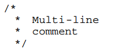

# 缩进和空白

* 关键字if、 while、 for与其后的控制表达式的左括号之间插入一个空格分隔，但括号内的表达式应紧贴括号。
* 双目运算符的两侧各插入一个空格分隔，单目运算符和操作数之间不加空格。
* 后缀运算符和操作数之间也不加空格，例如取结构体成员`s.a`、函数调用`foo(arg1)`、取数组成员`a[i]`。
* `,`号和`;`号之后要加空格，这是英文的书写习惯。
* 由于UNIX系统标准的字符终端是24行80列的，接近或大于80个字符的较长语句要折行写，折行后用空格和上面的表达式或参数对齐。
* 较长的字符串可以断成多个字符串然后分行书写。
* 要用缩进体现出语句块的层次关系，使用Tab字符缩进，不能用空格代替Tab。
* if/else、 while、 do/while、 for、 switch这些可以带语句块的语句，语句块的左括号是否另起一行，都可以，但一篇代码里要保持一致。
* 函数定义的`{`和`}`单独占一行，这一点和语句块的规定不同。
* 用于goto语句的自定义标号应该顶头写不缩进，而不管标号下的语句缩进到第几层。
* 代码中每个逻辑段落之间应该用一个空行分隔开。例如每个函数定义之间应该插入一个空行，头文件、全局变量定义和函数定义之间也应该插入空行。
* 一个函数的语句列表如果很长，也可以根据相关性分成若干组，用空行分隔。

# 注释

* 单行注释应采用`/* comment */`的形式，用空格把界定符和文字分开。
* 多行注释这样写：
* 注释的场合：
  * 整个源文件的顶部注释。说明此模块的相关信息，例如文件名、作者和版本历史等，顶头写不缩进。
  * 函数注释。说明此函数的功能、参数、返回值、错误码等，写在函数定义上侧，和此函数定义之间不留空行，顶头写不缩进。
  * 相对独立的语句组注释。对这一组语句做特别说明，写在语句组上侧，和此语句组之间不留空行，与当前语句组的缩进一致。
  * 代码行右侧的简短注释。对当前代码行做特别说明，一般为单行注释，和代码之间至少用一个空格隔开。
  * 复杂的结构体定义比函数更需要注释。
  * 复杂的宏定义和变量声明也需要注释。

# 标识符命名

* 标识符命名要清晰明了，可以使用完整的单词和易于理解的缩写。短的单词可以通过去元音形成缩写，较长的单词可以取单词的头几个字母形成缩写。
* 内核编码风格规定变量、函数和类型采用全小写加下划线的方式命名，常量（比如宏定义和枚举常量）采用全大写加下划线的方式命名软发明了一种变量命名法叫匈牙利命名法（Hungarian notation），在变量名中用前缀表示类型，例如iCnt（i表示int）、 pMsg（p表示pointer）、 lpszText（lpsz表示long pointer to azero-ended string）等。
* 全局变量和全局函数的命名一定要详细，不惜多用几个单词多写几个下划线。

# 函数

* 实现一个函数只是为了做好一件事情，不要把函数设计成用途广泛、面面俱到的，这样的函数肯定会超长，而且往往不可重用，维护困难。
* 函数内部的缩进层次不宜过多，一般以少于4层为宜。如果缩进层次太多就说明设计得太复杂了，应考虑分割成更小的函数（Helper Function） 来调用。
* 函数不要写得太长，建议在24行的标准终端上不超过两屏，太长会造成阅读困难，如果一个函数超过两屏就应该考虑分割函数了。 如果一个函数在概念上是简单的，只是长度很长，这倒没关系。例如函数由一个大的switch组成，其中有非常多的case，这是可以的，因为各case分支互不影响，整个函数的复杂度只等于其中一个case的复杂度，这种情况很常见，例如TCP协议的状态机实现。
* 执行函数就是执行一个动作，函数名通常应包含动词。
* 比较重要的函数定义上侧必须加注释，说明此函数的功能、参数、返回值、错误码等。
* 另一种度量函数复杂度的办法是看有多少个局部变量， 5到10个局部变量已经很多了，再多就很难维护了，应该考虑分割成多个函数。

# intent工具

用于格式化代码。

例：
```shell
indent -kr -i8 main.c
```

* `-kr`：使用K&R风格。
* `-i8`：缩进8个空格长度。

其它选项参看man page。
