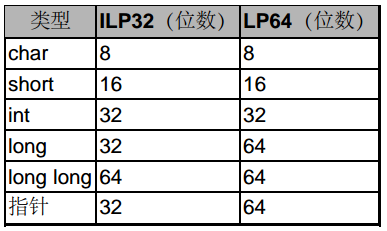
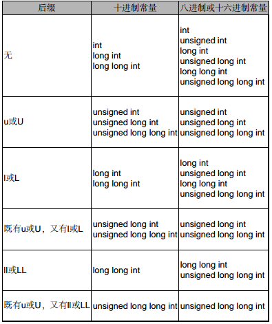
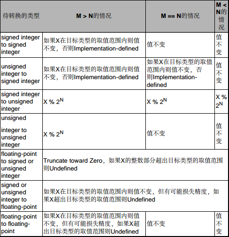

# 整型

包括char， short， int， long int，long long int（简写long long），signed/unsigned表示有符号数/无符号数。八进制数以0开头，十六进制以0x开头，常量结尾加u表示unsigned，L表示long。



指Intel x86/64平台，Linux，gcc编译器

## 后缀



# 浮点型

浮点型有float，double，long double。IEEE754标准，float 32位，double 64位，long double 平台差异较大。

# 类型转换

## Integer Promotion（整型提升）

在一个表达式中，凡是可以使用int或unsigned int类型做右值的地方也都可以使用有符号或无符号的char型、short型和Bit-field。如果原始类型的取值范围都能用int型表示，则其类型被提升为int，如果原始类型的取值范围用int型表示不了，则提升为unsigned int型，这称为IntegerPromotion。做Integer Promotion只影响上述几种类型的值，对其它类型无影响。C99规定IntegerPromotion适用于以下几种情况：

* 如果一个函数的形参类型未知，或者函数的参数列表中有...，那么调用函数时要对相应的实参做Integer Promotion。此外，相应的实参如果是float型的也要被提升为double型，这条规则称为Default Argument Promotion。
* 算术运算中的类型转换。有符号或无符号的char型、short型和Bit-field在做算术运算之前首先要做Integer Promotion，然后才能参与计算。例：

```c
unsigned char c1 = 255, c2 = 2;
int n = c1 + c2;
```

## Usual Arithmetic Conversion（常用算数转换）

1. 如果有一边的类型是long double，则把另一边也转成long double。
2. 否则，如果有一边的类型是double，则把另一边也转成double。
3. 否则，如果有一边的类型是float，则把另一边也转成float。
4. 否则，两边应该都是整型，首先按上一小节讲过的规则对a和b做Integer Promotion，然后如果类型仍不相同，则需要继续转换。首先我们规定char、short、int、long、long long的转换级别（ Integer Conversion Rank） 一个比一个高，同一类型的有符号和无符号数具有相同的Rank。转换规则如下：
    1. 如果两边都是有符号数，或者都是无符号数，那么较低Rank的类型转换成较高Rank的类型。例如unsigned int和unsigned long做算术运算时都转成unsigned long。
    2. 否则，如果一边是无符号数另一边是有符号数，无符号数的Rank不低于有符号数的Rank，则把有符号数转成另一边的无符号类型。例如unsigned long和int做算术运算时都转成unsigned long，unsigned long和long做算术运算时也都转成unsigned long。
    3. 剩下的情况是：一边有符号另一边无符号，并且无符号数的Rank低于有符号数的Rank。这时又分为两种情况，如果这个有符号数类型能够覆盖这个无符号数类型的取值范围，则把无符号数转成另一边的有符号类型。例如遵循LP64的平台上unsigned int和long在做算术运算时都转成long。
    4. 否则，也就是这个有符号数类型不足以覆盖这个无符号数类型的取值范围，则把两边都转成有符号数的Rank对应的无符号类型。例如在遵循ILP32的平台上unsigned int和long在做算术运算时都转成unsigned long。

## 赋值产生的类型转换

如果赋值或初始化时等号两边的类型不相同，则编译器会把等号右边的类型转换成等号左边的类型再做赋值。函数参数、返回值也是赋值的过程，也是同理的。

## 强制类型转换

例如计算表达式`(double)3 + i`，首先将整数3强制转换成double型（值为3.0），然后和整型变量i相加，这时适用Usual Arithmetic Conversion规则，首先把i也转成double型，然后两者相加，最后整个表达式也是double型的。

## 编译器处理类型转换

现在要把一个M位的类型（值为X）转换成一个N位的类型，所有可能的情况如下表所示。实际上下图中容易出错的做法很少出现，全部转换不需要记住，遇到bug能想到这方面现查即可。


