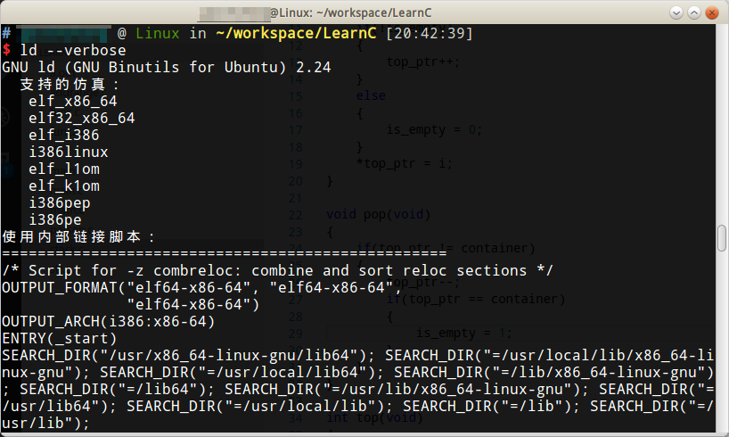

# 多目标文件链接

两个.c文件链接在一起：
```c
#直接编译链接
gcc main.c stack.c -o main

#分别编译连接
gcc -c main.c
gcc -c stack.c
gcc main.o stack.o -o main
```

链接的过程是由一个链接脚本（Linker Script） 控制的，链接脚本决定了给每个段分配什么地址，如何对齐，哪个段在前，哪个段在后，哪些段合并到同一个Segment，另外链接脚本还要插入一些符号到最终生成的文件中，例如`__bss_start`、`_edata`、`_end`等。如果用`ld`做链接时没有用`-T`选项指定链接脚本，则使用`ld`的默认链接脚本，默认链接脚本可以用`ld --verbose`命令查看：



# 定义和声明

stack.c
```c
int container[100];
int *top_ptr = container;
int is_empty = 1;

extern void push(int i);
extern void pop(void);
extern int top(void);

void push(int i)
{
    if(!is_empty)
    {
        top_ptr++;
    }
    else
    {
        is_empty = 0;
    }
    *top_ptr = i;
}

void pop(void)
{
    if(top_ptr != container)
    {
        top_ptr--;
        if(top_ptr == container)
        {
            is_empty = 1;
        }
    }
}

int top(void)
{
    return *top_ptr;
}
```

main.c
```c
#include <stdio.h>

int main(void)
{
    push(1);
    push(2);
    push(3);
    printf("%d\n", top());
    pop();
    printf("%d\n", top());
    pop();
    printf("%d\n", top());
    pop();
    return 0;
}
```

## extern和static的简单理解

extern关键字表示这个标识符具有External Linkage。  push这个标识符具有External Linkage指的是：如果把main.c和stack.c链接在一起，如果push在main.c和stack.c中都有声明（在stack.c中的声明同时也是定义），那么这些声明指的是同一个函数，链接之后是同一个GLOBAL符号，代表同一个地址。函数声明中的extern也可以省略不写，不写extern的函数声明也表示这个函数具有External Linkage。

如果用static关键字修饰一个函数或变量声明，则表示该标识符具有Internal Linkage，函数只在那个文件能多次声明，在另一个.c文件中声明编译器就认为这个函数不是原来那个函数了，变量也不能在原来文件的外部访问了。

注意，变量声明和函数声明有一点不同，函数声明的extern可写可不写，而变量声明如果不写extern意思就完全变了，如果变量在函数中，不写extern就表示在函数中定义一个局部变量。另外要注意，extern的变量声明不能加Initializer，否则编译器会报错。

实际上extern和static的规则更复杂一些，但这样简单理解不影响使用。

# 头文件

## 引入头文件<>和""区别

* `<>`表示：gcc先查`-I`指定的目录，再查系统头文件目录
* `""`表示：gcc先查包含头文件的`.c`文件所在的目录，然后查找`-I`指定的目录，再找系统头文件目录
* 头文件和`.c`源文件不在同一目录，也可以在编译时由`-I`参数指定给`gcc`
* include预处理指令也可以带有路径，如`#include "stack/stack.h"`

## 防止头文件重复包含

使用`#ifndef #define #endif`宏

```c
#ifndef STACK_H
#define STACK_H

extern void push(int i);
extern void pop(void);
extern int top(void);

#endif
```
