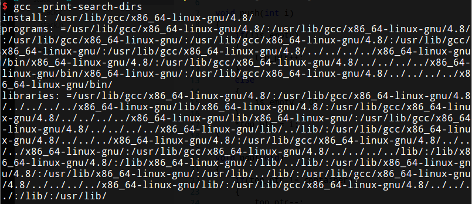
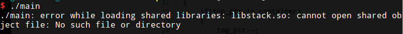
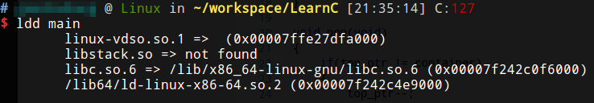
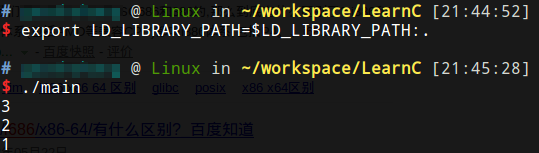
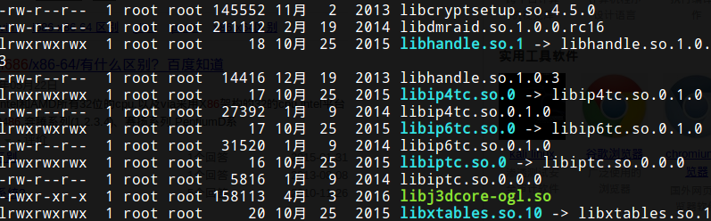

# 静态库

本节继续使用09的例子。


## 把stack.c打包成静态库

```shell
gcc -c stack.c #编译
ar rs libstack.a stack.o #打包
...省去目录操作步骤
gcc main.c -L. -lstack -Istack -o main #编译main.c和静态库链接到一起
```

注：库文件名都是以lib开头的，静态库以.a作为后缀，表示Archive。

### ar

* `-r`表示将后面的文件列表添加到文件包，如果文件包不存在就创建它，如果文件包中已有同名文件就替换成新的。
* `-s`是专用于生成静态库的，表示为静态库创建索引，这个索引被链接器使用。

### gcc

* `-c`：编译不链接。
* `-L`：告诉编译器去哪里找需要的库文件。即使库文件就在当前目录，编译器默认也不会去找的，所以-L.选项不能少。
* `-l`：-lstack告诉编译器要链接libstack库。
* `-I`：去哪里找头文件。

编译器默认会找的目录可以用`-print-search-dirs`选项查看：



## 链接静态库和共享库的区别

在链接libc共享库时只是指定了动态链接器和该程序所需要的库文件，并没有真的做链接，可执行文件main中调用的libc库函数仍然是未定义符号，要在运行时做动态链接。而在链接静态库时，链接器会把静态库中的目标文件取出来和可执行文件真正链接在一起。

# 共享库

编译共享库

```shell
gcc -c -fPIC stack.c
gcc -shared -o libstack.so stack.o
...省去目录操作步骤
gcc main.c -g -L. -lstack -Istack -o main
```

`-fPIC`：生成位置无关的代码（Position Independent Code）。正常编译，二进制代码的汇编地址是指定的，动态库需要动态加载，运行时内存地址应该根据程序上下文动态指定。

虽然编译通过，但是直接运行是找不到动态库的：



使用ldd指令（实际上是模拟运行）查看需要可执行程序的库：



`/lib64/ld-linux-x86-64.so.2`是动态链接器，它的路径是在编译链接时指定的，`libc.so.6`的路径是由动态链接器`ld-linux.so.2`在做动态链接时搜索到的，`linux-vdso.so.1`这个共享库其实并不存在于文件系统中，它是由内核虚拟出来的共享库，所以它没有对应的路径，它负责处理系统调用。

一种运行的方法



## 共享库的搜索路径

* 环境变量`LD_LIBRARY_PATH`
* 缓存文件`/etc/ld.so.cache`，这个缓存文件由ldconfig命令读取配置文件`/etc/ld.so.conf`之后生成
* 默认的系统路径，如`/usr/lib /lib`

## 共享库的命名

系统中的一些共享库：



真正的系统共享库包含符号链接，每个共享库有三个文件名：real name，soname和linker name。真正的库文件（而不是符号链接）的名字是real name，包含完整的共享库版本号。例如`libcap.so.1.10`、`libc-2.8.90.so`等。

### real name

真正的库文件（而不是符号链接）的名字是real name，包含完整的共享库版本号。例如`libcap.so.1.10`、`libc-2.8.90.so`等。

### so name

是一个符号链接的名字，只包含共享库的主版本号，主版本号一致即可保证库函数的接口一致，因此应用程序的`.dynamic`段只记录共享库的soname，只要soname一致，这个共享库就可以用。

例如`libcap.so.1`和`libcap.so.2`是两个主版本号不同的libcap，有些应用程序依赖于`libcap.so.1`，有些应用程序依赖于`libcap.so.2`，但对于依赖`libcap.so.1`的应用程序来说，真正的库文件不管是`libcap.so.1.10`还是`libcap.so.1.11`都可以用，所以使用共享库可以很方便地升级库文件而不需要重新编译应用程序，这是静态库所没有的优点。注意libc的版本编号有一点特殊，`libc-2.8.90.so`的主版本号是6而不是2或2.8。

### linker name

仅在编译链接时使用，gcc的`-L`选项应该指定linker name所在的目录。有的linkername是库文件的一个符号链接，有的linker name是一段链接脚本。

## 重新编译我们的共享库

```shell
gcc -c -fPIC stack.c
ln -s libstack.so.1.0 libstack.so #编译时使用的realname
gcc -shared -Wl,-soname,libstack.so.1 -o libstack.so.1.0 stack.o push.o pop.o is_empty.o
ln -s libstack.so.1.0 libstack.so.1 #执行时加载的soname
./main
```

* realname：`libstack.so.1.0` 包含完整版本号
* soname：`libstack.so.1` 只包含主版本号，编译共享库时指定
* linkername：`libstack.so` 编译器只认linkername，`libxxx.so`
