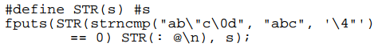
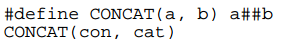
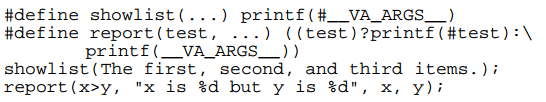
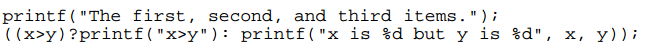
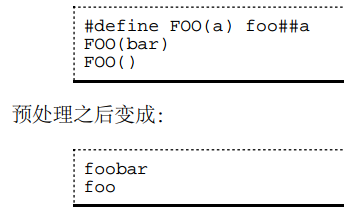

# 宏定义

## 变量式宏定义

例如#define N 20

## 函数式宏定义

例：
```c
#define MAX(a, b) ((a)>(b)?(a):(b))
k = MAX(i&0x0f, j&0x0f)

//展开是这样的：
k = ((i&0x0f)>(j&0x0f)?(i&0x0f):(j&0x0f))
```

宏函数和正常定义的函数区别：

* 函数式宏定义的参数没有类型，预处理器只负责做形式上的替换，而不做参数类型检查，所以传参时要格外小心。
* 调用真正函数的代码和调用函数式宏定义的代码编译生成的指令不同。如果MAX是个真正的函数，那么它的函数体`return a > b ? a : b;`要编译生成指令，代码中出现的每次调用也要编译生成传参指令和call指令。而如果MAX是个函数式宏定义，这个宏定义本身倒不必编译生成指令，但是代码中出现的每次调用编译生成的指令都相当于一个函数体，而不是简单的几条传参指令和call指令。所以，使用函数式宏定义编译生成的目标文件会比较大。
* 定义这种宏要格外小心，如果上面的定义写成`#define MAX(a, b) (a>b?a:b)`，省去内层括号，则宏展开就成了`k = (i&0x0f>j&0x0f?i&0x0f:j&0x0f)`，运算的优先级就错了。同样道理，这个宏定义的外层括号也是不能省的。
* 调用函数时先求实参表达式的值再传给形参，如果实参表达式有Side Effect，那么这些SideEffect只发生一次。例如`MAX(++a, ++b)`，如果MAX是个真正的函数， a和b只增加一次。但如果MAX是上面那样的宏定义，则要展开成`k = ((++a)>(++b)?(++a):(++b))`， a和b就不一定是增加一次还是两次了。
* 即使实参没有Side Effect，使用函数式宏定义也往往会导致较低的代码执行效率。
* 尽管函数式宏定义和真正的函数相比有很多缺点，但只要小心使用还是会显著提高代码的执行效率，毕竟省去了分配和释放栈帧、传参、传返回值等一系列工作，因此那些简短并且被频繁调用的函数经常用函数式宏定义来代替实现。例如C标准库的很多函数都提供两种实现，一种是真正的函数实现，一种是宏定义实现。

# 内联函数

inline修饰的函数。inline关键字告诉编译器，这个函数的调用要尽可能快，可以当普通的函数调用实现，也可以用宏展开的办法实现（效果就是没有函数调用过程）。

# `#`运算符、`##`运算符、可变参数

`#`用于定义宏定义字符串，后面跟形参。



预处理后：`fputs("strncmp(\"ab\\\"c\\0d\", \"abc\", '\\4\"') == 0" ": @\n", s);`

`##`运算符把前后两个预处理Token连接成一个预处理Token，和`#`运算符不同，`##`运算符不仅限于函数式宏定义，变量式宏定义也可以用。



预处理后：concat

我们知道printf函数带有可变参数，函数式宏定义也可以带可变参数，同样是在参数列表中用...表示可变参数。例如：



预处理后：



注：在宏定义中，可变参数的部分用`__VA_ARGS__`表示，实参中对应...的几个参数可以看成一个参数替换到宏定义中`__VA_ARGS__`所在的地方。

调用函数式宏定义允许传空参数，这一点和函数调用不同，例：



FOO在定义时带一个参数，在调用时必须传一个参数给它，如果不传参数则表示传了一个空参数。

# 条件预处理指令

```c
#ifndef HEADER_FILENAME
#define HEADER_FILENAME
/* body of header */
#endif

#if MACHINE == 68000
    int x;
#elif MACHINE == 8086
    long x;
#else /* all others */
    #error UNKNOWN TARGET MACHINE
#endif
```

* `#error UNKNOWN TARGETMACHINE`这段代码表示，编译器遇到这个预处理指示就报错退出，错误信息就是`UNKNOWN TARGET MACHINE`。

假设上述代码是用来识别处理器平台的，如果要为8086平台编译这段代码，在所有需要配置的源文件开头包含一个头文件，在头文件中定义`#define MACHINE 8086`，这样只需要改一个头文件就可以影响所有包含它的源文件。通常这个头文件由配置工具生成，比如在Linux内核源代码的目录下运行`make menuconfig`命令可以出来一个配置菜单，在其中配置的选项会自动转换成头文件`include/linux/autoconf.h`中的宏定义。

# 其它预处理特性

* `#pragma`预处理指示供编译器实现一些非标准的特性， C标准没有规定`#pragma`后面应该写什么以及起什么作用，由编译器自己规定。
* C标准规定了几个特殊的宏，在不同的地方使用可以自动展开成不同的值，常用的有`__FILE__`和`__LINE__`，`__FILE__`展开为当前源文件的文件名，是一个字符串，`__LINE__`展开为当前代码行的行号，是一个整数。这两个宏在源代码中不同的位置使用会自动取不同的值，显然不是用#define能定义得出来的，它们是编译器内建的特殊的宏。在打印调试信息时打印这两个宏可以给开发者非常有用的提示。
* C99引入一个特殊的标识符`__func__`支持这一功能。这个标识符应该是一个变量名而不是宏定义，不属于预处理的范畴，但它的作用和`__FILE__`、`__LINE__`类似，使用`printf("%s\n", __func__)`可以输出函数名。
