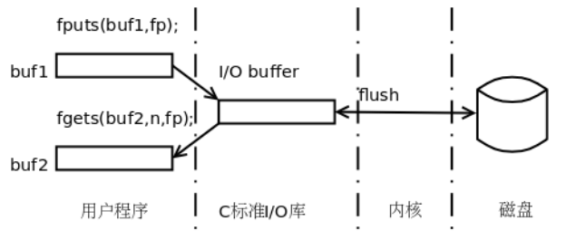

# 标准库

Linux平台提供的C标准库包括：

* 一组头文件，定义了很多类型和宏，声明了很多库函数。这些头文件放在哪些目录下取决于不同的编译器。
* 一组库文件，提供了库函数的实现。大多数库函数在libc共享库中，有些库函数在另外的共享库中，例如数学函数在libm中。

Man Page是很好的标准库手册，在开发时应该查阅Man Page。

## 字符串操作

### 初始化memset

```c
#include <string.h>
void *memset(void *s, int c, size_t n);
```

memset函数把s所指的内存地址开始的n个字节都填充为c的值。通常c取0，用于初始化一块内存。

### 字符串长度strlen

```c
#include <string.h>
size_t strlen(const char *s);
```

只能用于字符串，因为会寻找'\0'。

### 字符串拷贝strcpy strncpy memcpy memmove strdup

```c
#include <string.h>
char *strcpy(char *dest, const char *src);
char *strncpy(char *dest, const char *src, size_t n);
void *memcpy(void *dest, const void *src, size_t n);
void *memmove(void *dest, const void *src, size_t n);
```

* strcpy函数从src指向内存拷贝整个字符串到dest指向内存，字符串是用`'\0'`判断的。
* strncpy函数从src指向内存拷贝整个字符串到dest指向内存，字符串是用`'\0'`判断的，但至多只能拷贝n个字节，dest中内容可能不是以`'\0'`结尾的。
* memcpy函数从src所指的内存地址拷贝n个字节到dest所指的内存地址。
* memmove也是从src所指的内存地址拷贝n个字节到dest所指的内存地址，和memcpy有一点不同， memcpy的两个参数src和dest所指的内存区间如果重叠则无法保证正确拷贝，而memmove却可以正确拷贝。

```c
#include <string.h>
char *strdup(const char *s);
```

strdup非标准库，这个函数调用malloc动态分配内存，把字符串s拷贝到新分配的内存中然后返回。用这个函数省去了事先为新字符串分配内存的麻烦，但是用完之后要记得调用free释放新字符串的内存。

### 连接字符串 strcat strncat

```c
#include <string.h>
char *strcat(char *dest, const char *src);
char *strncat(char *dest, const char *src, size_t n);
```

* strcat和strcpy有同样的问题，调用者必须确保dest缓冲区足够大，否则会导致缓冲区溢出错误。
* strncat函数通过参数n指定一个长度，可以避免缓冲区溢出错误。注意这个参数n的含义和strncpy的参数n不同，它表示最多从src缓冲区中取n个字符（不包括结尾的`'\0'`）连接到dest后面。如果src中前n个字符没有出现`'\0'`，则取前n个字符再加一个`'\0'`连接到dest后面，所以strncat总是保证dest缓冲区以`'\0'`结尾。所以，提供给strncat函数的dest缓冲区的大小至少应该是strlen(dest)+n+1个字节，才能保证不溢出。

### 比较字符串strcmp strncmp memcmp

```c
#include <string.h>
int memcmp(const void *s1, const void *s2, size_t n);
int strcmp(const char *s1, const char *s2);
int strncmp(const char *s1, const char *s2, size_t n);
int strcasecmp(const char *s1, const char *s2);
int strncasecmp(const char *s1, const char *s2, size_t n);
/*返回值：负值表示s1小于s2， 0表示s1等于s2，正值表示s1大于s2*/
```

* memcmp从前到后逐个比较缓冲区s1和s2的前n个字节（不管里面有没有`'\0'`），如果s1和s2的前n个字节全都一样就返回0，如果遇到不一样的字节，s1的字节比s2小就返回负值，s1的字节比s2大就返回正值。
* strcmp把s1和s2当字符串比较，在其中一个字符串中遇到`'\0'`时结束，按照上面的比较准则，"ABC"比"abc"小，"ABCD"比"ABC"大，"123A9"比"123B2"小。
* strncmp的比较结束条件是：要么在其中一个字符串中遇到`'\0'`结束（类似于strcmp），要么比较完n个字符结束（类似于memcmp）。例如， `strncmp("ABCD", "ABC", 3)`的返回值是0，`strncmp("ABCD", "ABC", 4)`的返回值是正值。
* strcasecmp strncasecmp忽略大小写。

### 搜索字符串 strchr strrchr strstr

```c
#include <string.h>
char *strchr(const char *s, int c);
char *strrchr(const char *s, int c);
/*返回值：如果找到字符c，返回字符串s中指向字符c的指针，如果找不到就返回NULL*/

char *strstr(const char *haystack, const char *needle);
/*返回值：如果找到子串，返回值指向子串的开头，如果找不到就返回NULL*/
```

* strchr在字符串s中从前到后查找字符c，找到字符c第一次出现的位置时就返回，返回值指向这个位置，如果找不到字符c就返回NULL。
* strrchr和strchr类似，但是从右向左找字符c，找到字符c第一次出现的位置就返回，函数名中间多了一个字母r可以理解为Reverse。
* strstr在一个长字符串中从前到后找一个子串（Substring），找到子串第一次出现的位置就返回，返回值指向子串的开头，如果找不到就返回NULL。

### 分割字符串strtok strtok_r

```c
#include <string.h>
char *strtok(char *str, const char *delim);
char *strtok_r(char *str, const char *delim, char **saveptr);
/*返回值：返回指向下一个Token的指针，如果没有下一个Token了就返回NULL*/
```

参数str是待分割的字符串， delim是分隔符，可以指定一个或多个分隔符， strtok遇到其中任何一个分隔符就会分割字符串。

使用示例
```c
#include <stdio.h>
#include <string.h>
int main(void)
{
    char str[] = "root:x::0:root:/root:/bin/bash:";
    char *token;
    token = strtok(str, ":");
    printf("%s\n", token);
    while ( (token = strtok(NULL, ":")) != NULL)
        printf("%s\n", token);
    return 0;
}
```

* 这两个函数要改写字符串以达到分割的效果，不能用于常量字符串
* 做了分割之后，字符串中的分隔符就被`'\0'`覆盖了
* strtok函数使用了静态变量，它不是线程安全的，必要时应该用可重入的strtok_r函数

## IO操作

### 打开/关闭文件fopen fclose

```c
#include <stdio.h>
FILE *fopen(const char *path, const char *mode);
/*返回值：成功返回文件指针，出错返回NULL并设置errno*/
```

在操作文件之前要用fopen打开文件，操作完毕要用fclose关闭文件。打开文件就是在操作系统中分配资源用于保存该文件的状态信息，并得到该文件的标识，用户程序就可以用这个标识对文件做各种操作，关闭文件则释放文件在操作系统中占用的资源，使文件的标识失效。

打开模式：

* r：只读
* w：只写，如果文件不存在则创建，覆盖写
* a：只写，如果文件不存在则创建，追加写
* r+：允许读写，文件必须已经存在
* w+：允许读和写，如果文件不存在则创建，如果文件已存在覆盖写
* a+：允许读和追加数据，如果文件不存在则创建

注意errno的处理

```c
if ( (fp = fopen("/tmp/file1", "r")) == NULL)
{
    printf("error open file /tmp/file1!\n");
    exit(1);
}
```

Unix中流，设备等都是文件，标准输入/输出/错误流也能通过IO函数读写，读写前不需要重复打开。

### 以字节为单位IO fgetc getchar fputc putchar

```c
#include <stdio.h>
int fgetc(FILE *stream);
int getchar(void);
/*返回值：成功返回读到的字节，出错或者读到文件末尾时返回EOF即-1*/
int fputc(int c, FILE *stream);
int putchar(int c);
/*返回值：成功返回写入的字节，出错返回EOF*/
```

* getchar是从stdin读入，相当于fgetc(stdin)，putchar同理。
* 系统对于每个打开的文件都记录着当前读写位置在文件中的地址（或者说距离文件开头的字节数），也叫偏移量（Offset）。当文件打开时，读写位置是0，每调用一次fgetc，读写位置向后移动一个字节，因此可以连续多次调用fgetc函数依次读取多个字节。

### 操作读写位置fseek ftell rewind

```c
#include <stdio.h>
int fseek(FILE *stream, long offset, int whence);
/*返回值：成功返回0，出错返回-1并设置errno*/

long ftell(FILE *stream);
/*返回值：成功返回当前读写位置，出错返回-1并设置errno*/

void rewind(FILE *stream);
```

* fseek的whence和offset参数共同决定了读写位置移动到何处， whence参数的含义如下：
  * SEEK_SET 从文件开头移动offset个字节
  * SEEK_CUR 从当前位置移动offset个字节
  * SEEK_END 从文件末尾移动offset个字节
* offset可正可负

### 以字符串为单位IO fgets

fgets从指定的文件中读一行字符到调用者提供的缓冲区中， gets从标准输入读一行字符到调用者提供的缓冲区中。

```c
#include <stdio.h>
char *fgets(char *s, int size, FILE *stream);
char *gets(char *s); //不应该使用这个函数，容易缓冲区溢出
/*返回值：成功时s指向哪返回的指针就指向哪，出错或者读到文件末尾时返回NULL*/
```

* fgets函数，参数s是缓冲区的首地址， size是缓冲区的长度，该函数从stream所指的文件中读取以`'\n'`结尾的一行（包括`'\n'`在内）存到缓冲区s中，并且在该行末尾添加一个`'\0'`组成完整的字符串。如果文件中的一行太长， fgets从文件中读了size-1个字符还没有读到`'\n'`，就把已经读到的size-1个字符和一个`'\0'`字符存入缓冲区，文件中剩下的半行可以在下次调用fgets时继续读。
* fget只适合读取文本，不适合二进制文件，因为如果读入`'\0'`会造成混乱。

### 以记录为单位IO fread fwrite

```c
#include <stdio.h>
size_t fread(void *ptr, size_t size, size_t nmemb, FILE *stream);
size_t fwrite(const void *ptr, size_t size, size_t nmemb, FILE *stream);
/*返回值：读或写的记录数，成功时返回的记录数等于nmemb，出错或读到文件末尾时返回的记录数小于nmemb，也可能返回0*/
```

* fread和fwrite用于读写记录，这里的记录是指一串固定长度的字节，比如一个int、一个结构体或者一个定长数组。参数size指出一条记录的长度，而nmemb指出要读或写多少条记录，这些记录在ptr所指的内存空间中连续存放，共占size * nmemb个字节。
* fwrite把ptr中的size * nmemb个字节写到文件stream中。
* nmemb是请求读或写的记录数， fread和fwrite返回的记录数有可能小于nmemb指定的记录数。例如当前读写位置距文件末尾只有一条记录的长度，调用fread时指定nmemb为2，则返回值为1。如果当前读写位置已经在文件末尾了，或者读文件时出错了，则fread返回0。如果写文件时出错了，则fwrite的返回值小于nmemb指定的值。

读写结构体实例
```c
/* writerec.c */
#include <stdio.h>
#include <stdlib.h>
struct record
{
    char name[10];
    int age;
};
int main(void)
{
    struct record array[2] = {{"Ken", 24}, {"Knuth", 28}};
    FILE *fp = fopen("recfile", "w");
    if (fp == NULL)
    {
        perror("Open file recfile");
        exit(1);
    }
    fwrite(array, sizeof(struct record), 2, fp);
    fclose(fp);
    return 0;
}

/* readrec.c */
#include <stdio.h>
#include <stdlib.h>
struct record
{
    char name[10];
    int age;
};
int main(void)
{
    struct record array[2];
    FILE *fp = fopen("recfile", "r");
    if (fp == NULL)
    {
        perror("Open file recfile");
        exit(1);
    }
    fread(array, sizeof(struct record), 2, fp);
    printf("Name1: %s\tAge1: %d\n", array[0].name, array[0].age);
    printf("Name2: %s\tAge2: %d\n", array[1].name, array[1].age);
    fclose(fp);
    return 0;
}
```

### 格式化IO printf scanf

```c
#include <stdio.h>
int printf(const char *format, ...);
int fprintf(FILE *stream, const char *format, ...);
int sprintf(char *str, const char *format, ...);
int snprintf(char *str, size_t size, const char *format, ...);

#include <stdarg.h>
int vprintf(const char *format, va_list ap);
int vfprintf(FILE *stream, const char *format, va_list ap);
int vsprintf(char *str, const char *format, va_list ap);
int vsnprintf(char *str, size_t size, const char *format, va_list ap);
/*返回值：成功返回格式化输出的字节数（不包括字符串的结尾'\0'），出错返回一个负值*/

#include <stdio.h>
int scanf(const char *format, ...);
int fscanf(FILE *stream, const char *format, ...);
int sscanf(const char *str, const char *format, ...);

#include <stdarg.h>
int vscanf(const char *format, va_list ap);
int vsscanf(const char *str, const char *format, va_list ap);
int vfscanf(FILE *stream, const char *format, va_list ap);
/*返回值：返回成功匹配和赋值的参数个数，成功匹配的参数可能少于所提供的赋值参数，返回0表示一个都不匹配，出错或者读到文件字符串末尾时返回EOF并设置errno*/
```

函数名v表示可变参数是用va_list传递的。

### IO缓冲区

用户程序调用C标准I/O库函数读写文件或设备，而这些库函数要通过系统调用把读写请求传给内核（以后我们会看到与I/O相关的系统调用），最终由内核驱动磁盘或设备完成I/O操作。 C标准库为每个打开的文件分配一个I/O缓冲区以加速读写操作。



如果用户程序不想完全依赖于自动的Flush操作，可以调fflush函数手动做Flush操作。

## errno和perror函数

### 处理errno perror

很多系统函数在错误返回时将错误原因记录在libc定义的全局变量errno中，每种错误原因对应一个错误码，请查阅errno(3)的Man Page了解。各种错误码， errno在头文件errno.h中声明，是一个整型变量，所有错误码都是正整数。如果在程序中打印错误信息时直接打印errno变量，打印出来的只是一个整数值，仍然看不出是什么错误。比较好的办法是用perror或strerror函数将errno解释成字符串再打印。

```c
#include <stdio.h>
void perror(const char *s);
```

perror函数将错误信息打印到标准错误输出，首先打印参数s所指的字符串，然后打印:号，然后根据当前errno的值打印错误原因。

例子
```c
#include <stdio.h>
#include <stdlib.h>
int main(void)
{
    FILE *fp = fopen("abcde", "r");
    if (fp == NULL)
    {
        perror("Open file abcde");
        exit(1);
    }
    return 0;
}
```

### 打印errno对应字符串 strerror

```c
#include <string.h>
char *strerror(int errnum);
/*返回值：错误码errnum所对应的字符串*/
```

这个函数返回指向静态内存的指针。有些函数的错误码并不保存在errno中，而是通过返回值返回，就不能调用perror打印错误原因了，这时strerror就派上了用场。

## 数值字符串转换函数

```c
#include <stdlib.h>
int atoi(const char *nptr);
double atof(const char *nptr);
/*返回值：转换结果*/
```

例：atoi("123abc")会转换成123

```c
#include <stdlib.h>
long int strtol(const char *nptr, char **endptr, int base);
double strtod(const char *nptr, char **endptr);
/*返回值：转换结果，出错时设置errno*/
```

## 内存分配

```c
#include <stdlib.h>
void *calloc(size_t nmemb, size_t size);
void *realloc(void *ptr, size_t size);
void *malloc(size_t size);
/*返回值：成功返回所分配内存空间的首地址，出错返回NULL*/

void *alloca(size_t size);
/*返回值：返回所分配内存空间的首地址，如果size太大导致栈空间耗尽，结果是未定义的*/

void free(void *ptr);
```

* realloc：重新分配内存
* alloca：分配栈上空间
