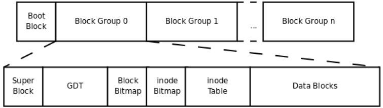
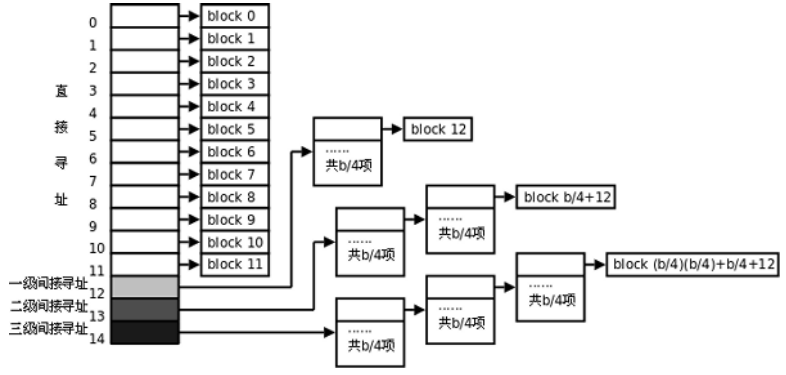
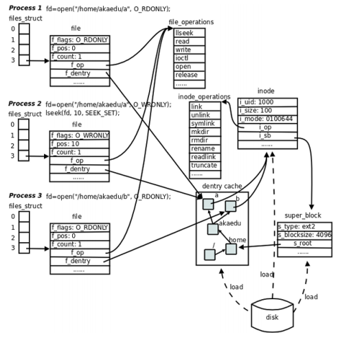

# Linux文件系统

现在Linux最广泛使用的是ext4文件系统，书中介绍的是ext2，基本是兼容的。除此之外，Linux还有大量其他文件系统。

# ext2

## 总体存储布局



文件系统中存储的最小单位是块（ Block） ，一个块究竟多大是在格式化时确定的，例如mke2fs的-b选项可以设定块大小为1024、 2048或4096字节。而上图中启动块（ Boot Block） 的大小是确定的，就是1KB，启动块是由PC标准规定的，用来存储磁盘分区信息和启动信息，任何文件系统都不能使用启动块。启动块之后才是ext2文件系统的开始， ext2文件系统将整个分区划成若干个同样大小的块组（ Block Group） ，每个块组都由以下部分组成：

* 超级块（ Super Block）描述整个分区的文件系统信息，例如块大小、文件系统版本号、上次mount的时间等等。超级块在每个块组的开头都有一份拷贝。
* 块组描述符表（ GDT， Group Descriptor Table）由很多块组描述符组成，整个分区分成多少个块组就对应有多少个块组描述符。每个块组描述符（ Group Descriptor） 存储一个块组的描述信息，例如在这个块组中从哪里开始是inode表，从哪里开始是数据块，空闲的inode和数据块还有多少个等等。和超级块类似，块组描述符表在每个块组的开头也都有一份拷贝，这些信息是非常重要的，一旦超级块意外损坏就会丢失整个分区的数据，一旦块组描述符意外损坏就会丢失整个块组的数据，因此它们都有多份拷贝。
* 块位图（ Block Bitmap）一个块组中的块是这样利用的：数据块存储所有文件的数据，比如某个分区的块大小是1024字节，某个文件是2049字节，那么就需要三个数据块来存，即使第三个块只存了一个字节也需要占用一个整块；超级块、块组描述符表、块位图、 inode位图、 inode表这几部分存储该块组的描述信息。那么如何知道哪些块已经用来存储文件数据或其它描述信息，哪些块仍然空闲可用呢？块位图就是用来描述整个块组中哪些块已用哪些块空闲的，它本身占一个块，其中的每个bit代表本块组中的一个块，这个bit为1表示该块已用，这个bit为0表示该块空闲可用。
* inode位图（ inode Bitmap）和块位图类似，本身占一个块，其中每个bit表示一个inode是否空闲可用。
* inode表（ inode Table）我们知道，一个文件除了数据需要存储之外，一些描述信息也需要存储，例如文件类型（常规、目录、符号链接等），权限，文件大小，创建/修改/访问时间等，也就是ls -l命令看到的那些信息，这些信息存在inode中而不是数据块中。每个文件都有一个inode，一个块组中的所有inode组成了inode表。
* 数据块（ Data Block）
  * 对于常规文件，文件的数据存储在数据块中。
  * 对于目录，该目录下的所有文件名和目录名存储在数据块中，注意文件名保存在它所在目录的数据块中，除文件名之外， ls -l命令看到的其它信息都保存在该文件的inode中。注意这个概念：目录也是一种文件，是一种特殊类型的文件。
  * 对于符号链接，如果目标路径名较短则直接保存在inode中以便更快地查找，如果目标路径名较长则分配一个数据块来保存。
  * 设备文件、 FIFO和socket等特殊文件没有数据块，设备文件的主设备号和次设备号保存在inode中。

## 数据块寻址

如果一个文件有多个数据块，这些数据块很可能不是连续存放的，应该如何寻址到每个块呢？根据上面的分析，根目录的数据块是通过其inode中的索引项Blocks[0]找到的，事实上，这样的索引项一共有15个，从Blocks[0]到Blocks[14]，每个索引项占4字节。前12个索引项都表示块编号，例如上面的例子中Blocks[0]字段保存着24，就表示第24个块是该文件的数据块，如果块大小是1KB，这样可以表示从0字节到12KB的文件。如果剩下的三个索引项Blocks[12]到Blocks[14]也是这么用的，就只能表示最大15KB的文件了，这是远远不够的，事实上，剩下的三个索引项都是间接索引。



注：实际上，磁盘中的inode和数据块往往已经被内核缓存了，读大文件的效率也不会太低。

## 文件和目录操作的系统函数

常用的文件操作命令如ls、 cp、 mv等也是基于这些函数实现的。

### stat fstat lstat

```c
#include <sys/types.h>
#include <sys/stat.h>
#include <unistd.h>

int stat(const char *path, struct stat *buf);
int fstat(int fd, struct stat *buf);
int lstat(const char *path, struct stat *buf);
```

stat(2)函数读取文件的inode，然后把inode中的各种文件属性填入一个struct stat结构体传出给调用者。 stat(1)命令是基于stat函数实现的。 stat需要根据传入的文件路径找到inode，假设一个路径是/opt/file，则查找的顺序是：

* 出inode表中第2项，也就是根目录的inode，从中找出根目录数据块的位置
* 从根目录的数据块中找出文件名为opt的记录，从记录中读出它的inode号
* 读出opt目录的inode，从中找出它的数据块的位置
* 从opt目录的数据块中找出文件名为file的记录，从记录中读出它的inode号
* 读出file文件的inode

还有另外两个类似stat的函数： fstat(2)函数传入一个已打开的文件描述符，传出inode信息， lstat(2)函数也是传入路径传出inode信息，但是和stat函数有一点不同，当文件是一个符号链接时， stat(2)函数传出的是它所指向的目标文件的inode，而lstat函数传出的就是符号链接文件本身的inode。

### access

```c
#include <unistd.h>
int access(const char *pathname, int mode);
```

access(2)函数检查执行当前进程的用户是否有权限访问某个文件，传入文件路径和要执行的访问操作（读/写/执行）， access函数取出文件inode中的st_mode字段，比较一下访问权限，然后返回0表示允许访问，返回-1表示错误或不允许访问。

### chmod fchmod

```c
#include <sys/stat.h>

int chmod(const char *path, mode_t mode);
int fchmod(int fd, mode_t mode);
```

chmod(2)和fchmod(2)函数改变文件的访问权限，也就是修改inode中的st_mode字段。这两个函数的区别类似于stat/fstat。 chmod(1)命令是基于chmod函数实现的。

### chown fchown lchown

```c
#include <unistd.h>
int chown(const char *path, uid_t owner, gid_t group);
int fchown(int fd, uid_t owner, gid_t group);
int lchown(const char *path, uid_t owner, gid_t group);
```

chown(2)/fchown(2)/lchown(2)改变文件的所有者和组，也就是修改inode中的User和Group字段，只有超级用户才能正确调用这几个函数，这几个函数之间的区别类似于stat/fstat/lstat。 chown(1)命令是基于chown函数实现的。

### utime

```c
#include <sys/types.h>
#include <utime.h>
int utime(const char *filename, const struct utimbuf *times);
```

utime(2)函数改变文件的访问时间和修改时间，也就是修改inode中的atime和mtime字段。 touch(1)命令是基于utime函数实现的。

### truncate ftruncate

```c
#include <unistd.h>
#include <sys/types.h>
int truncate(const char *path, off_t length);
int ftruncate(int fd, off_t length);
```

truncate(2)和ftruncate(2)函数把文件截断到某个长度，如果新的长度比原来的长度短，则后面的数据被截掉了，如果新的长度比原来的长度长，则后面多出来的部分用0填充，这需要修改inode中的Blocks索引项以及块位图中相应的bit。这两个函数的区别类似于stat/fstat。

### link symlink

```c
#include <unistd.h>
int link(const char *oldpath, const char *newpath);
int symlink(const char *oldpath, const char *newpath);
```

link(2)函数创建硬链接，其原理是在目录的数据块中添加一条新记录，其中的inode号字段和原文件相同。 symlink(2)函数创建一个符号链接，这需要创建一个新的inode，其中st_mode字段的文件类型是符号链接，原文件的路径保存在inode中或者分配一个数据块来保存。 ln(1)命令是基于link和symlink函数实现的。

### unlink

```c
#include <unistd.h>
int unlink(const char *pathname);
```

unlink(2)函数删除一个链接。如果是符号链接则释放这个符号链接的inode和数据块，清除inode位图和块位图中相应的位。如果是硬链接则从目录的数据块中清除一条文件名记录，如果当前文件的硬链接数已经是1了还要删除它，就同时释放它的inode和数据块，清除inode位图和块位图中相应的位，这样就真的删除文件了。unlink(1)命令和rm(1)命令是基于unlink函数实现的。

### rename

```c
#include <stdio.h>
int rename(const char *oldpath, const char *newpath);
```

rename(2)函数改变文件名，需要修改目录数据块中的文件名记录，如果原文件名和新文件名不在一个目录下则需要从原目录数据块中清除一条记录然后添加到新目录的数据块中。mv(1)命令是基于rename函数实现的，因此在同一分区的不同目录中移动文件并不需要复制和删除文件的inode和数据块，只需要一个改名操作，即使要移动整个目录，这个目录下有很多子目录和文件也要随着一起移动，移动操作也只是对顶级目录的改名操作，很快就能完成。但是，如果在不同的分区之间移动文件就必须复制和删除inode和数据块，如果要移动整个目录，所有子目录和文件都要复制删除，这就很慢了。

### readlink

```c
#include <unistd.h>
ssize_t readlink(const char *path, char *buf, size_t bufsiz);
```

readlink(2)函数读取一个符号链接所指向的目标路径，其原理是从符号链接的inode或数据块中读出保存的数据，这就是目标路径。

### mkdir

```c
#include <sys/stat.h>
#include <sys/types.h>
int mkdir(const char *pathname, mode_t mode);
```

mkdir(2)函数创建新的目录，要做的操作是在它的父目录数据块中添加一条记录，然后分配新的inode和数据块， inode的st_mode字段的文件类型是目录，在数据块中填两个记录，分别是.和..，由于..表示父目录，因此父目录的硬链接数要加1。 mkdir(1)命令是基于mkdir函数实现的。

### rmdir

```c
#include <unistd.h>
int rmdir(const char *pathname);
```

rmdir(2)函数删除一个目录，这个目录必须是空的（只包含.和..）才能删除，要做的操作是释放它的inode和数据块，清除inode位图和块位图中相应的位，清除父目录数据块中的记录，父目录的硬链接数要减1。 rmdir(1)命令是基于rmdir函数实现的。

### opendir readdir closedir

```c
#include <dirent.h>
struct dirent *readdir(DIR *dirp);

#include <sys/types.h>
#include <dirent.h>
DIR *opendir(const char *name);
DIR *fdopendir(int fd);

#include <sys/types.h>
#include <dirent.h>
int closedir(DIR *dirp);
```

opendir(3)/readdir(3)/closedir(3)用于遍历目录数据块中的记录。 opendir打开一个目录，返回一个DIR `*`指针代表这个目录，它是一个类似`FILE *`指针的句柄， closedir用于关闭这个句柄，把`DIR*`指针传给readdir读取目录数据块中的记录，每次返回一个指向`struct dirent`的指针，反复读就可以遍历所有记录，所有记录遍历完之后readdir返回NULL。结构体`struct dirent`的定义如下：

```c
struct dirent
{
    ino_t d_ino; /* inode number */
    off_t d_off; /* offset to the next dirent */
    unsigned short d_reclen; /* length of this record */
    unsigned char d_type; /* type of file */
    char d_name[256]; /* filename */
};
```

# VFS

Linux内核在各种不同的文件系统格式之上做了一个抽象层，使得文件、目录、读写访问等概念成为抽象层的概念，因此各种文件系统看起来用起来都一样，这个抽象层称为虚拟文件系统（ VFS， Virtual Filesystem） 。

Linux内核的VFS子系统可以图示如下：



file、 dentry、 inode、 super_block这几个结构体组成了VFS的核心概念。对于ext2文件系统来说，在磁盘存储布局上也有inode和超级块的概念，所以很容易和VFS中的概念建立对应关系。而另外一些文件系统格式来自非UNIX系统（例如Windows的FAT32、 NTFS），可能没有inode或超级块这样的概念，但为了能mount到Linux系统，也只好在驱动程序中硬凑一下，在Linux下看FAT32和NTFS分区会发现权限位是错的，所有文件都是rwxrwxrwx，因为它们本来就没有inode和权限位的概念，这是硬凑出来的。

* 在file结构体中维护File Status Flag（ file结构体的成员f_flags）和当前读写位置（ file结构体的成员f_pos）。在上图中，进程1和进程2都打开同一文件，但是对应不同的file结构体，因此可以有不同的File Status Flag和读写位置。 file结构体中比较重要的成员还有f_count，表示引用计数（ Reference Count） ，后面我们会讲到， dup、 fork等系统调用会导致多个文件描述符指向同一个file结构体，例如有fd1和fd2都引用同一个file结构体，那么它的引用计数就是2，当close(fd1)时并不会释放file结构体，而只是把引用计数减到1，如果再close(fd2)，引用计数就会减到0同时释放file结构体，这才真的关闭了文件。

* 每个file结构体都指向一个file_operations结构体，这个结构体的成员都是函数指针，指向实现各种文件操作的内核函数。比如在用户程序中read一个文件描述符， read通过系统调用进入内核，然后找到这个文件描述符所指向的file结构体，找到file结构体所指向的file_operations结构体，调用它的read成员所指向的内核函数以完成用户请求。在用户程序中调用lseek、 read、 write、 ioctl、 open等函数，最终都由内核调用file_operations的各成员所指向的内核函数完成用户请求。 file_operations结构体中的release成员用于完成用户程序的close请求，之所以叫release而不叫close是因为它不一定真的关闭文件，而是减少引用计数，只有引用计数减到0才关闭文件。对于同一个文件系统上打开的常规文件来说， read、 write等文件操作的步骤和方法应该是一样的，调用的函数应该是相同的，所以图中的三个打开文件的file结构体指向同一个file_operations结构体。如果打开一个字符设备文件，那么它的read、 write操作肯定和常规文件不一样，不是读写磁盘的数据块而是读写硬件设备，所以file结构体应该指向不同的file_operations结构体，其中的各种文件操作函数由该设备的驱动程序实现。

* 每个file结构体都有一个指向dentry结构体的指针， “dentry”是directory entry（目录项）的缩写。我们传给open、 stat等函数的参数的是一个路径，例如/home/akaedu/a，需要根据路径找到文件的inode。为了减少读盘次数，内核缓存了目录的树状结构，称为dentry cache，其中每个节点是一个dentry结构体，只要沿着路径各部分的dentry搜索即可，从根目录/找到home目录，然后找到akaedu目录，然后找到文件a。 dentry cache只保存最近访问过的目录项，如果要找的目录项在cache中没有，就要从磁盘读到内存中。

* 每个dentry结构体都有一个指针指向inode结构体。 inode结构体保存着从磁盘inode读上来的信息。在上图的例子中，有两个dentry，分别表示/home/akaedu/a和/home/akaedu/b，它们都指向同一个inode，说明这两个文件互为硬链接。 inode结构体中保存着从磁盘分区的inode读上来信息，例如所有者、文件大小、文件类型和权限位等。每个inode结构体都有一个指向inode_operations结构体的指针，后者也是一组函数指针指向一些完成文件目录操作的内核函数。和file_operations不同， inode_operations所指向的不是针对某一个文件进行操作的函数，而是影响文件和目录布局的函数，例如添加删除文件和目录、跟踪符号链接等等，属于同一文件系统的各inode结构体可以指向同一个inode_operations结构体。

* inode结构体有一个指向super_block结构体的指针。 super_block结构体保存着从磁盘分区的超级块读上来的信息，例如文件系统类型、块大小等。 super_block结构体的s_root成员是一个指向dentry的指针，表示这个文件系统的根目录被mount到哪里，在上图的例子中这个分区被mount到/home目录下。

## dup dup2

dup和dup2都可用来复制一个现存的文件描述符，使两个文件描述符指向同一个file结构体。如果两个文件描述符指向同一个file结构体， File Status Flag和读写位置只保存一份在file结构体中，并且file结构体的引用计数是2。如果两次open同一文件得到两个文件描述符，则每个描述符对应一个不同的file结构体，可以有不同的File Status Flag和读写位置。请注意区分这两种情况。

```c
#include <unistd.h>
int dup(int oldfd);
int dup2(int oldfd, int newfd);
/*如果调用成功，这两个函数都返回新分配或指定的文件描述符，如果出错则返回-1*/
```
