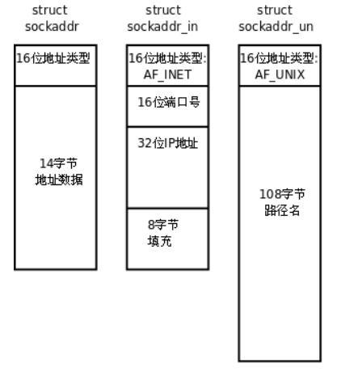
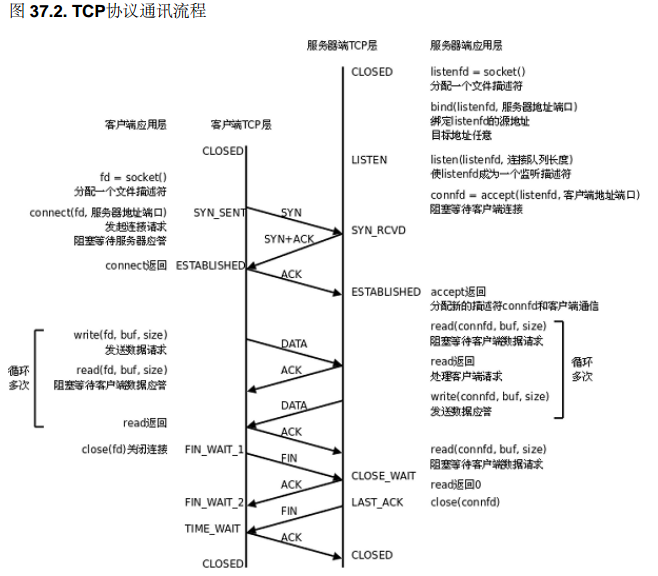
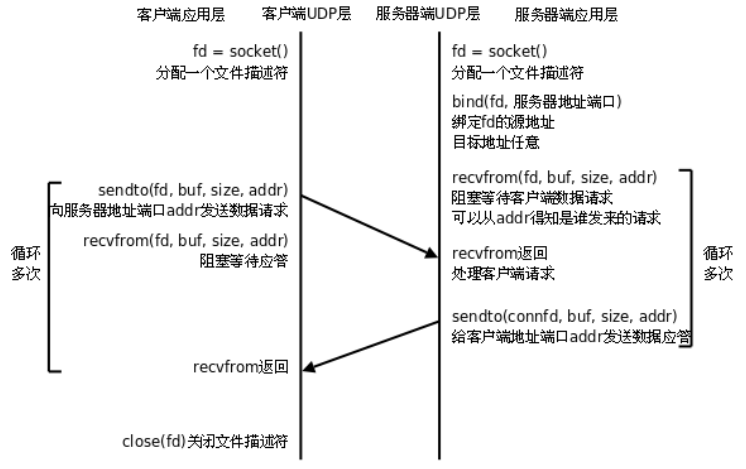

# 网络字节序

内存中的多字节数据相对于内存地址有大端和小端之分，磁盘文件中的多字节数据相对于文件中的偏移地址也有大端小端之分。网络数据流同样有大端小端之分，发送主机通常将发送缓冲区中的数据按内存地址从低到高的顺序发出，接收主机把从网络上接到的字节依次保存在接收缓冲区中，也是按内存地址从低到高的顺序保存，因此，网络数据流的地址应这样规定：先发出的数据是低地址，后发出的数据是高地址。

TCP/IP协议规定，网络数据流应采用大端字节序，即低地址高字节。为使网络程序具有可移植性，使同样的C代码在大端和小端计算机上编译后都能正常运行，可以调用以下库函数做网络字节序和主机字节序的转换。

```c
#include <arpa/inet.h>
uint32_t htonl(uint32_t hostlong);
uint16_t htons(uint16_t hostshort);
uint32_t ntohl(uint32_t netlong);
uint16_t ntohs(uint16_t netshort);
```

h表示host， n表示network， l表示32位长整数， s表示16位短整数。例如htonl表示将32位的长整数从主机字节序转换为网络字节序，例如将IP地址转换后准备发送。如果主机是小端字节序，这些函数将参数做相应的大小端转换然后返回，如果主机是大端字节序，这些函数不做转换，将参数原封不动地返回。

## socket地址数据类型及相关函数



IPv4和IPv6的地址格式定义在netinet/in.h中， IPv4地址用sockaddr_in结构体表示，包括16位端口号和32位IP地址，UNIX Domain Socket的地址格式定义在sys/un.h中，用sockaddr_un结构体表示。IPv4、 IPv6和UNIX Domain Socket的地址类型分别定义为常数AF_INET、 AF_INET6、 AF_UNIX。这样，只要取得某种sockaddr结构体的首地址，不需要知道具体是哪种类型的sockaddr结构体，就可以根据地址类型字段确定结构体中的内容（但是需要强制转换一下）。

```c
struct sockaddr_in servaddr;
/* initialize servaddr */
bind(listen_fd, (struct sockaddr *)&servaddr, sizeof(servaddr));
```

本节只介绍基于IPv4的socket网络编程， sockaddr_in中的成员struct sin_addr表示32位的IP地址。但是我们通常用点分十进制的字符串表示IP地址，以下函数可以在字符串表示和in_addr表示之间转换。

```c
#include <arpa/inet.h>
int inet_aton(const char *strptr, struct in_addr *addrptr);
in_addr_t inet_addr(const char *strptr);
int inet_pton(int family, const char *strptr, void *addrptr);

char *inet_ntoa(struct in_addr inaddr);
const char *inet_ntop(int family, const void *addrptr, char *strptr, size_t len);
```

# 基于TCP协议的网络程序



服务器调用socket()、 bind()、 listen()完成初始化后，调用accept()阻塞等待，处于监听端口的状态，客户端调用socket()初始化后，调用connect()发出SYN段并阻塞等待服务器应答，服务器应答一个SYN-ACK段，客户端收到后从connect()返回，同时应答一个ACK段，服务器收到后从accept()返回。

## 一个tcp网络程序例子

实例：从client读字符，转换为大写返回

server
```c
/* server.c */
#include <stdio.h>
#include <stdlib.h>
#include <string.h>
#include <unistd.h>
#include <sys/socket.h>
#include <netinet/in.h>
#define MAXLINE 80
#define SERV_PORT 8000
int main(void)
{
    struct sockaddr_in servaddr, cliaddr;
    socklen_t cliaddr_len;
    int listenfd, connfd;
    char buf[MAXLINE];
    char str[INET_ADDRSTRLEN];
    int i, n;
    listenfd = socket(AF_INET, SOCK_STREAM, 0);
    bzero(&servaddr, sizeof(servaddr));
    servaddr.sin_family = AF_INET;
    servaddr.sin_addr.s_addr = htonl(INADDR_ANY);
    servaddr.sin_port = htons(SERV_PORT);
    bind(listenfd, (struct sockaddr *)&servaddr,
    sizeof(servaddr));
    listen(listenfd, 20);
    printf("Accepting connections ...\n");
    while (1)
    {
        cliaddr_len = sizeof(cliaddr);
        connfd = accept(listenfd, (struct sockaddr *)&cliaddr, &cliaddr_len);
        n = read(connfd, buf, MAXLINE);
        printf("received from %s at PORT %d\n", inet_ntop(AF_INET, &cliaddr.sin_addr, str, sizeof(str)),
        ntohs(cliaddr.sin_port));
        for (i = 0; i < n; i++)
            buf[i] = toupper(buf[i]);
        write(connfd, buf, n);
        close(connfd);
    }
}
```

client
```c
/* client.c */
#include <stdio.h>
#include <stdlib.h>
#include <string.h>
#include <unistd.h>
#include <sys/socket.h>
#include <netinet/in.h>
#define MAXLINE 80
#define SERV_PORT 8000
int main(int argc, char *argv[])
{
    struct sockaddr_in servaddr;
    char buf[MAXLINE];
    int sockfd, n;
    char *str;
    if (argc != 2)
    {
        fputs("usage: ./client message\n", stderr);
        exit(1);
    }
    str = argv[1];
    sockfd = socket(AF_INET, SOCK_STREAM, 0);
    bzero(&servaddr, sizeof(servaddr));
    servaddr.sin_family = AF_INET;
    inet_pton(AF_INET, "127.0.0.1", &servaddr.sin_addr);
    servaddr.sin_port = htons(SERV_PORT);
    connect(sockfd, (struct sockaddr *)&servaddr, sizeof(servaddr));
    write(sockfd, str, strlen(str));
    n = read(sockfd, buf, MAXLINE);
    printf("Response from server:\n");
    write(STDOUT_FILENO, buf, n);
    close(sockfd);
    return 0;
}
```

下面介绍程序中用到的socket API，这些函数都在sys/socket.h中：

```c
int socket(int family, int type, int protocol);
```

* socket()打开一个网络通讯端口，如果成功的话，就像open()一样返回一个文件描述符，应用程序可以像读写文件一样用read/write在网络上收发数据，如果socket()调用出错则返回-1。
* 对于IPv4， family参数指定为AF_INET。对于TCP协议， type参数指定为SOCK_STREAM，表示面向流的传输协议。如果是UDP协议，则type参数指定为SOCK_DGRAM，表示面向数据报的传输协议。
* protocol参数指定为0即可。

```c
int bind(int sockfd, const struct sockaddr *myaddr, socklen_t addrlen);
```

* 服务器需要调用bind绑定一个固定的网络地址和端口号。 bind()成功返回0，失败返回-1。
* `struct sockaddr *`是一个通用指针类型， myaddr参数实际上可以接受多种协议的sockaddr结构体，而它们的长度各不相同，所以需要第三个参数addrlen指定结构体的长度。

```c
int listen(int sockfd, int backlog);
```

* 最多允许有backlog个客户端处于连接待状态，如果接收到更多的连接请求就忽略。
* listen()成功返回0，失败返回-1。

```c
int accept(int sockfd, struct sockaddr *cliaddr, socklen_t *addrlen);
```

* 三方握手完成后，服务器调用accept()接受连接，如果服务器调用accept()时还没有客户端的连接请求，就阻塞等待直到有客户端连接上来。
* cliaddr是一个传出参数， accept()返回时传出客户端的地址和端口号。
* addrlen参数是一个传入传出参数（ value-result argument），传入的是调用者提供的缓冲区cliaddr的长度以避免缓冲区溢出问题，传出的是客户端地址结构体的实际长度（有可能没有占满调用者提供的缓冲区）。
* 如果给cliaddr参数传NULL，表示不关心客户端的地址。

```c
int connect(int sockfd, const struct sockaddr *servaddr, socklen_t addrlen);
```

客户端需要调用connect()连接服务器， connect和bind的参数形式一致，区别在于bind的参数是自己的地址，而connect的参数是对方的地址。 connect()成功返回0，出错返回-1。

## 错误处理与读写控制

为使错误处理的代码不影响主程序的可读性，我们把与socket相关的一些系统函数加上错误处理代码包装成新的函数，做成一个模块wrap.c：

```c
#include <stdlib.h>
#include <errno.h>
#include <sys/socket.h>
void perr_exit(const char *s)
{
    perror(s);
    exit(1);
}
int Accept(int fd, struct sockaddr *sa, socklen_t *salenptr)
{
    int n;
again:
    if ( (n = accept(fd, sa, salenptr)) < 0)
    {
    if ((errno == ECONNABORTED) || (errno == EINTR))
        goto again;
    else
        perr_exit("accept error");
    }
    return n;
}
void Bind(int fd, const struct sockaddr *sa, socklen_t salen)
{
    if (bind(fd, sa, salen) < 0)
        perr_exit("bind error");
}
void Connect(int fd, const struct sockaddr *sa, socklen_t salen)
{
    if (connect(fd, sa, salen) < 0)
        perr_exit("connect error");
}
void Listen(int fd, int backlog)
{
    if (listen(fd, backlog) < 0)
        perr_exit("listen error");
}
int Socket(int family, int type, int protocol)
{
    int n;
    if ( (n = socket(family, type, protocol)) < 0)
        perr_exit("socket error");
    return n;
}
ssize_t Read(int fd, void *ptr, size_t nbytes)
{
    ssize_t n;
again:
    if ( (n = read(fd, ptr, nbytes)) == -1)
    {
        if (errno == EINTR)
            goto again;
        else
            return -1;
    }
    return n;
}
ssize_t Write(int fd, const void *ptr, size_t nbytes)
{
    ssize_t n;
again:
    if ((n = write(fd, ptr, nbytes)) == -1)
    {
        if (errno == EINTR)
            goto again;
        else
            return -1;
    }
    return n;
}
void Close(int fd)
{
    if (close(fd) == -1)
        perr_exit("close error");
}
```

慢系统调用accept、 read和write被信号中断时应该重试。 connect虽然也会阻塞，但是被信号中断时不能立刻重试。对于accept，如果errno是ECONNABORTED，也应该重试。详细解释见参考资料。

```c
ssize_t Readn(int fd, void *vptr, size_t n)
{
    size_t nleft;
    ssize_t nread;
    char *ptr;
    ptr = vptr;
    nleft = n;
    while (nleft > 0)
    {
        if ((nread = read(fd, ptr, nleft)) < 0)
        {
        if (errno == EINTR)
            nread = 0;
        else
            return -1;
        }
        else if (nread == 0)
            break;
        nleft -= nread;
        ptr += nread;
    }
    return n - nleft;
}
ssize_t Writen(int fd, const void *vptr, size_t n)
{
    size_t nleft;
    ssize_t nwritten;
    const char *ptr;
    ptr = vptr;
    nleft = n;
    while (nleft > 0)
    {
        if ( (nwritten = write(fd, ptr, nleft)) <= 0)
        {
        if (nwritten < 0 && errno == EINTR)
            nwritten = 0;
        else
            return -1;
        }
        nleft -= nwritten;
        ptr += nwritten;
    }
    return n;
}
```

常见的应用层协议都是带有可变长字段的，字段之间的分隔符用换行的比用'\0'的更常见，可变长字段的协议用readn来读就很不方便了，为此我们实现一个类似于fgets的readline函数：

```c
static ssize_t my_read(int fd, char *ptr)
{
    static int read_cnt;
    static char *read_ptr;
    static char read_buf[100];
    if (read_cnt <= 0)
    {
again:
        if ( (read_cnt = read(fd, read_buf, sizeof(read_buf))) < 0)
        {
            if (errno == EINTR)
                goto again;
            return -1;
        }
        else if (read_cnt == 0)
            return 0;
        read_ptr = read_buf;
    }
    read_cnt--;
    *ptr = *read_ptr++;
    return 1;
}
ssize_t Readline(int fd, void *vptr, size_t maxlen)
{
    ssize_t n, rc;
    char c, *ptr;
    ptr = vptr;
    for (n = 1; n < maxlen; n++)
    {
        if ( (rc = my_read(fd, &c)) == 1)
        {
            *ptr++ = c;
            if (c == '\n')
                break;
        }
        else if (rc == 0)
        {
            *ptr = 0;
            return n - 1;
        }
        else
            return -1;
    }
    *ptr = 0;
    return n;
}
```

## 交互式输入client例子

```c
/* client.c */
#include <stdio.h>
#include <string.h>
#include <unistd.h>
#include <netinet/in.h>
#include "wrap.h"
#define MAXLINE 80
#define SERV_PORT 8000
int main(int argc, char *argv[])
{
    struct sockaddr_in servaddr;
    char buf[MAXLINE];
    int sockfd, n;
    sockfd = Socket(AF_INET, SOCK_STREAM, 0);
    bzero(&servaddr, sizeof(servaddr));
    servaddr.sin_family = AF_INET;
    inet_pton(AF_INET, "127.0.0.1", &servaddr.sin_addr);
    servaddr.sin_port = htons(SERV_PORT);
    Connect(sockfd, (struct sockaddr *)&servaddr, sizeof(servaddr));
    while (fgets(buf, MAXLINE, stdin) != NULL)
    {
        Write(sockfd, buf, strlen(buf));
        n = Read(sockfd, buf, MAXLINE);
        if (n == 0)
            printf("the other side has been closed.\n");
        else
            Write(STDOUT_FILENO, buf, n);
    }
    Close(sockfd);
    return 0;
}
```

上述代码存在的问题：

server仍在运行，但是client的运行结果并不正确。原因是什么呢？仔细查看server.c可以发现， server对每个请求只处理一次，应答后就关闭连接， client不能继续使用这个连接发送数据。但是client下次循环时又调用write发数据给server， write调用只负责把数据交给TCP发送缓冲区就可以成功返回了，所以不会出错，而server收到数据后应答一个RST段， client收到RST段后无法立刻通知应用层，只把这个状态保存在TCP协议层。 client下次循环又调用write发数据给server，由于TCP协议层已经处于RST状态了，因此不会将数据发出，而是发一个SIGPIPE信号给应用层， SIGPIPE信号的缺省处理动作是终止程序，所以看到上面的现象。

为了避免client异常退出，上面的代码应该在判断对方关闭了连接后break出循环，而不是继续write。另外，有时候代码中需要连续多次调用write，可能还来不及调用read得知对方已关闭了连接就被SIGPIPE信号终止掉了，这就需要在初始化时调用sigaction处理SIGPIPE信号，如果SIGPIPE信号没有导致进程异常退出， write返回-1并且errno为EPIPE。

另外，我们需要修改server，使它可以多次处理同一客户端的请求：

```c
/* server.c */
#include <stdio.h>
#include <string.h>
#include <netinet/in.h>
#include "wrap.h"
#define MAXLINE 80
#define SERV_PORT 8000
int main(void)
{
    struct sockaddr_in servaddr, cliaddr;
    socklen_t cliaddr_len;
    int listenfd, connfd;
    char buf[MAXLINE];
    char str[INET_ADDRSTRLEN];
    int i, n;
    listenfd = Socket(AF_INET, SOCK_STREAM, 0);
    bzero(&servaddr, sizeof(servaddr));
    servaddr.sin_family = AF_INET;
    servaddr.sin_addr.s_addr = htonl(INADDR_ANY);
    servaddr.sin_port = htons(SERV_PORT);
    Bind(listenfd, (struct sockaddr *)&servaddr, sizeof(servaddr));
    Listen(listenfd, 20);
    printf("Accepting connections ...\n");
    while (1)
    {
        cliaddr_len = sizeof(cliaddr);
        connfd = Accept(listenfd,
        (struct sockaddr *)&cliaddr,
        &cliaddr_len);
        while (1)
        {
            n = Read(connfd, buf, MAXLINE);
            if (n == 0)
            {
                printf("the other side has been closed.\n");
                break;
            }
            printf("received from %s at PORT %d\n",
                inet_ntop(AF_INET, &cliaddr.sin_addr, str, sizeof(str)),
                ntohs(cliaddr.sin_port));
            for (i = 0; i < n; i++)
                buf[i] = toupper(buf[i]);
            Write(connfd, buf, n);
        }
        Close(connfd);
    }
}
```

## 使用fork并发处理多个client的请求例子

```c
listenfd = socket(...);
bind(listenfd, ...);
listen(listenfd, ...);
while (1)
{
    connfd = accept(listenfd, ...);
    n = fork();
    if (n == -1)
    {
        perror("call to fork");
        exit(1);
    }
    else if (n == 0)
    {
        close(listenfd);
        while (1)
        {
            read(connfd, ...);
            ...
            write(connfd, ...);
        }
        close(connfd);
        exit(0);
    }
    else
        close(connfd);
}
```

TCP协议规定，主动关闭连接的一方要处于TIME_WAIT状态，等待两个MSL（ maximum segment lifetime）的时间后才能回到CLOSED状态，在TIME_WAIT期间仍然不能再次监听同样的server端口。

在server的TCP连接没有完全断开之前不允许重新监听是不合理的，因为， TCP连接没有完全断开指的是connfd（ 127.0.0.1:8000）没有完全断开，而我们重新监听的是listenfd（ 0.0.0.0:8000），虽然是占用同一个端口，但IP地址不同， connfd对应的是与某个客户端通讯的一个具体的IP地址，而listenfd对应的是wildcard address。解决这个问题的方法是使用setsockopt()设置socket描述符的选项SO_REUSEADDR为1，表示允许创建端口号相同但IP地址不同的多个socket描述符。

```c
int opt = 1;
setsockopt(listenfd, SOL_SOCKET, SO_REUSEADDR, &opt, sizeof(opt));
```

## select

```c
/* According to POSIX.1-2001 */
#include <sys/select.h>
/* According to earlier standards */
#include <sys/time.h>
#include <sys/types.h>
#include <unistd.h>
int select(int nfds, fd_set *readfds, fd_set *writefds, fd_set *exceptfds, struct timeval *timeout);
```

select是网络程序中很常用的一个系统调用，它可以同时监听多个阻塞的文件描述符（例如多个网络连接），哪个有数据到达就处理哪个，这样，不需要fork和多进程就可以实现并发服务的server。

```c
/* server.c */
#include <stdio.h>
#include <stdlib.h>
#include <string.h>
#include <netinet/in.h>
#include "wrap.h"
#define MAXLINE 80
#define SERV_PORT 8000
int main(int argc, char **argv)
{
    int i, maxi, maxfd, listenfd, connfd, sockfd;
    int nready, client[FD_SETSIZE];
    ssize_t n;
    fd_set rset, allset;
    char buf[MAXLINE];
    char str[INET_ADDRSTRLEN];
    socklen_t cliaddr_len;
    struct sockaddr_in cliaddr, servaddr;
    listenfd = Socket(AF_INET, SOCK_STREAM, 0);
    bzero(&servaddr, sizeof(servaddr));
    servaddr.sin_family = AF_INET;
    servaddr.sin_addr.s_addr = htonl(INADDR_ANY);
    servaddr.sin_port = htons(SERV_PORT);
    Bind(listenfd, (struct sockaddr *)&servaddr,
    sizeof(servaddr));
    Listen(listenfd, 20);
    maxfd = listenfd; /* initialize */
    maxi = -1; /* index into client[] array*/
    for (i = 0; i < FD_SETSIZE; i++)
        client[i] = -1; /* -1 indicates available entry */
    FD_ZERO(&allset);
    FD_SET(listenfd, &allset);
    for ( ; ; )
    {
        rset = allset; /* structure assignment */
        nready = select(maxfd+1, &rset, NULL, NULL, NULL);
        if (nready < 0)
        perr_exit("select error");
        if (FD_ISSET(listenfd, &rset))
        { /* new client connection */
            cliaddr_len = sizeof(cliaddr);
            connfd = Accept(listenfd, (struct sockaddr *)&cliaddr, &cliaddr_len);
            printf("received from %s at PORT %d\n",
            inet_ntop(AF_INET, &cliaddr.sin_addr,
            str, sizeof(str)),
            ntohs(cliaddr.sin_port));
            for (i = 0; i < FD_SETSIZE; i++)
            if (client[i] < 0)
            {
                client[i] = connfd; /* save descriptor */
                break;
            }
            if (i == FD_SETSIZE)
            {
                fputs("too many clients\n", stderr);
                exit(1);
            }
            FD_SET(connfd, &allset); /* add new descriptor to set */
            if (connfd > maxfd)
                maxfd = connfd; /* for select */
            if (i > maxi)
                maxi = i; /* max index in client[] array */
            if (--nready == 0)
                continue; /* no more readable descriptors */
        }
        for (i = 0; i <= maxi; i++)
        { /* check all clients for data */
            if ( (sockfd = client[i]) < 0)
                continue;
            if (FD_ISSET(sockfd, &rset))
            {
                if ( (n = Read(sockfd, buf, MAXLINE)) == 0)
                {
                    /* connection closed by client*/
                    Close(sockfd);
                    FD_CLR(sockfd, &allset);
                    client[i] = -1;
                }
                else
                {
                    int j;
                    for (j = 0; j < n; j++)
                        buf[j] = toupper(buf[j]);
                    Write(sockfd, buf, n);
                }
                if (--nready == 0)
                    break; /* no more readable descriptors */
            }
        }
    }
}
```

# 基于UDP协议的网络程序



## 程序实例

```c
/* server.c */
#include <stdio.h>
#include <string.h>
#include <netinet/in.h>
#include "wrap.h"
#define MAXLINE 80
#define SERV_PORT 8000
int main(void)
{
    struct sockaddr_in servaddr, cliaddr;
    socklen_t cliaddr_len;
    int sockfd;
    char buf[MAXLINE];
    char str[INET_ADDRSTRLEN];
    int i, n;
    sockfd = Socket(AF_INET, SOCK_DGRAM, 0);
    bzero(&servaddr, sizeof(servaddr));
    servaddr.sin_family = AF_INET;
    servaddr.sin_addr.s_addr = htonl(INADDR_ANY);
    servaddr.sin_port = htons(SERV_PORT);
    Bind(sockfd, (struct sockaddr *)&servaddr, sizeof(servaddr));
    printf("Accepting connections ...\n");
    while (1)
    {
        cliaddr_len = sizeof(cliaddr);
        n = recvfrom(sockfd, buf, MAXLINE, 0, (struct sockaddr *)&cliaddr, &cliaddr_len);
        if (n == -1)
            perr_exit("recvfrom error");
        printf("received from %s at PORT %d\n",
        inet_ntop(AF_INET, &cliaddr.sin_addr, str,
        sizeof(str)),
        ntohs(cliaddr.sin_port));
        for (i = 0; i < n; i++)
            buf[i] = toupper(buf[i]);
        n = sendto(sockfd, buf, n, 0, (struct sockaddr *)&cliaddr, sizeof(cliaddr));
        if (n == -1)
            perr_exit("sendto error");
    }
}
```

```c
/* client.c */
#include <stdio.h>
#include <string.h>
#include <unistd.h>
#include <netinet/in.h>
#include "wrap.h"
#define MAXLINE 80
#define SERV_PORT 8000
int main(int argc, char *argv[])
{
    struct sockaddr_in servaddr;
    int sockfd, n;
    char buf[MAXLINE];
    char str[INET_ADDRSTRLEN];
    socklen_t servaddr_len;
    sockfd = Socket(AF_INET, SOCK_DGRAM, 0);
    bzero(&servaddr, sizeof(servaddr));
    servaddr.sin_family = AF_INET;
    inet_pton(AF_INET, "127.0.0.1", &servaddr.sin_addr);
    servaddr.sin_port = htons(SERV_PORT);
    while (fgets(buf, MAXLINE, stdin) != NULL)
    {
        n = sendto(sockfd, buf, strlen(buf), 0, (struct sockaddr *)&servaddr, sizeof(servaddr));
        if (n == -1)
            perr_exit("sendto error");
        n = recvfrom(sockfd, buf, MAXLINE, 0, NULL, 0);
        if (n == -1)
            perr_exit("recvfrom error");
        Write(STDOUT_FILENO, buf, n);
    }
    Close(sockfd);
    return 0;
}
```

由于UDP不需要维护连接，程序逻辑简单了很多，但是UDP协议是不可靠的，实际上有很多保证通讯可靠性的机制需要在应用层实现。

# UNIX Domain Socket IPC

socket API原本是为网络通讯设计的，但后来在socket的框架上发展出一种IPC机制，就是UNIXDomain Socket。

虽然网络socket也可用于同一台主机的进程间通讯（通过loopback地址127.0.0.1），但是UNIX Domain Socket用于IPC更有效率：不需要经过网络协议栈，不需要打包拆包、计算校验和、维护序号和应答等，只是将应用层数据从一个进程拷贝到另一个进程。这是因为， IPC机制本质上是可靠的通讯，而网络协议是为不可靠的通讯设计的。 UNIX DomainSocket也提供面向流和面向数据包两种API接口，类似于TCP和UDP，但是面向消息的UNIXDomain Socket也是可靠的，消息既不会丢失也不会顺序错乱。

UNIX Domain Socket是全双工的， API接口语义丰富，相比其它IPC机制有明显的优越性，目前已成为使用最广泛的IPC机制，比如X Window服务器和GUI程序之间就是通过UNIX DomainSocket通讯的。

UNIX Domain Socket的地址是一个socket类型的文件在文件系统中的路径，这个socket文件由bind()调用创建，如果调用bind()时该文件已存在，则bind()错误返回。

```c
#include <stdlib.h>
#include <stdio.h>
#include <stddef.h>
#include <sys/socket.h>
#include <sys/un.h>
int main(void)
{
    int fd, size;
    struct sockaddr_un un;
    memset(&un, 0, sizeof(un));
    un.sun_family = AF_UNIX;
    strcpy(un.sun_path, "foo.socket");
    if ((fd = socket(AF_UNIX, SOCK_STREAM, 0)) < 0)
    {
        perror("socket error");
        exit(1);
    }
    size = offsetof(struct sockaddr_un, sun_path) +
    strlen(un.sun_path);
    if (bind(fd, (struct sockaddr *)&un, size) < 0)
    {
        perror("bind error");
        exit(1);
    }
    printf("UNIX domain socket bound\n");
    exit(0);
}
```

注意程序中的offsetof宏，它在stddef.h头文件中定义：

```c
#define offsetof(TYPE, MEMBER) ((int)&((TYPE *)0)->MEMBER)
```

offsetof(struct sockaddr_un, sun_path)就是取sockaddr_un结构体的sun_path成员在结构体中的偏移，也就是从结构体的第几个字节开始是sun_path成员。

服务器的listen模块

```c
#include <stddef.h>
#include <sys/socket.h>
#include <sys/un.h>
#include <errno.h>
#define QLEN 10
/*
* Create a server endpoint of a connection.
* Returns fd if all OK, <0 on error.
*/
int serv_listen(const char *name)
{
    int fd, len, err, rval;
    struct sockaddr_un un;
    /* create a UNIX domain stream socket */
    if ((fd = socket(AF_UNIX, SOCK_STREAM, 0)) < 0)
        return(-1);
    unlink(name); /* in case it already exists */
    /* fill in socket address structure */
    memset(&un, 0, sizeof(un));
    un.sun_family = AF_UNIX;
    strcpy(un.sun_path, name);
    len = offsetof(struct sockaddr_un, sun_path) + strlen(name);
    /* bind the name to the descriptor */
    if (bind(fd, (struct sockaddr *)&un, len) < 0)
    {
        rval = -2;
        goto errout;
    }
    if (listen(fd, QLEN) < 0)
    { /* tell kernel we're a server */
        rval = -3;
        goto errout;
    }
    return(fd);
errout:
    err = errno;
    close(fd);
    errno = err;
    return(rval);
}
```

服务器的accept模块

```c
#include <stddef.h>
#include <sys/stat.h>
#include <sys/socket.h>
#include <sys/un.h>
#include <errno.h>
int serv_accept(int listenfd, uid_t *uidptr)
{
    int clifd, len, err, rval;
    time_t staletime;
    struct sockaddr_un un;
    struct stat statbuf;
    len = sizeof(un);
    if ((clifd = accept(listenfd, (struct sockaddr *)&un, &len)) < 0)
        return(-1); /* often errno=EINTR, if signal caught */
    /* obtain the client's uid from its calling address */
    len -= offsetof(struct sockaddr_un, sun_path); /* len of pathname */
    un.sun_path[len] = 0; /* null terminate */
    if (stat(un.sun_path, &statbuf) < 0)
    {
        rval = -2;
        goto errout;
    }
    if (S_ISSOCK(statbuf.st_mode) == 0)
    {
        rval = -3; /* not a socket */
        goto errout;
    }
    if (uidptr != NULL)
        *uidptr = statbuf.st_uid; /* return uid of caller*/
    unlink(un.sun_path); /* we're done with pathname now*/
    return(clifd);
errout:
    err = errno;
    close(clifd);
    errno = err;
    return(rval);
}
```

客户端的connect模块

```c
#include <stdio.h>
#include <stddef.h>
#include <sys/stat.h>
#include <sys/socket.h>
#include <sys/un.h>
#include <errno.h>
#define CLI_PATH "/var/tmp/" /* +5 for pid = 14 chars */
/*
* Create a client endpoint and connect to a server.
* Returns fd if all OK, <0 on error.
*/
int cli_conn(const char *name)
{
    int fd, len, err, rval;
    struct sockaddr_un un;
    /* create a UNIX domain stream socket */
    if ((fd = socket(AF_UNIX, SOCK_STREAM, 0)) < 0)
        return(-1);
    /* fill socket address structure with our address */
    memset(&un, 0, sizeof(un));
    un.sun_family = AF_UNIX;
    sprintf(un.sun_path, "%s%05d", CLI_PATH, getpid());
    len = offsetof(struct sockaddr_un, sun_path) + strlen(un.sun_path);
    unlink(un.sun_path); /* in case it already exists */
    if (bind(fd, (struct sockaddr *)&un, len) < 0)
    {
        rval = -2;
        goto errout;
    }
    /* fill socket address structure with server's address */
    memset(&un, 0, sizeof(un));
    un.sun_family = AF_UNIX;
    strcpy(un.sun_path, name);
    len = offsetof(struct sockaddr_un, sun_path) + strlen(name);
    if (connect(fd, (struct sockaddr *)&un, len) < 0)
    {
        rval = -4;
        goto errout;
    }
    return(fd);
errout:
    err = errno;
    close(fd);
    errno = err;
    return(rval);
}
```
