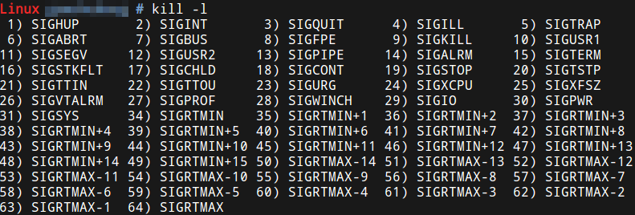
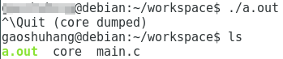
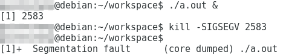

# 信号

例如终端中的前台进程，按下CTRL+C，终端驱动程序将这个组合键解释成SIGINT，记在该进程PCB中，当某个时刻要从内核返回到该进程的用户空间代码继续执行之前，首先处理PCB中记录的信号，发现有一个SIGINT信号待处理，而这个信号的默认处理动作是终止进程，所以直接终止进程而不再返回它的用户空间代码执行。

root用户使用kill -l可以列出所有信号和对应编号。每个信号都有一个编号和一个宏定义名称，这些宏定义可以在signal.h中找到，例如其中有定义#define SIGINT 2。信号的详细信息见signal(7)。



信号产生条件：

* Ctrl-C产生SIGINT信号， `Ctrl-\`产生SIGQUIT信号，`Ctrl-Z`产生SIGTSTP信号
* 硬件异常产生信号
* 一个进程调用kill(2)函数可以发送信号给另一个进程
* 用kill(1)命令发送信号给某个进程，kill(1)命令也是调用kill(2)函数实现的，如果不明确指定信号则发送SIGTERM信号，该信号的默认处理动作是终止进程。
* 当内核检测到某种软件条件发生时也可以通过信号通知进程，例如闹钟超时产生SIGALRM信号，向读端已关闭的管道写数据时产生SIGPIPE信号。

如果不想按默认动作处理信号，用户程序可以调用sigaction(2)函数告诉内核如何处理某种信号：

* 忽略此信号
* 执行该信号的默认处理动作
* 提供一个信号处理函数，要求内核在处理该信号时切换到用户态执行这个处理函数，这种方式称为捕捉（Catch） 一个信号

# 产生信号

## core dump

当一个进程要异常终止时，可以选择把进程的用户空间内存数据全部保存到磁盘上，文件名通常是core，这叫做Core Dump。一个进程允许产生多大的core文件取决于进程的Resource Limit（这个信息保存在PCB中）。默认是不允许产生core文件的，在开发调试阶段可以用ulimit命令改变这个限制，允许产生core文件。



使用`ctrl+\`结束一个进程，产生core dump。

## 调用系统函数向进程发信号

### 使用kill命令



* `-SIGSEGV` 指定了给进程发一个非法内存访问信号，实际上程序没有错
* 也可以使用-11（SIGSEGV编号）

### 使用kill函数

kill命令就是调用kill函数实现的。kill函数可以给一个指定的进程发送指定的信号。 raise函数可以给当前进程发送指定的信号（自己给自己发信号）。

```c
#include <signal.h>
int kill(pid_t pid, int signo);
int raise(int signo);
/*成功返回0，错误返回-1*/
```

### abort

abort函数使当前进程接收到SIGABRT信号而异常终止。

```c
#include <stdlib.h>
void abort(void);
/*abort函数总是会成功的，所以没有返回值*/
```

### 由软件条件产生信号

SIGPIPE是一种由软件条件产生的信号，本节主要介绍alarm函数和SIGALRM信号。

```c
#include <unistd.h>
unsigned int alarm(unsigned int seconds);
```

调用alarm函数可以设定一个闹钟，也就是告诉内核在seconds秒之后给当前进程发SIGALRM信号，该信号的默认处理动作是终止当前进程。这个函数的返回值是0或者是以前设定的闹钟时间还余下的秒数。打个比方，某人要小睡一觉，设定闹钟为30分钟之后响， 20分钟后被人吵醒了，还想多睡一会儿，于是重新设定闹钟为15分钟之后响， “以前设定的闹钟时间还余下的时间”就是10分钟。如果seconds值为0，表示取消以前设定的闹钟，函数的返回值仍然是以前设定的闹钟时间还余下的秒数。

```c
#include <unistd.h>
#include <stdio.h>
int main(void)
{
    int i = 0;
    alarm(1);
    while(1)
    {
        printf("%d\n", i);
        i++;
    }
    return 0;
}
```

这个程序的作用是1秒钟之内不停地数数， 1秒钟到了就被SIGALRM信号终止。

# 阻塞信号

执行信号的处理动作称为信号递达（Delivery），信号从产生到递达之间的状态，称为信号未决（Pending）。进程可以选择阻塞（Block）某个信号。被阻塞的信号产生时将保持在未决状态，直到进程解除对此信号的阻塞，才执行递达的动作。注意，阻塞和忽略是不同的。

每个信号都有两个标志位分别表示阻塞和未决，还有一个函数指针表示处理动作。信号产生时，内核在进程控制块中设置该信号的未决标志，直到信号递达才清除该标志。

如果在进程解除对某信号的阻塞之前这种信号产生过多次，Linux是这样实现的：常规信号在递达之前产生多次只计一次，而实时信号在递达之前产生多次可以依次放在一个队列里。阻塞信号集也叫做当前进程的信号屏蔽字（Signal Mask） ，这里的“屏蔽”应该理解为阻塞而不是忽略。

## 信号集操作函数

```c
#include <signal.h>
int sigemptyset(sigset_t *set);
int sigfillset(sigset_t *set);
int sigaddset(sigset_t *set, int signo);
int sigdelset(sigset_t *set, int signo);
/*成功返回0，出错返回-1*/
int sigismember(const sigset_t *set, int signo);
/*判断一个信号集的有效信号中是否包含某种信号，若包含则返回1，不包含则返回0，出错返回-1*/
```

* sigemptyset 初始化set所指向的信号集，使其中所有信号的对应bit清零，表示该信号集不包含任何有效信号。
* sigfillset 初始化set所指向的信号集，使其中所有信号的对应bit置位，表示该信号集的有效信号包括系统支持的所有信号。

注：

* sigset_t类型对于每种信号用一个bit表示“有效”或“无效”状态，至于这个类型内部如何存储这些bit则依赖于系统实现，从使用者的角度是不必关心的，使用者只能调用以下函数来操作sigset_t变量，而不应该对它的内部数据做任何解释
* 在使用sigset_t类型的变量之前，一定要调用sigemptyset或sigfillset做初始化

## sigprocmask

调用函数sigprocmask可以读取或更改进程的信号屏蔽字。

```c
#include <signal.h>
int sigprocmask(int how, const sigset_t *set, sigset_t *oldset);
/*成功则为0，若出错则为-1*/
```

* 如果oldset是非空指针，则读取进程的当前信号屏蔽字通过oldset参数传出。
* 如果set是空指针，信号屏蔽字不会改变，但当前信号屏蔽字值存储到oldset中
* 如果set是非空指针，则更改进程的信号屏蔽字，参数how指示如何更改。
* 如果oldset和set都是非空指针，则先将原来的信号屏蔽字备份到oldset里，然后根据set和how参数更改信号屏蔽字。
* 假设当前的信号屏蔽字为mask，how参数意义：
  * SIG_BLOCK set包含了我们希望添加到当前信号屏蔽字的信号，相当于mask=mask|set
  * SIG_UNBLOCK set包含了我们希望从当前信号屏蔽字中解除阻塞的信号，相当于mask=mask&~set
  * SIG_SETMASK 设置当前信号屏蔽字为set所指向的值，相当于mask=set

注：如果调用sigprocmask解除了对当前若干个未决信号的阻塞，则在sigprocmask返回前，至少将其中一个信号递达。

## sigpending

```c
#include <signal.h>
int sigpending(sigset_t *set);
/*调用成功则返回0，出错则返回-1*/
```

sigpending读取当前进程的未决信号集，通过set参数传出。

信号函数实例：
```c
#include <signal.h>
#include <stdio.h>
#include <unistd.h>
void printsigset(const sigset_t *set)
{
    int i;
    for (i = 1; i < 32; i++)
        if (sigismember(set, i) == 1)
            putchar('1');
        else
            putchar('0');
    puts("");
}
int main(void)
{
    sigset_t s, p;
    sigemptyset(&s);
    sigaddset(&s, SIGINT);
    sigprocmask(SIG_BLOCK, &s, NULL);
    while (1)
    {
        sigpending(&p);
        printsigset(&p);
        sleep(1);
    }
    return 0;
}
```

# 捕捉信号

如果信号的处理动作是用户自定义函数，在信号递达时就调用这个函数，这称为捕捉信号。流程：执行main函数->收到中断，进入内核态执行中断处理程序->检查信号是否到达->返回用户态执行自定义中断处理函数->执行sigreturn系统调用进入内核态->返回用户态执行main。

## sigaction

```c
#include <signal.h>
int sigaction(int signo, const struct sigaction *act, struct sigaction *oact);
/*调用成功则返回0，出错则返回-1*/
struct sigaction
{
    void (*sa_handler)(int); /* addr of signal handler, */
    /* or SIG_IGN, or SIG_DFL */
    sigset_t sa_mask; /* additional signals to block */
    int sa_flags; /* signal options, Figure 10.16 */
    /* alternate handler */
    void (*sa_sigaction)(int, siginfo_t *, void *);
};
```

sigaction函数可以读取和修改与指定信号相关联的处理动作。

* signo 指定信号的编号
* 若act指针非空，则根据act修改该信号的处理动作
* 若oact指针非空，则通过oact传出该信号原来的处理动作

sigaction结构体参数：

* sa_handler
  * 常数SIG_IGN 忽略信号
  * 常数SIG_DFL 执行系统默认动作
  * 函数指针 自定义捕捉信号，参数是信号编号，被系统回调
* sa_mask 额外屏蔽的信号
* sa_flags 具体见手册
* sa_sigaction 实时信号的处理函数

注：当某个信号的处理函数被调用时，内核自动将当前信号加入进程的信号屏蔽字，当信号处理函数返回时自动恢复原来的信号屏蔽字，这样就保证了在处理某个信号时，如果这种信号再次产生，那么它会被阻塞到当前处理结束为止。如果在调用信号处理函数时，除了当前信号被自动屏蔽之外，还希望自动屏蔽另外一些信号，则用sa_mask字段说明这些需要额外屏蔽的信号，当信号处理函数返回时自动恢复原来的信号屏蔽字。

## pause

```c
#include <unistd.h>
int pause(void);
```

pause函数使调用进程挂起直到有信号递达。如果信号的处理动作是终止进程，则进程终止， pause函数没有机会返回；如果信号的处理动作是忽略，则进程继续处于挂起状态， pause不返回；如果信号的处理动作是捕捉，则调用了信号处理函数之后pause返回-1， errno设置为EINTR，所以pause只有出错的返回值。错误码EINTR表示“被信号中断”。

实例 实现sleep函数

```c
#include <unistd.h>
#include <signal.h>
#include <stdio.h>
void sig_alrm(int signo)
{
    /* nothing to do */
}
unsigned int mysleep(unsigned int nsecs)
{
    struct sigaction newact, oldact;
    unsigned int unslept;
    newact.sa_handler = sig_alrm;
    sigemptyset(&newact.sa_mask);
    newact.sa_flags = 0;
    sigaction(SIGALRM, &newact, &oldact);
    alarm(nsecs);
    pause();
    //取消闹钟
    unslept = alarm(0);
    sigaction(SIGALRM, &oldact, NULL);
    return unslept;
}
int main(void)
{
    while(1)
    {
        mysleep(2);
        printf("Two seconds passed\n");
    }
    return 0;
}
```

## 可重入函数
信号处理函数是一个单独的控制流程，如果和主控制流程访问相同的全局资源（全局变量、硬件资源等），就有可能出现冲突。函数被不同的控制流程调用，有可能在第一次调用还没返回时就再次进入该函数，这称为重入。可能因为重入而造成错乱，这样的函数称为不可重入函数，如果一个函数只访问自己的局部变量或参数，则称为可重入（ Reentrant）函数。

如果一个函数符合以下条件之一则是不可重入的：

* 调用了malloc或free，因为malloc也是用全局链表来管理堆的。
* 调用了标准I/O库函数。标准I/O库的很多实现都以不可重入的方式使用全局数据结构。

## sig_atomic_t

由于C语言最终编译成汇编代码，一条C语句是不是原子操作和CPU平台有关，为了解决这些平台相关的问题， C标准定义了一个类型sig_atomic_t，在不同平台的C语言库中取不同的类型，例如在32位机上定义sig_atomic_t为int类型。

## volatile

程序中存在多个执行流程，是因为调用了特定平台上的特定库函数，比如sigaction、 pthread_create，这些不是C语言本身的规范，如果编译器指定了优化选项可能出错。

对于程序中存在多个执行流程访问同一全局变量的情况， volatile限定符是必要的，此外，虽然程volatile序只有单一的执行流程，但是变量属于以下情况之一的也需要：

* 变量的内存单元中的数据不需要写操作就可以自己发生变化，每次读上来的值都可能不一样
* 即使多次向变量的内存单元中写数据，只写不读，也并不是在做无用功，而是有特殊意义的

映射到内存地址空间的硬件寄存器，例如串口的接收寄存器属于上述第一种情况，而发送寄存器属于上述第二种情况。sig_atomic_t类型的变量应该总是加上volatile限定符，因为要使用sig_atomic_t类型的理由也正是要加volatile限定符的理由。

## 前文实现sleep函数的潜在bug

虽然alarm(nsecs)紧接着的下一行就是pause()，但是无法保证pause()一定会在调用alarm(nsecs)之后的nsecs秒之内被调用（虽然sleep(1)已经足够久避免这种情况了）。由于时序问题而导致错误，这叫做竞态条件（ Race Condition） 。

## sigsuspend

```c
#include <signal.h>
int sigsuspend(const sigset_t *sigmask);
```

sigsuspend包含了pause的挂起等待功能，同时解决了竞态条件的问题，在对时序要求严格的场合下都应该调用sigsuspend而不是pause。和pause一样， sigsuspend没有成功返回值，只有执行了一个信号处理函数之后sigsuspend才返回，返回值为-1， errno设置为EINTR。

调用sigsuspend时，进程的信号屏蔽字由sigmask参数指定，可以通过指定sigmask来临时解除对某个信号的屏蔽，然后挂起等待，当sigsuspend返回时，进程的信号屏蔽字恢复为原来的值，如果原来对该信号是屏蔽的，从sigsuspend返回后仍然是屏蔽的。

实例 修改后的sleep
```c
unsigned int mysleep(unsigned int nsecs)
{
    struct sigaction newact, oldact;
    sigset_t newmask, oldmask, suspmask;
    unsigned int unslept;
    /* set our handler, save previous information */
    newact.sa_handler = sig_alrm;
    sigemptyset(&newact.sa_mask);
    newact.sa_flags = 0;
    sigaction(SIGALRM, &newact, &oldact);
    /* block SIGALRM and save current signal mask */
    sigemptyset(&newmask);
    sigaddset(&newmask, SIGALRM);
    sigprocmask(SIG_BLOCK, &newmask, &oldmask);
    alarm(nsecs);
    suspmask = oldmask;
    sigdelset(&suspmask, SIGALRM); /* make sure SIGALRM isn't blocked */
    sigsuspend(&suspmask); /* wait for any signal to be caught */
    /* some signal has been caught, SIGALRM is now blocked */
    unslept = alarm(0);
    sigaction(SIGALRM, &oldact, NULL); /* reset previous action*/
    /* reset signal mask, which unblocks SIGALRM */
    sigprocmask(SIG_SETMASK, &oldmask, NULL);
    return(unslept);
}
```

## SIGCHLD信号

进程一章讲过用wait和waitpid函数清理僵尸进程，父进程可以阻塞等待子进程结束，也可以非阻塞地查询是否有子进程结束等待清理（也就是轮询的方式），这两种方式都有缺点。实际上，子进程在终止时会给父进程发SIGCHLD信号，该信号的默认处理动作是忽略，父进程可以自定义SIGCHLD信号的处理函数，这样父进程只需专心处理自己的工作，不必关心子进程了，子进程终止时会通知父进程，父进程在信号处理函数中调用wait清理子进程即可。
