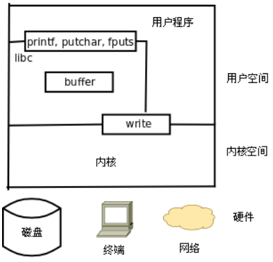

# 标准库IO函数和系统调用

open、 read、 write、 close等系统函数称为无缓冲I/O（ Unbuffered I/O） 函数，因为它们位于C标准库的I/O缓冲区的底层。用户程序在读写文件时既可以调用C标准I/O库函数，也可以直接调用底层的Unbuffered I/O函数。C标准库函数是C标准的一部分，而Unbuffered I/O函数是UNIX标准的一部分，支持POSIX标准的平台一般是通用的。

* 用Unbuffered I/O函数每次读写都要进内核，调一个系统调用比调一个用户空间的函数要慢很多，所以在用户空间开辟I/O缓冲区还是必要的，用C标准I/O库函数就比较方便，省去了自己管理I/O缓冲区的麻烦。
* 用C标准I/O库函数要时刻注意I/O缓冲区和实际文件有可能不一致，在必要时需调用fflush。
* 在读写设备时通常是不希望有缓冲的，所以网络编程通常直接调用Unbuffered I/O函数。
* 实际上unbufferedIO还是有内核缓冲，应用层就不考虑了，不影响使用



# 文件描述符

每个进程在Linux内核中都有一个task_struct结构体来维护进程相关的信息，称为进程描述符（ Process Descriptor） ，而在操作系统理论中称为进程控制块（ PCB， Process Control Block） 。 task_struct中有一个指针指向files_struct结构体，称为文件描述符表，其中每个表项包含一个指向已打开的文件的指针。用户程序不能直接访问内核中的文件描述符表，而只能使用文件描述符表的索引（即0、 1、 2、 3这些数字），这些索引就称为文件描述符（ File Descriptor） ，用int型变量保存。

unistd.h定义
```c
#define STDIN_FILENO 0
#define STDOUT_FILENO 1
#define STDERR_FILENO 2
```

# open/close

```c
#include <sys/types.h>
#include <sys/stat.h>
#include <fcntl.h>
int open(const char *pathname, int flags);
int open(const char *pathname, int flags, mode_t mode);
/*返回值：成功返回新分配的文件描述符，出错返回-1并设置errno*/
```

* open有两种形式，是通过可变参数实现的。有可变参数个数由flags决定。
* flags必选取值：
  * O_RDONLY 只读打开
  * O_WRONLY 只写打开
  * O_RDWR 可读可写打开
* flags可选取值：
  * O_APPEND 追加
  * O_CREAT 文件不存在则创建。使用此选项时需要提供第三个参数mode，表示该文件的访问权限。
  * O_EXCL 如果同时指定了O_CREAT，并且文件已存在，则出错返回。
  * O_TRUNC 如果文件已存在，并且以只写或可读可写方式打开，则将其长度截断（ Truncate） 为0字节。就是覆盖写。
  * O_NONBLOCK 对于设备文件，以O_NONBLOCK方式打开可以做非阻塞I/O（ Nonblock I/O） 。
* mode：指定文件权限，用八进制表示比较方便，如0644对应-rw-r--r--，文件权限由open mode和进程umask掩码共同决定。也可以用预定义的宏来表示，但显然比较麻烦，具体查询man 2 open。
* 进程umask可以从shell用umask命令得到。

# read/close

read函数从打开的设备或文件中读取数据。

```c
#include <unistd.h>
ssize_t read(int fd, void *buf, size_t count);
/*返回值：成功返回读取的字节数，出错返回-1并设置errno，如果在调read之前已到达文件末尾，则这次read返回0*/
```

* 参数count是请求读取的字节数，读上来的数据保存在缓冲区buf中，同时文件的当前读写位置向后移。
* 如果非阻塞读取，暂时没有内容可读时，返回-1，errno设置为EAGAIN或EWOULDBLOCK（这两个宏定义值相同）。分阻塞应该轮询处理或使用select。

write函数向打开的设备或文件中写数据。

```c
#include <unistd.h>
ssize_t write(int fd, const void *buf, size_t count);
/*返回值：成功返回写入的字节数，出错返回-1并设置errno*/
```

例子 非阻塞读取终端和等待超时：

```c
#include <unistd.h>
#include <fcntl.h>
#include <errno.h>
#include <string.h>
#include <stdlib.h>
#define MSG_TRY "try again\n"
#define MSG_TIMEOUT "timeout\n"
int main(void)
{
    char buf[10];
    int fd, n, i;
    fd = open("/dev/tty", O_RDONLY|O_NONBLOCK);
    if(fd<0)
    {
        perror("open /dev/tty");
        exit(1);
    }
    for(i=0; i<5; i++)
    {
        n = read(fd, buf, 10);
        if(n>=0)
        break;
        if(errno!=EAGAIN)
        {
            perror("read /dev/tty");
            exit(1);
        }
        sleep(1);
        write(STDOUT_FILENO, MSG_TRY, strlen(MSG_TRY));
    }
    if(i==5)
        write(STDOUT FILENO, MSG TIMEOUT, strlen(MSG_TIMEOUT));
    else
        write(STDOUT_FILENO, buf, n);
    close(fd);
    return 0;
}
```

# lseek

每个打开的文件都记录着当前读写位置，打开文件时读写位置是0，表示文件开头，通常读写多少个字节就会将读写位置往后移多少个字节。但是有一个例外，如果以O_APPEND方式打开，每次写操作都会在文件末尾追加数据，然后将读写位置移到新的文件末尾。 lseek和标准I/O库的fseek函数类似，可以移动当前读写位置（或者叫偏移量）。

```c
#include <sys/types.h>
#include <unistd.h>
off_t lseek(int fd, off_t offset, int whence);
```

和标准库fseek区别：fseek成功时返回0失败时返回-1，要返回当前偏移量需调用ftell，而lseek成功时返回当前偏移量失败时返回-1。

# fcntl

fcntl函数改变一个已打开的文件的属性，可以重新设置读、写、追加、非阻塞等标志（这些标志称为File Status Flag），而不必重新open文件。

```c
#include <unistd.h>
#include <fcntl.h>
int fcntl(int fd, int cmd);
int fcntl(int fd, int cmd, long arg);
int fcntl(int fd, int cmd, struct flock *lock);
```

通过fcntl设置的都是当前进程如何访问设备或文件的访问控制属性，例如读、写、追加、非阻塞、加锁等，但并不设置文件或设备本身的属性，例如文件的读写权限、串口波特率等。

实例 打印文件描述符的File Status Flag

```c
#include <sys/types.h>
#include <fcntl.h>
#include <stdio.h>
#include <stdlib.h>
int main(int argc, char *argv[])
{
    int val;
    if (argc != 2)
    {
        fputs("usage: a.out <descriptor#>\n", stderr);
        exit(1);
    }
    if ((val = fcntl(atoi(argv[1]), F_GETFL)) < 0)
    {
        printf("fcntl error for fd %d\n", atoi(argv[1]));
        exit(1);
    }
    switch(val & O_ACCMODE)
    {
    case O_RDONLY:
        printf("read only");
        break;
    case O_WRONLY:
        printf("write only");
        break;
    case O_RDWR:
        printf("read write");
        break;
    default:
        fputs("invalid access mode\n", stderr);
        exit(1);
    }
    if (val & O_APPEND)
        printf(", append");
    if (val & O_NONBLOCK)
        printf(", nonblocking");
    putchar('\n');
    return 0;
}
```

# ioctl

ioctl用于向设备发控制和配置命令，有些命令也需要读写一些数据，但这些数据是不能用read/write读写的，称为Out-of-band数据。也就是说， read/write读写的数据是in-band数据，是I/O操作的主体，而ioctl命令传送的是控制信息，其中的数据是辅助的数据。例如，在串口线上收发数据通过read/write操作，而串口的波特率、校验位、停止位通过ioctl设置， A/D转换的结果通过read读取，而A/D转换的精度和工作频率通过ioctl设置。

```c
#include <sys/ioctl.h>
int ioctl(int d, int request, ...);
```

d是某个设备的文件描述符。 request是ioctl的命令，可变参数取决于request，通常是一个指向变量或结构体的指针。若出错则返回-1，若成功则返回其他值，返回值也是取决于request。

实例：获得终端设备窗口大小

```c
#include <stdio.h>
#include <stdlib.h>
#include <unistd.h>
#include <sys/ioctl.h>
int main(void)
{
    struct winsize size;
    if (isatty(STDOUT_FILENO) == 0)
        exit(1);
    if(ioctl(STDOUT_FILENO, TIOCGWINSZ, &size)<0)
    {
        perror("ioctl TIOCGWINSZ error");
        exit(1);
    }
    printf("%d rows, %d columns\n", size.ws_row, size.ws_col);
    return 0;
}
```

# mmap

mmap可以把磁盘文件的一部分直接映射到内存，这样文件中的位置直接就有对应的内存地址，对文件的读写可以直接用指针来做而不需要read/write函数。

```c
#include <sys/mman.h>
void *mmap(void *addr, size_t len, int prot, int flag, int filedes, off_t off);
int munmap(void *addr, size_t len);
```

* 如果addr参数为NULL，内核会自己在进程地址空间中选择合适的地址建立映射。如果addr不是NULL，则给内核一个提示，应该从什么地址开始映射，内核会选择addr之上的某个合适的地址开始映射。
* 建立映射后，真正的映射首地址通过返回值可以得到。
* len参数是需要映射的那一部分文件的长度。
* off从文件的什么位置开始映射，必须是页大小的整数倍（在32位体系统结构上通常是4K）。
* filedes代表该文件的描述符。
* prot
  * PROT_EXEC表示映射的这一段可执行，例如映射共享库
  * PROT_READ表示映射的这一段可读
  * PROT_WRITE表示映射的这一段可写
  * PROT_NONE表示映射的这一段不可访问
* flag
  * MAP_SHARED多个进程对同一个文件的映射是共享的，一个进程对映射的内存做了修改，另一个进程也会看到这种变化。
  * MAP_PRIVATE多个进程对同一个文件的映射不是共享的，一个进程对映射的内存做了修改，另一个进程并不会看到这种变化，也不会真的写到文件中去。
* 如果mmap成功则返回映射首地址，如果出错则返回常数MAP_FAILED。当进程终止时，该进程的映射内存会自动解除，也可以调用munmap解除映射。 munmap成功返回0，出错返回-1。

实例

```c
#include <stdlib.h>
#include <sys/mman.h>
#include <fcntl.h>
int main(void)
{
    int *p;
    int fd = open("hello", O_RDWR);
    if (fd < 0)
    {
        perror("open hello");
        exit(1);
    }
    p = mmap(NULL, 6, PROT_WRITE, MAP_SHARED, fd, 0);
    if (p == MAP_FAILED)
    {
        perror("mmap");
        exit(1);
    }
    close(fd);
    p[0] = 0x30313233;
    munmap(p, 6);
    return 0;
}
```
