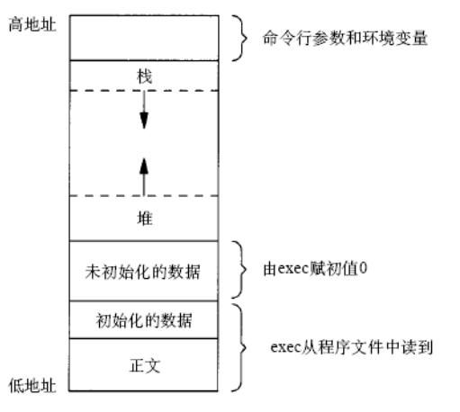
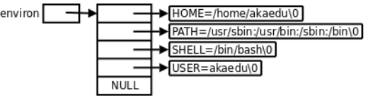
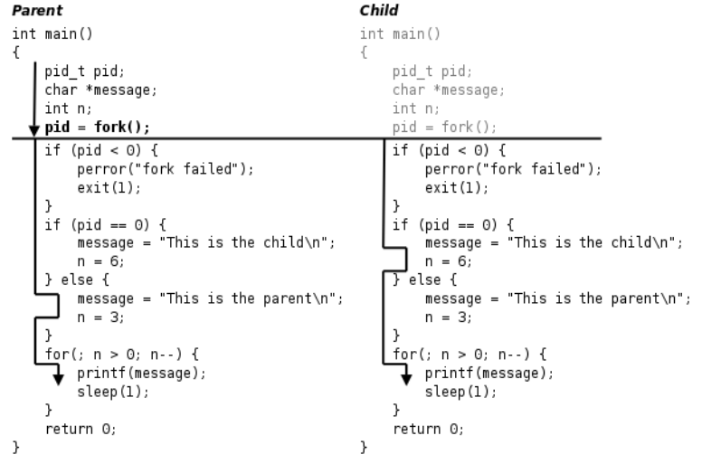
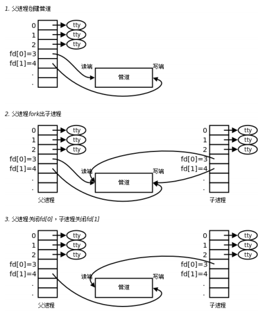
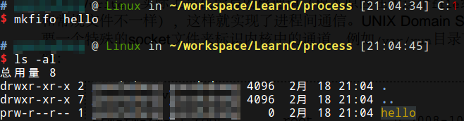
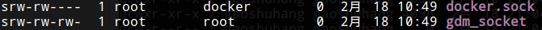

# 进程

我们知道，每个进程在内核中都有一个进程控制块（ PCB）来维护进程相关的信息， Linux内核的进程控制块是task_struct结构体。具体内容如下：

* 进程id。系统中每个进程有唯一的id，在C语言中用pid_t类型表示，其实就是一个非负整数。
* 进程的状态，有运行、挂起、停止、僵尸等状态。
* 进程切换时需要保存和恢复的一些CPU寄存器。
* 描述虚拟地址空间的信息。
* 描述控制终端的信息。
* 当前工作目录（ Current Working Directory） 。
* umask掩码。
* 文件描述符表，包含很多指向file结构体的指针。
* 和信号相关的信息。
* 用户id和组id。
* 控制终端、 Session和进程组。
* 进程可以使用的资源上限（ Resource Limit） 。

# 环境变量

exec系统调用执行新程序时会把命令行参数和环境变量表传递给main函数，它们在整个进程地址空间中的位置如下图所示。



环境变量字符串都是name=value这样的形式，大多数name由大写字母加下划线组成，一般把name的部分叫做环境变量， value的部分则是环境变量的值。

环境变量也是一组字符串。libc中定义的全局变量environ指向环境变量表， environ没有包含在任何头文件中，所以在使用时要用extern声明。

例如：
```c
#include <stdio.h>
int main(void)
{
    extern char **environ;
    int i;
    for(i=0; environ[i]!=NULL; i++)
        printf("%s\n", environ[i]);
    return 0;
}
```

由于父进程在调用fork创建子进程时会把自己的环境变量表也复制给子进程，所以a.out打印的环境变量和Shell进程的环境变量是相同的。



* PATH 可执行文件的搜索路径。
* SHELL 当前Shell，它的值通常是/bin/bash。
* TERM 当前终端类型，在图形界面终端下它的值通常是xterm。
* LANG 语言和locale，决定了字符编码以及时间、货币等信息的显示格式。
* HOME 当前用户主目录的路径，很多程序需要在主目录下保存配置文件，使得每个用户在运行该程序时都有自己的一套配置。

## getenv

给出name要在环境变量表中查找它对应的value，可以用getenv函数。

```c
#include <stdlib.h>
char *getenv(const char *name);
/*返回值是指向value的指针，若未找到则为NULL*/
```

## setenv unsetenv

```c
#include <stdlib.h>
int setenv(const char *name, const char *value, int rewrite);
void unsetenv(const char *name);
/*成功则返回为0，若出错则返回非0*/
```

如果已存在环境变量name，那么若rewrite非0，则覆盖原来的定义；若rewrite为0，则不覆盖原来的定义，也不返回错误。

# 进程控制

## fork

fork的作用是根据一个现有的进程复制出一个新进程，原来的进程称为父进程（ Parent Process） ，新进程称为子进程（ Child Process） 。系统中同时运行着很多进程，这些进程都是从最初只有一个进程开始一个一个复制出来的。在Shell下输入命令可以运行一个程序，是因为Shell进程在读取用户输入的命令之后会调用fork复制出一个新的Shell进程，然后新的Shell进程调用exec执行新的程序。

```c
#include <sys/types.h>
#include <unistd.h>
pid_t fork(void);
/*失败返回-1，成功子进程返回0，父进程返回子进程PID*/
```

实例

```c
#include <sys/types.h>
#include <unistd.h>
#include <stdio.h>
#include <stdlib.h>
int main(void)
{
    pid_t pid;
    char *message;
    int n;
    pid = fork();
    if (pid < 0)
    {
        perror("fork failed");
        exit(1);
    }
    if (pid == 0)
    {
        message = "This is the child\n";
        n = 6;
    }
    else
    {
        message = "This is the parent\n";
        n = 3;
    }
    for(; n > 0; n--)
    {
        printf(message);
        sleep(1);
    }
    return 0;
}
```



* fork函数的特点概括起来就是“调用一次，返回两次”。fork在子进程中返回0，子进程仍可以调用getpid函数得到自己的进程id，也可以调用getppid函数得到父进程的id。在父进程中用getpid可以得到自己的进程id，然而要想得到子进程的id，只有将fork的返回值记录下来，别无它法。
* fork的另一个特性是所有由父进程打开的描述符都被复制到子进程中。父、子进程中相同编号的文件描述符在内核中指向同一个file结构体，也就是说， file结构体的引用计数要增加。

注：gdb只能跟踪一个进程

* set follow-fork-mode child 设置跟踪子进程
* set follow-fork-mode parent 跟踪父进程

## exec

当进程调用一种exec函数时，该进程的用户空间代码和数据完全被新程序替换，从新程序的启动例程开始执行。调用exec并不创建新进程，所以调用exec前后该进程的id并未改变。调用exec后，原来打开的文件描述符仍然是打开的。其实有六种以exec开头的函数，统称exec函数：

```c
#include <unistd.h>
int execl(const char *path, const char *arg, ...);
int execlp(const char *file, const char *arg, ...);
int execle(const char *path, const char *arg, ..., char *const envp[]);
int execv(const char *path, char *const argv[]);
int execvp(const char *file, char *const argv[]);
int execve(const char *path, char *const argv[], char *const envp[]);
```

* 不带字母p（表示path）的exec函数第一个参数必须是程序的相对路径或绝对路径，例如"/bin/ls"或"./a.out"，而不能是"ls"或"a.out"。
* 带字母p：
  * 如果参数中包含/，则将其视为路径名。
  * 否则视为不带路径的程序名，在PATH环境变量的目录列表中搜索这个程序。
* 带有字母l（表示list）的exec函数要求将新程序的每个命令行参数都当作一个参数传给它，命令行参数的个数是可变的，因此函数原型中有...， ...中的最后一个可变参数应该是NULL，起sentinel的作用。
* 对于带有字母v（表示vector）的函数，则应该先构造一个指向各参数的指针数组，然后将该数组的首地址当作参数传给它，数组中的最后一个指针也应该是NULL，就像main函数的argv参数或者环境变量表一样。
* 对于以e（表示environment）结尾的exec函数，可以把一份新的环境变量表传给它，其他exec函数仍使用当前的环境变量表执行新程序。

调用实例

```c
char *const ps_argv[] ={"ps", "-o", "pid,ppid,pgrp,session,tpgid,comm", NULL};
char *const ps_envp[] ={"PATH=/bin:/usr/bin", "TERM=console", NULL};
execl("/bin/ps", "ps", "-o", "pid,ppid,pgrp,session,tpgid,comm", NULL);
execv("/bin/ps", ps_argv);
execle("/bin/ps", "ps", "-o", "pid,ppid,pgrp,session,tpgid,comm", NULL, ps_envp);
execve("/bin/ps", ps_argv, ps_envp);
execlp("ps", "ps", "-o", "pid,ppid,pgrp,session,tpgid,comm", NULL);
execvp("ps", ps_argv);
```

注：事实上，只有execve是真正的系统调用，其它五个函数最终都调用execve。

## wait waitpid

一个进程在终止时会关闭所有文件描述符，释放在用户空间分配的内存，但它的PCB还保留着，内核在其中保存了一些信息：如果是正常终止则保存着退出状态，如果是异常终止则保存着导致该进程终止的信号是哪个。这个进程的父进程可以调用wait或waitpid获取这些信息，然后彻底清除掉这个进程。如果一个进程已经终止，但是它的父进程尚未调用wait或waitpid对它进行清理，这时的进程状态称为僵尸（ Zombie） 进程。

如果一个父进程终止，而它的子进程还存在（这些子进程或者仍在运行，或者已经是僵尸进程了），则这些子进程的父进程改为init进程。

僵尸进程是不能用kill命令清除掉的，因为kill命令只是用来终止进程的，而僵尸进程已经终止了。

```c
#include <sys/types.h>
#include <sys/wait.h>
pid_t wait(int *status);
pid_t waitpid(pid_t pid, int *status, int options);
/*调用成功则返回清理掉的子进程id，若调用出错则返回-1*/
```

父进程调用wait或waitpid时可能会：

* 阻塞（如果它的所有子进程都还在运行）。
* 带子进程的终止信息立即返回（如果一个子进程已终止，正等待父进程读取其终止信息）。
* 出错立即返回（如果它没有任何子进程）。

wait waitpid区别：

* 如果父进程的所有子进程都还在运行，调用wait将使父进程阻塞，而调用waitpid时如果在options参数中指定WNOHANG可以使父进程不阻塞而立即返回0。
* wait等待第一个终止的子进程，而waitpid可以通过pid参数指定等待哪一个子进程。

status：如果参数status不是空指针，则子进程的终止信息通过这个参数传出，如果只是为了同步而不关心子进程的终止信息，可以将status参数指定为NULL。

```c
#include <sys/types.h>
#include <sys/wait.h>
#include <unistd.h>
#include <stdio.h>
#include <stdlib.h>
int main(void)
{
    pid_t pid;
    pid = fork();
    if (pid < 0)
    {
        perror("fork failed");
        exit(1);
    }
    if (pid == 0)
    {
        int i;
        for (i = 3; i > 0; i--)
        {
            printf("This is the child\n");
            sleep(1);
        }
        exit(3);
    }
    else
    {
        int stat_val;
        waitpid(pid, &stat_val, 0);
        if (WIFEXITED(stat_val))
            printf("Child exited with code%d\n", WEXITSTATUS(stat_val));
        else if (WIFSIGNALED(stat_val))
            printf("Child terminated abnormally, signal %d\n", WTERMSIG(stat_val));
    }
    return 0;
}
```

子进程的终止信息在一个int中包含了多个字段，用宏定义可以取出其中的每个字段：

* 如果子进程是正常终止的， WIFEXITED取出的字段值非零
* WEXITSTATUS取出的字段值就是子进程的退出状态
* 如果子进程是收到信号而异常终止的， WIFSIGNALED取出的字段值非零
* WTERMSIG取出的字段值就是信号的编号

# 进程通信

每个进程各自有不同的用户地址空间，任何一个进程的全局变量在另一个进程中都看不到，所以进程之间要交换数据必须通过内核，内核提供的这种机制称为进程间通信（ IPC， InterProcess Communication） 。

## 管道

管道是最简单的一种IPC机制。可以用pipe函数创建。

```c
#include <unistd.h>
int pipe(int filedes[2]);
/*pipe函数调用成功返回0，调用失败返回-1*/
```

调用pipe函数时在内核中开辟一块缓冲区（称为管道）用于通信，它有一个读端一个写端，然后通过filedes参数传出给用户程序两个文件描述符， filedes[0]指向管道的读端， filedes[1]指向管道的写端。



如图，父进程可以往管道里写，子进程可以从管道里读，管道是用环形队列实现的，数据从写端流入从读端流出，这样就实现了进程间通信。

实例

```c
#include <stdlib.h>
#include <unistd.h>
#define MAXLINE 80
int main(void)
{
    int n;
    int fd[2];
    pid_t pid;
    char line[MAXLINE];
    if (pipe(fd) < 0)
    {
        perror("pipe");
        exit(1);
    }
    if ((pid = fork()) < 0)
    {
        perror("fork");
        exit(1);
    }
    if (pid > 0)
    { /* parent */
        close(fd[0]);
        write(fd[1], "hello world\n", 12);
        wait(NULL);
    }
    else
    { /* child */
        close(fd[1]);
        n = read(fd[0], line, MAXLINE);
        write(STDOUT_FILENO, line, n);
    }
    return 0;
}
```

使用管道有一些限制：

* 一个管道只能单向通信，但可以开两个管道
* 需要通过fork传递文件描述符使两个进程都能访问同一管道，它们才能通信

使用管道需要注意以下4种特殊情况（假设都是阻塞I/O操作，没有设置O_NONBLOCK标志）：

* 如果所有指向管道写端的文件描述符都关闭了（管道写端的引用计数等于0），而仍然有进程从管道的读端读数据，那么管道中剩余的数据都被读取后，再次read会返回0，就像读到文件末尾一样。
* 如果有指向管道写端的文件描述符没关闭（管道写端的引用计数大于0），而持有管道写端的进程也没有向管道中写数据，这时有进程从管道读端读数据，那么管道中剩余的数据都被读取后，再次read会阻塞，直到管道中有数据可读了才读取数据并返回。
* 如果所有指向管道读端的文件描述符都关闭了（管道读端的引用计数等于0），这时有进程向管道的写端write，那么该进程会收到信号SIGPIPE，通常会导致进程异常终止。
* 如果有指向管道读端的文件描述符没关闭（管道读端的引用计数大于0），而持有管道读端的进程也没有从管道中读数据，这时有进程向管道写端写数据，那么在管道被写满时再次write会阻塞，直到管道中有空位置了才写入数据并返回。

## 其他IPC机制

FIFO和UNIX Domain Socket这两种IPC机制都是利用文件系统中的特殊文件来标识的。

### FIFO

可以用mkfifo命令创建一个FIFO文件：



FIFO文件在磁盘上没有数据块，仅用来标识内核中的一条通道，各进程可以打开这个文件进行read/write，实际上是在读写内核通道（根本原因在于这个file结构体所指向的read、 write函数和常规文件不一样），这样就实现了进程间通信。

### UNIX Domain Socket

UNIX Domain Socket和FIFO的原理类似，也需要一个特殊的socket文件来标识内核中的通道，例如/var/run目录下有很多系统服务的socket文件：



文件类型s表示socket，这些文件在磁盘上也没有数据块。 UNIX Domain Socket是目前最广泛使用的IPC机制。
