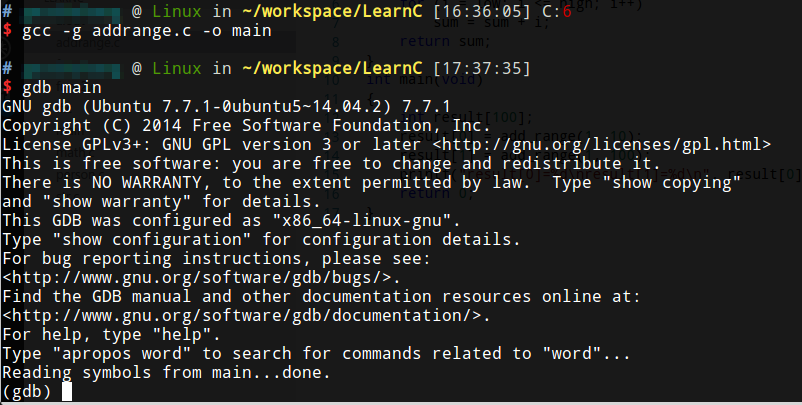

# gdb

gdb是一个强大的调试工具，可以完全操控程序运行，设置断点，查看程序状态等。

## 常用命令 速查总结列表


## 单步执行和跟踪函数调用

gcc编译时使用-g选项插入调试信息。然后启动gdb：
```shell
gcc -g main.c -o main
gdb main
```


使用`help`可以随时查看帮助。使用`help running`等，可以进一步查看。


`list`命令可以列出代码，`list`可以简写成`l`，什么都不敲直接回车执行上一次执行的指令，如果把`.c`文件移走，列出源代码就不好使了。


`quit`退出


`start`开始执行程序


`next`单步执行，简写`n`


`step`进入函数，简写`s`


`backtrace`查看函数调用栈，简写`bt`


`info`查看局部变量，简写`i`，`lcoals`是局部变量，具体查看help即可


进入子函数查看主函数变量，使用`frame`切换栈帧，简写`f`


打印变量值，`$1`等是gdb保存的临时值


`finish`，跳出函数


`set var`，强行修改一个变量


## 断点调试

`display` 跟踪，每次都显示某个变量，`undisplay`取消跟踪


`break`，设置断点，简写`b`，可以直接`continue`到断点位置，`continue`简写`c`


断点可以使用`info breakpoints`查看，简写`i b`


断点的Num是编号，可以用例如`delete breakpoints 4`来删除断点，例如`disable breakpoints 4`临时禁用断点，简写`disable 4`，`enable 4`启用断点。

可以根据条件设置断点，例：`break 9 if sum != 0`，虽然看上去很强大，但很少使用。

## 观察点

观察点watch，当程序访问到哪个存储单元时中断，例：`watch input[5]`。

## 段错误

直接运行程序发生段错误没有提示，使用gdb遇到段错误会自动停下来，一条规律， 如果某个函数的局部变量发生访问越界，有可并不立即产生段错误，而是在函数返回时产生段错误。
