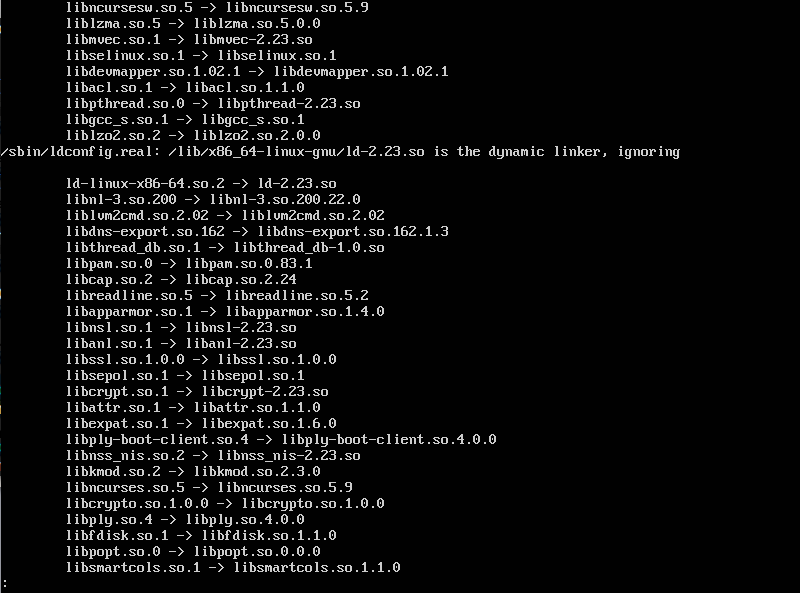

# ldconfig 动态库加载管理

使用包管理器安装新软件时，通常包管理器自动为我们把一切都做好了。但是，我们自己编写的软件使用起来可能要考虑更多，软件通常需要依赖一些动态库，我们也可能自己编写一些动态库。这就不得不提Linux中管理动态库缓存的命令ldconfig。

## Linux如何查找系统拥有的动态库

Linux中有几个指定的位置，存放系统所有的动态库。我们可以查看`/etc/ld.so.conf`和`/etc/ld.so.conf.d`下的配置文件得知默认加载动态库的位置。但是如果我们试图把自己的动态库放到这些默认位置并调用时，这并不能成功。因为程序加载器实际读取的不是这些配置文件，而是一个缓存`/etc/ld.so.cache`，这个二进制文件保存了动态库的位置信息。我们添加自己的动态库后，必须重建这个缓存，这个就是ldconfig的作用。

## 使用ldconfig

```
ldconfig -v
```

* `-v, --verbose`选项：输出ldconfig正在扫描的目录和它正在创建的缓存



如图所示，ldconfig重建了动态库路径缓存，ldconfig实际还处理了动态库的版本号，关于动态库版本号请参考LinuxC编程相关章节。

## 何时使用ldconfig

1. 对系统动态库做任何改动的时候。
2. 在`/etc/ld.so.conf`或`/etc/ld.so.conf.d/*`添加新的默认动态库搜索路径时。
3. 当我们在开发过程中，需要临时使用动态库，此时不建议操作系统的动态库文件夹，这太麻烦了。我们直接添加一个环境变量`LD_LIBRARY_PATH`，可以临时使某个目录作为动态库路径起效。
