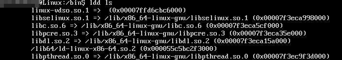

# ldd命令

我们有时需要知道一个可执行文件依赖哪些动态库。例如配置`chroot`环境的时候，我们要拷贝一些我们需要的动态库到虚拟环境。这时`ldd`命令就派上用场了。

## 使用ldd命令

```
ldd <command>
```



如图，我们使用ldd命令查看了ls依赖的动态库。

## ldd如何工作

我们有必要了解一下ldd是如何工作的。实际上，显示依赖这个工作是elf动态加载器完成的，`ldd`只是一个shell脚本，我们可以在`/bin/ldd`找到它。它设置了一些环境变量，指示动态加载器不实际运行程序，而是输出这个程序的所有动态库依赖。

当然我们可以手动设置这些环境变量，但是这就比较麻烦了，因为我们得在当前shell中切换多次环境变量。因此`ldd`命令帮我们做了这些工作。
