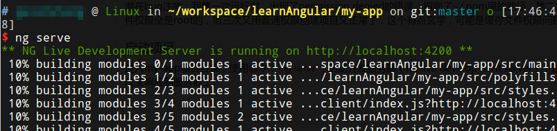
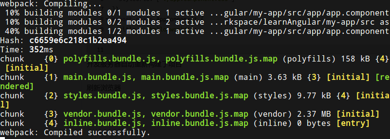
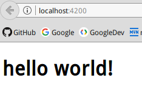
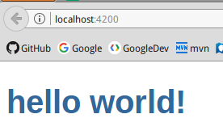

# Angular简介

本系列笔记参考Angular官网教程：[https://angular.cn/docs/ts/latest/](https://angular.cn/docs/ts/latest/)

注：Angular2是Angular2.0及以上版本的简称，最新版本为Angular4.x，Angular1也叫AngularJS，1和2有巨大不同，搜索问题时应该搜索Angular2，避开AngularJS等字样。

## 传统开发方式

传统开发方式最常见的例子就是web入门时学习的XX管理系统，JSP/Velocity+SpringMVC/Struts2实现表现层MVC架构，JSP页面引用一堆CSS、JS和各种资源文件，通过JQuery编写Ajax和操作当前html的DOM树，在用户请求服务器时，JSP或其他模板编译成Servlet向用户动态输出html，依赖的JQuery等类库通常从静态服务器/CDN加载到用户浏览器。

## 新型开发方式

Angular是google开发的web前端框架，是web应用的一种客户端解决方案。和JQuery等类库不同，框架是通过一个更高层次的抽象来简化开发的工具，Angular十分适合交互密集，DOM操作密集的单页web应用，如游戏，管理系统后台等，能提供类似C/S的用户体验，而开发过程却不像传统html+css+js那样繁琐（不过显然传统方式也能实现这种需求）。

Angular提供了前端模板，数据绑定，路由等功能，这些是在用户浏览器中完成的，而后台只负责提供一些接口即可，不需要负责模板等工作，减轻了后台的压力。Angular项目要通过一个“构建”过程，输出结果用于部署给用户。

# 搭建开发环境

首先需要已经安装了node（4.x.x）和npm（3.x.x），很多现代的javascript组件、模块都使用npm管理，甚至包括前端开发需要的构建工具和模块。

## 安装Angular-CLI

Angular-CLI用于创建Angular项目，添加文件，测试、打包、发布等。他封装了一些底层工具的操作，包括webpack等，专门用于Angular项目。

```shell
npm install -g @angular/cli
```

安装过程比较慢，还自动编译了不少东西，安装完成后可以用`npm list -g`查看，你会发现安装了好多好多东西。。。

关于Angular-CLI，可以使用`ng help`命令查看帮助。

## 创建项目

```shell
ng new my-app
```

该命令初始化项目目录结构，这个过程中会下载依赖库，需要等待很长时间（真的非常慢，下载有缓存，因此可能是在编译东西）。

潜在bug注意：我第一次运行时，出现了permission denied的错误，指向了`~/.npm`里的路径，第二次用sudo运行，创建项目成功，但是项目文件权限全是root的，第三次又用普通权限创建项目又正常了，这个有点玄学，可能是缓存文件权限问题（Ubuntu14.04 node6.10.1 npm4.4.4）。

## 启动项目

进入my-app项目目录，使用命令：`ng serve`，启动开发服务器（ng live development server），这个服务器可以监听文件的修改，可以实时把改变响应到服务器上。



## 编辑第一个Angular组件

项目自动创建了一个“app-root”根组件，它在src/app/app.component.ts，这里我们把title改成hello，world！

```javascript
import { Component } from '@angular/core';

@Component({
  selector: 'app-root',
  templateUrl: './app.component.html',
  styleUrls: ['./app.component.css']
})
export class AppComponent {
  title = 'hello world!';
}
```

开发服务器自动重新构建了项目



浏览器会自动刷新



## 给组件添加简单的样式

`src/app/app.component.html`可以看到组件的html代码，实际上就是`<h1>`，而ts代码中的title属性，在html中则用`{{title}}`表示

`src/app/app.component.css`中，我们加入一些样式代码：

```css
h1 {
  color: #369;
  font-family: Arial, Helvetica, sans-serif;
  font-size: 250%;
}
```

如图所示：



最简单的hello，world就完成了。
