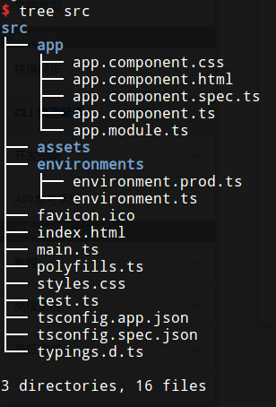

# Angular项目目录结构

接着上一篇笔记，看一下新创建的Angular项目目录结构。

## src

存放组件，模板，样式，图片等源代码和资源。这个文件夹外的文件都是为项目构建提供支持的。

* `app/app.components.*`：AppComponent组件，现在只有一个根组件。
* `app/app.module.ts`：目前只定义了AppComponent组件，稍后还会声明更多组件。
* `assets`：可以用来放图片等资源，构建时会全部拷贝到发布包中。
* `enviroments`：包括为各个目标环境准备的文件，导出了一些应用中要用到的环境变量。
* `favicon.ico`：网站图标。
* `index.html`：项目构建时自动添加js和css，平时不需要修改。
* `main.ts`：应用的主要入口点。
* `polyfills.ts`：填充库，把浏览器的不同点标准化。
* `style.css`：集中存放组件的全局样式。
* `test.ts`：单元测试的主要入口点。
* `tsconfig.json`：TypeScript编译器配置文件。

## 其他目录

### e2e/*

端到端测试。

### node_modules/*

ng-cli自动通过npm本地安装的依赖库。

### .editorconfig

给编辑器看的配置文件，大多数编辑器都支持这个文件。在visual studio code中搜索扩展：EditorConfig for VS Code即可找到相应插件，安装即可。

### .gitignore

git的忽略文件。

### angular-cli.json

Angular-CLI工具的配置文件。具体配置请参考文档。

### karma.conf.js

给karma的单元测试配置，使用ng test时会用到。

### package.json

npm的项目配置文件。

### protractor.conf.js

端到端测试配置文件，使用ng e2e会用到。

### README.md

项目的基础文档。

### tslint.json

ng lint时会用到，lint功能用于确保代码风格统一。
