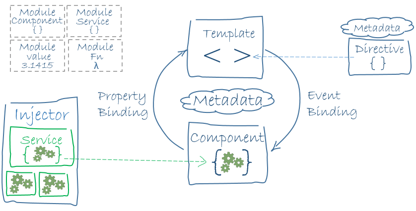

# Angular

Angular 是一个用 HTML 和 JavaScript 或者一个可以编译成 JavaScript 的语言（如 TypeScript ），来构建客户端应用的框架。该框架包含一系列类库，包括核心库和可选库。

我们是这样写 Angular 应用的：用 Angular 扩展语法编写 HTML 模板， 用组件类管理这些模板，用服务添加应用逻辑， 用模块打包发布组件与服务。然后，我们通过引导根模块来启动该应用。 Angular 在浏览器中接管、展现应用的内容，并根据我们提供的操作指令响应用户的交互。



Angular主要组成部分：

* 模块（module）
* 组件（component）
* 模板（template）
* 元数据（metadata）
* 数据绑定（data binding）
* 指令（directive）
* 服务（service）
* 依赖注入（DI：dependency injection）

这篇笔记简要介绍每个组成部分。

## 模块

Angular 应用是模块化的，并且 Angular 有自己的模块系统，即NgModules。每个应用都有一个根模块，通常叫AppModule（就是在项目目录中的app.module.ts）。

模块使用@NgModule装饰器修饰，它接受描述模块属性的元数据对象，最常用的属性包括：

* declarations - 声明本模块中拥有的视图类。 Angular 有三种视图类：组件、指令和管道。
* exports - declarations 的子集，可用于其它模块的组件模板。
* imports - 本模块声明的组件模板需要的类所在的其它模块。
* providers - 服务的创建者，并加入到全局服务列表中，可用于应用任何部分。
* bootstrap - 指定应用的主视图（称为根组件），它是所有其它视图的宿主。只有根模块才能设置bootstrap属性。

应用是通过在项目的main.ts中引导根模块启动的。

### Angular模块库（NgModules）

Angular提供了一组JavaScript模块，可以把它们看做库模块。每个 Angular 库的名字都带有@angular前缀。可以使用JavaScript 的import语句导入其中某些部件。

导入Angular库例子：

app.module.ts
```javascript
import { BrowserModule } from '@angular/platform-browser';
```

在上面那个简单的根模块的例子中，应用模块需要BrowserModule的某些素材。 要访问这些素材，就得把它加入@NgModule元数据的imports中，就像这样：

```javascript
imports:      [ BrowserModule ],
```

## 组件

组件用来控制视图的显示逻辑，它控制一个显示区域，比如一个表格。组件以@Component装饰器修饰，主要属性包括：

* selector：组件的选择器（CSS选择器），用于在父模板中寻找这个组件
* templateUrl：模板URL
* styleUrls：样式表URL数组
* providers：依赖注入的服务数组

当用户在这个应用中漫游时， Angular 会创建、更新和销毁组件。 应用可以通过生命周期钩子在组件生命周期的各个时间点上插入自己的操作，例如`ngOnInit()`。

## 模板

模板实际上是HTML代码的形式，但是其中插入了一些Angular特有的模板语法，如指令`*ngFor`等。其他组件通过标签的形式插入模板中。这样组件之间就组合了起来。


## 元数据

TypeScript中，使用装饰器附加元数据：

```javascript
@Component({
  moduleId: module.id,
  selector:    'hero-list',
  templateUrl: './hero-list.component.html',
  providers:  [ HeroService ]
})
```

在Java，Python中都有这种用法（虽然注解和装饰器实现不同，但某些方面用途一样，最重要的是写法一样）。

## 数据绑定

如果没有框架，我们就得自己把数据值推送到 HTML 控件中，并把用户的反馈转换成动作和值更新。 如果手工写代码来实现这些推/拉逻辑，肯定会枯燥乏味、容易出错，读起来简直是噩梦 —— 写过 jQuery 的程序员大概都对此深有体会。

Angular 支持数据绑定，一种让模板的各部分与组件的各部分相互合作的机制。 我们往模板 HTML 中添加绑定标记，来告诉 Angular 如何把二者联系起来。

如图所示，数据绑定的语法有四种形式。每种形式都有一个方向 —— 绑定到 DOM 、绑定自 DOM 以及双向绑定。


数据绑定例子：
```html
<li>{{hero.name}}</li>
<my-hero-detail [hero]="selectedHero"></my-hero-detail>
<ul class="heroes">
  <li *ngFor="let hero of heroes" [class.selected]="hero === selectedHero" (click)="onSelect(hero)">
    <span class="badge">{{hero.id}}</span> {{hero.name}}
  </li>
</ul>
<input [(ngModel)]="hero.name">
```

代码说明：

* `{{}}`：插值表达式，其实就是显示括号内对象的属性值，这个对象是父组件的一个属性。
* `[]`：属性绑定，上面例子中的意思是 把父组件HeroListComponent的selectedHero的值传到子组件HeroDetailComponent的hero属性中。
* `()`：事件绑定，在用户点击英雄的名字时调用组件的selectHero方法，传入参数hero是通过`*ngFor`得到的。
* `[()]`：双向绑定，组合了属性绑定和事件绑定，上面例子中，改变`<input>`的值时，值会同步到hero.name属性，再由component同步至`<li>`中，也就是说，改变`<input>`内容，`<li>`也会同时改变。

Angular 在每个 JavaScript 事件循环中处理所有的数据绑定，它会从组件树的根部开始，递归处理全部子组件。

数据绑定在模板与对应组件的交互中扮演了重要的角色。


数据绑定在父组件与子组件的通讯中也同样重要。


## 指令

Angular 模板是动态的。当 Angular 渲染它们时，它会根据指令提供的操作对 DOM 进行转换。

### 结构型指令

结构型指令通过在 DOM 中添加、移除和替换元素来修改布局。

例子：
```javascript
<li *ngFor="let hero of heroes"></li>
<hero-detail *ngIf="selectedHero"></hero-detail>
```

`*ngFor`：for循环，heroes是一个数组，hero是迭代的变量。
`*ngIf`：条件判断，selectedHero存在时才包含hero-detail组件。

### 属性型指令

属性型 指令修改一个现有元素的外观或行为。 在模板中，它们看起来就像是标准的 HTML 属性。

例子：
```html
<input [(ngModel)]="hero.name">
```

[(ngModule)]实现了数据的双向绑定

## 服务

几乎任何东西都可以是一个服务。 典型的服务是一个类，有若干方法，具有专注的、明确的用途。它应该做一件特定的事情。

组件是服务的消费者，这体现了分层的架构，组件控制视图的显示逻辑，服务负责提供一部分业务逻辑。

组件通过依赖注入引入服务。

## 依赖注入

“依赖注入”是提供类的新实例的一种方式，还负责处理好类所需的全部依赖。大多数依赖都是服务。 Angular 使用依赖注入来提供新组件以及组件所需的服务。

### 使用依赖注入

对需要使用依赖注入的类添加`@Injectable()`装饰器。通常是标识在Service类上。

通常情况下，将providers添加到项目根模块的NgModule装饰器：

```javascript
@NgModule({
  declarations: [
    AppComponent
  ],
  imports: [
    BrowserModule,
    FormsModule,
    HttpModule
  ],
  providers: [
    HeroService
  ],
  bootstrap: [AppComponent]
})
export class AppModule { }
```

这样就会在所有组件中自动注入某个Service。

注意：如果不想在全局使用某个服务，也可以将特定服务加入某个@Component的providers元数据中。
