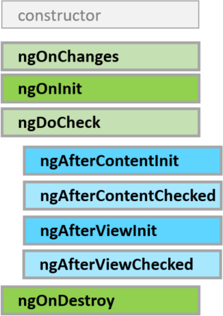

# 组件

组件用来控制视图的显示逻辑，这里说的“视图”，其实就是组件定义的html模板。这个模板中，可能包含一组按钮，或者一个表单，或者一组其他组件。组件可以类比认为是传统网站开发中，类似于springMVC的Controller，html模板可以类比成JSP视图模板。

## 创建组件

1. 在一个模块文件夹中，新建一个组件文件夹，存放我们的组件文件，例如user-login。
2. 在user-login中，创建user-login.component.ts，这个文件就是组件的TypeScript代码。
3. 在user-login.component.ts中编写组件类，组件使用@Component装饰器，传入其选择器，模板，样式表。

注意：由于较大的项目通常划分特性模块，根模块只负责引导其他模块，因此一般组件都创建在其他的特性模块中，而不是直接创建在根模块中。

## 使用Angular-CLI创建组件

使用Angular-CLI创建组件十分方便，推荐使用这种方法。

创建test组件
```shell
ng generate component test
```

在user模块下创建user-login组件
```shell
ng generate component user/user-login
```
# 组件类

## 一个简单的组件类

user-login.component.ts
```javascript
import { Component, OnInit } from '@angular/core';

@Component({
  selector: 'app-user-login',
  templateUrl: './user-login.component.html',
  styleUrls: ['./user-login.component.css']
})
export class UserLoginComponent implements OnInit {

  constructor() { }

  ngOnInit() {
  }

}
```

上述代码由Angular-CLI自动生成。

## selector

组件的选择器。在父组件html模板中引用子组件，以标签的形式调用，选择器就是组件的标签名，通常命名为app-组件名。

## templateUrl

模板URL。尽管@Component中可以直接传入模板字符串，但是十分不建议这么做。最好将模板放在单独的文件中。

## styleUrls

样式表URL数组。可以传入不止一个样式表。

## OnInit 接口

继承OnInit接口，需要实现ngOnInit()，这个函数在组件创建时自动调用。显然，这是一个和组件生命周期有关的回调函数，他叫做声明周期钩子函数。实际上不止有ngOnInit()，其他的声明周期钩子函数在生命周期相关章节中介绍。

## 组件在模块中的声明

对于根组件，需要在根模块的bootstrap中声明，表示这个组件是组件树的根。

对于特性模块的组件，需要在declarations中声明，可以在exports中导出，供其他模块使用。

# 组件间通信

## @Input()和@Output()

父组件通过模板引用子组件，通常父子组件有互相通信的需求。比如模板语法章节中，自定义事件的例子：

子组件可能只是一个按钮，要删除的数据在父组件里，它没有办法直接对数据进行操作。因此子组件创建了一个EventEmitter（事件发射器），并发射了一个事件，这个事件携带了hero实体。父组件通过标签中的事件绑定接受事件。

注意：@Input()和@Output()应用于组件属性，也就是数据模型。不使用这两个注解时，它们仅仅是这个组件的数据模型。加上@Input()，代表这是一个输入数据，可以由父组件模板传入数据；加上@Output()，代表这是一个输出数据，例如一个从子组件传向父组件的事件（加载EventEmitter上）。

传入数据十分简单，这里就不演示了。

## 利用Service通信

由于Service是全局单例的，因此可以用Service进行组件间通讯。和上面方法不同，利用Service组件通讯时，通常是跨度较大的组件，比如：论坛的登录表单组件和评论组件（必须登录才能评论，否则把评论表单disable掉）。

# 组件的生命周期



每个组件都有声明周期，这让我想起了Android的Activity。Angular提供了生命周期钩子，其实就是一组回调函数，当执行到某个生命周期时，对应函数会被回调。

关于声明周期的详细文档：[https://angular.cn/docs/ts/latest/guide/lifecycle-hooks.html](https://angular.cn/docs/ts/latest/guide/lifecycle-hooks.html)

这里只介绍下最常用的ngOnInit()和ngOnDestroy()

```javascript
import { Component, OnInit, OnDestroy } from '@angular/core';

@Component({
  selector: 'app-root',
  templateUrl: './app.component.html',
  styleUrls: ['./app.component.css']
})
export class AppComponent implements OnInit, OnDestroy {
  constructor(){
    console.log("constructed");
  }

  ngOnInit() {
    console.log("init");
  }

  ngOnDestroy() {
    console.log("destroy");
  }
}
```

组件初始化前，先执行构造函数，然后执行ngOnInit()回调，销毁时执行ngOnDestroy()。注意：上面代码中，是在根组件上，实际上是永远不会销毁的。
