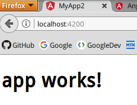
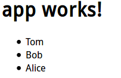
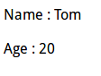
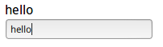
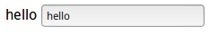

# 显示数据

这里我们直接在根组件上实验。根组件@Component装饰器传入了`templateUrl`，即模板URL。组件的外观，和其需要展示的数据格式都编码在模板中。

## 插值表达式

相当于JSP的EL表达式，用法几乎相同。实际上，插值表达式就是向html输出一个字符串，这个字符串可以用作展示数据，或是一个标签的属性值。

### 表达式计算

```html
<h1>{{1 + 1}}</h1>
```

这种表达式计算确实好使，只不过用处不是很大。

### 显示Component的属性

#### 字符串

直接显示组件类的属性。

app.component.html
```html
<h1>{{title}}</h1>
```

app.component.ts
```javascript
import { Component } from '@angular/core';

@Component({
  selector: 'app-root',
  templateUrl: './app.component.html',
  styleUrls: ['./app.component.css']
})
export class AppComponent {
  title = 'app works!';
}
```

运行结果



#### 数组

使用循环指令可以迭代显示一个数组。就像JSP标签的`<c:forEach items="" var=""/>`。有关指令，请参考指令相关章节。

app.component.html
```html
<h1>{{title}}</h1>
<ul>
  <li *ngFor="let student of students">{{student}}</li>
</ul>
```

app.component.ts
```javascript
import { Component } from '@angular/core';

@Component({
  selector: 'app-root',
  templateUrl: './app.component.html',
  styleUrls: ['./app.component.css']
})
export class AppComponent {
  title = 'app works!';
  students = ["Tom", "Bob", "Alice"];
}
```

运行结果



#### 显示类属性

app.component.html
```html
<p>Name : {{student.name}}</p>
<p>Age : {{student.age}}</p>
```

app.component.ts
```javascript
import { Component } from '@angular/core';

@Component({
  selector: 'app-root',
  templateUrl: './app.component.html',
  styleUrls: ['./app.component.css']
})
export class AppComponent {
  student = {
    name: "Tom",
    age: 20
  };
}
```

运行结果



# 数据流绑定

绑定的意义：一方改动会引起另一方变化。

插值表达式实际上也是一种数据绑定，是Model->View的数据。但是插值表达式仅仅用于向html模板输出一个字符串。下面介绍更强大的几种绑定。

## 双向绑定

双向绑定是Angular强大的特性之一。双向指：View->Model，传递的是事件流，Model->View，传递的是属性数据流。双向绑定即让视图上的数据随着视图上触发的事件而改变。如果不使用Angular，需要在事件发生的组件上注册事件监听器，在回调函数中编写改变另外一个组件的代码，这种代码不符合常人逻辑，难以维护。Angular利用双向绑定优雅的解决了这个问题。

这里我们编写一个简单的例子，让界面上的值随着输入的改变而改变。

app.component.html
```html
<label for="username">{{username}}</label><br />
<input type="text" id="username" [(ngModel)]="username" placeholder="Input your username" />
```

app.component.ts
```javascript
import { Component } from '@angular/core';

@Component({
  selector: 'app-root',
  templateUrl: './app.component.html',
  styleUrls: ['./app.component.css']
})
export class AppComponent {
  username = "";
}
```

运行结果



label显示的值随着输入改变而改变。

注意：这是Angular2官网教程上的例子，ngModel一开始让我十分费解，后来了解到，ngModel实际上是一个方便表单数据绑定的指令，其包含在FormsModule，这个模块在项目创建时，就由根模块引用。关于ngModel，在表单章节中讲解。这里可以简单理解为，是键盘事件触发了数据读取，而{{username}}这个绑定又及时显示了数据。

## 属性绑定

属性绑定传递的是数据，且是单向的。属性绑定的方向只能是Model->View，也就是说，只能从模型取值，向一个组件（子Component或HTML元素）设置属性。

如果必须读取目标元素上的属性或调用它的某个方法，得用另一种技术。参见ViewChild 和 ContentChild。

一个简单的例子：
```html

```

组件包含一个imgUrl属性，通过中括号绑定，将其作为属性值传入``中。属性也可以绑定到方法上，例如``，getUrl返回图片地址字符串。

还有另一个例子是设置自定义组件的模型属性（这是父子组件之间通讯的重要途径）：

```html
<hero-detail [hero]="currentHero"></hero-detail>
```

### 属性绑定表达式和插值表达式区别

这两种都是Model->View数据流。实际上，某些情况下，他们可以做完全相同的事（下面代码）。插值表达式更方便，可读性更好，但是只能传递字符串。通常情况下，我们倾向于代码可读性，所以，是向html模板输出一个字符串这种简单需求就是用插值表达式，向子组件传递一个对象这种复杂需求使用属性绑定。

```html
<p> is the <i>interpolated</i> image.</p>
<p> is the <i>property bound</i> image.</p>
```

### CSS类绑定

属性绑定还为我们提供了修改HTML元素CSS的方法。

```html
<div class="bad curly special" [class]="badCurly">Bad curly</div>
```

```html
<div class="special" [class.special]="isSpecial">This one is not so special</div>
```

注意两端代码的区别：

* 第一段代码，如果badCurly有值，css会被新值覆盖。
* 第二段代码，和第一段不同，绑定的是CSS的确定的类，如果isSpecial为真，添加CSS类special，否则移除。

### 内联样式绑定

属性绑定还能直接修改内联样式。

```html
<button [style.color]="isSpecial ? 'red': 'green'">Red</button>
```

## 事件绑定

事件绑定同样是数据单向传递，传递的是事件流。

最简单的事件绑定：
```html
<button (click)="onSave()">Save</button>
```

每当按钮点击，就会触发onSave()函数被调用。注意：括号里是click，而正常写html绑定函数写的是onclick。

### 接受Event对象

处理事件时，可以接受Event对象，这个Event就是DOM的事件对象（可参考/web前端开发/JavaScript客户端编程/事件处理详解 章节）。

```html
<label for="username">{{username}}</label>
<input [value]="username" (input)="username=$event.target.value" id="username">
```

```javascript
import { Component } from '@angular/core';

@Component({
  selector: 'app-root',
  templateUrl: './app.component.html',
  styleUrls: ['./app.component.css']
})
export class AppComponent {
  username = "";
}
```

运行结果



没错，这个例子实现了上面双向绑定相同的功能。input事件绑定将DOM事件的`event.target.value`传入username，`{{username}}`和`[value]="username"`则取出了其中的值。`$event`这里表示DOM事件对象。

注意：经测试，`[value]="username"`删掉也没事。

### 处理自定义事件

值得注意的是，Angular中，标签不止有html元素，还有子Component的标签。子Component标签上也可以定义事件处理。

子组件模板
```html
<button (click)="delete()">Delete</button>
```

子组件类
```javascript
@Output
deleteRequest = new EventEmitter<Hero>();
delete() {
  this.deleteRequest.emit(this.hero);
}
```

父组件模板
```html
<hero-detail (deleteRequest)="deleteHero($event)" [hero]="currentHero"></hero-detail>
```

父组件类
```javascript
deleteHero(hero){
  //hero删除操作
}
```

代码解释

子组件可能只是一个按钮，要删除的数据在父组件里，它没有办法直接对数据进行操作。因此子组件创建了一个EventEmitter（事件发射器），并发射了一个事件，这个事件携带了hero实体。父组件通过标签中的事件绑定接受事件，这里的`$event`就不是DOM的Event了，它就是hero实体。

注意@Output()装饰器。这个装饰器用于组件间通信（这个事件是在组件间传递的），详见组件章节。
