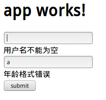
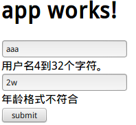

# 表单

表单是Web应用最重要的组件之一，尤其是对于企业及管理系统，做的事基本就是提交表单和展示数据。Angular对表单提供了良好的支持，包括数据双向绑定，错误校验。在Angular中，可以使用三种方式创建表单，模板驱动表单即所有代码编写在html模板中，响应式表单表示部分功能由JavaScript编写，动态表单则是完全由JavaScript创建，表单的组件可以动态组合。

## 模板驱动表单

模板驱动表单的表单内容全部定义在模板中，因此，数据校验只能使用html5提供的控件校验属性。有关html5模板新特性，请参考/web前端开发/HTML5/增强表单。

例子

```html
<form #form="ngForm" (ngSubmit)="form.form.valid && doLogin()">
  <input #username="ngModel" type="text" name="username" [(ngModel)]="user.username" required/>
  <div *ngIf="form.submitted && !username.valid">用户名不能为空</div>
  <input #age="ngModel" type="text" name="age" [(ngModel)]="user.age" pattern="^[0-9]*$"/>
  <div *ngIf="form.submitted && !age.valid">年龄格式错误</div>
  <input type="submit" value="submit" />
</form>
```

上面代码中，在html模板里定义了模板的全部信息，包括校验规则。Angular使用指令，对Form进一步增强。

* ngForm 通过此指令可以获得模板对象
* ngSubmit 此指令可以绑定模板提交事件
* ngModel 此指令可以获得控件对象，可以用它将控件的值双向绑定到数据模型上

实际上表单的写法还是比较固定的。`<form>`上，使用`(ngSubmit)`绑定提交事件，提交时进行表单验证和执行`login()`函数。各个控件和数据模型双向绑定，使用`form.submitted && !username.valid`判断输出错误结果。

注意`form.submitted`，因为错误输出也是随着用户输入动态变化的，如果不使用这个判断，会出现一个比较尴尬的状况，页面一加载，满篇的错误信息就出现了，这样写保证用户提交一次后，才进行动态错误判断，而用户第一次填写表单过程中是没有错误信息输出的。



注：下面的json是为了调试输出的，其实写在了doLogin()里，没什么实际意义。

## 响应式表单

所谓“响应式表单”，是把校验规则搬到了代码里。由于模板驱动表单只能使用html5提供的内置校验规则，可能某些情况下还是不够用，或者说复用性不好。有时候校验规则很多，如果全部写在模板中，可读性太差，难以维护，显然这种做法不符合软件工程。

响应式表单，虽然能够精确控制表单的行为，但是写起来十分繁琐。因此使用响应式表单还是模板驱动表单，需要根据需求仔细权衡。

```html
<form [formGroup]="loginForm" (ngSubmit)="form.form.valid">
  <input formControlName="username" type="text" name="username"/>
  <div *ngIf="formErrors.username">{{formErrors.username}}</div>
  <input formControlName="age" type="text" name="age"/>
  <div *ngIf="formErrors.age">{{formErrors.age}}</div>
  <input type="submit" value="submit" />
</form>
```

html模板中，使用formGroup将表单绑定到loginForm对象，每个控件的formControlName将该控件绑定到loginForm对象的对应字段。

```javascript
import { Component, OnInit } from '@angular/core';
import { FormGroup, FormBuilder, Validators } from '@angular/forms';
import { User } from './user';

@Component({
  selector: 'app-form2',
  templateUrl: './form2.component.html',
  styleUrls: ['./form2.component.css']
})
export class Form2Component implements OnInit {
  //表单对象
  public loginForm: FormGroup;
  //模型对象
  public user: User = new User();

  //用于输出错误信息
  public formErrors = {
    'username': '',
    'age': ''
  };

  //预先编写的错误信息
  validationMessages = {
    'username': {
      'required': '用户名必须输入。',
      'minlength': '用户名4到32个字符。',
      'maxlength': '用户名4到32个字符。'
    },
    'age': {
      'required': '年龄必须输入',
      'pattern': '年龄格式不符合'
    }
  }
  //构造器注入FormBuilder，一个用于创建表单的工具类
  constructor(public fb: FormBuilder) { }

  //调用buildForm()初始化表单
  ngOnInit() {
    this.buildForm();
  }

  //初始化表单，传入字段和验证信息
  buildForm(): void {

    this.loginForm = this.fb.group({
      "username": [
        this.user.username,
        [
          Validators.required,
          Validators.minLength(4),
          Validators.maxLength(32)
        ]
      ],
      "age": [
        this.user.age,
        [
          Validators.required,
          Validators.pattern("^[0-9]+$")
        ]
      ]
    });
    //绑定valueChanges事件
    this.loginForm.valueChanges
      .subscribe(data => this.onValueChanged(data));
    this.onValueChanged();
  }

  //输出错误信息，其实就是添加到this.formErrors
  onValueChanged(data?: any) {
    if (!this.loginForm) {
      return;
    }
    const form = this.loginForm;
    for (const field in this.formErrors) {
      this.formErrors[field] = '';
      const control = form.get(field);
      if (control && control.dirty && !control.valid) {
        const messages = this.validationMessages[field];
        for (const key in control.errors) {
          this.formErrors[field] += messages[key] + ' ';
        }
      }
    }
  }

}
```

这样编写确实能更好的控制表单了。运行结果：



## 动态表单

动态表单就是直接使用TypeScript代码创建表单的所有控件，通常用于表单字段是动态变化的时候。比如，根据用户权限，增减字段（实际上我的做法一般是创建多个表单）。

这个写法就更复杂了，具体请参考[http://git.oschina.net/mumu-osc/NiceFish](http://git.oschina.net/mumu-osc/NiceFish)。

## 数据校验

### 内置校验规则

* required 必填字段
* minLength 最段长度
* maxLength 最大长度
* pattern 正则表达式

Angular的内置校验规则提供了几种最基本的校验，我们可以直接在模板驱动表单的html模板上，或响应式表单的代码里直接指定。

### 自定义校验规则

有时候，内置的校验规则不够用，比如：判断密码和确认密码是否相等。这时，需要自定义校验规则。

自定义校验规则实际上是一个指令。因此需要在declarations中声明。

例子
```javascript
import { Directive,Input } from '@angular/core';
import { Validator, AbstractControl, NG_VALIDATORS } from '@angular/forms';


@Directive({
    selector: '[validateEqual]',
    providers: [
        { provide: NG_VALIDATORS, useExisting: EqualValidator, multi: true }
    ]
})
export class EqualValidator implements Validator {
    @Input()validateEqual: string;
    @Input()reverse: boolean;
    constructor() { }

    validate(control: AbstractControl): { [key: string]: any } {
        //当前控件的值
        let selfValue = control.value;

        // 需要比较的控件，根据属性名称获取
        let targetControl = control.root.get(this.validateEqual);
        // 值不相等
        if (targetControl && selfValue !== targetControl.value ) {
            if(!this.reverse){
                return {
                    validateEqual: false
                }
            }else{
                targetControl.setErrors({
                    validateEqual: false
                })
            }
        }else{
          //值相等，清空错误信息
           targetControl.setErrors(null);
        }
        return null;
    }
}
```

```html
<input formControlName="password" validateEqual="confirmPassword" reverse=true type="password" >
<input formControlName="confirmPassword" validateEqual="password" type="password" >
```

实际上，也有其他的方法解决这个问题，比如在组件中添加验证两个密码相同的逻辑。

### 后台校验不可避免

最后，上面所做的都是前台校验，后台的严格校验也是必须的，后台校验才是安全真正的保证。
