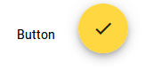
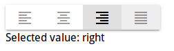

# 按钮

`<button>`和`<a>`可以作为按钮控件的载体。`<button>`用于响应一个事件，`<a>`用于路由导航。

使用时，在html标签上添加`md-button`指令即可。

按钮类
```javascript
import {MdButtonModule} from '@angular/material';
```

例子
```html
<button md-button>Button</button>
<a md-fab><md-icon>check</md-icon></a>
```

效果



注意：点击的水波纹效果

# 切换式按钮 切换式按钮组

切换式按钮有选中和未选中两个状态，点击可以切换。

切换式按钮组是一组按钮，像单选框一样，只能选择一个，选择不同的按钮时会自动切换。

切换式按钮类（包括切换式按钮组）
```javascript
import {MdButtonToggleModule} from '@angular/material';
```

使用按钮组
```javascript
<md-button-toggle-group #group="mdButtonToggleGroup">
  <md-button-toggle value="left">
    <md-icon>format_align_left</md-icon>
  </md-button-toggle>
  <md-button-toggle value="center">
    <md-icon>format_align_center</md-icon>
  </md-button-toggle>
  <md-button-toggle value="right">
    <md-icon>format_align_right</md-icon>
  </md-button-toggle>
  <md-button-toggle value="justify" disabled>
    <md-icon>format_align_justify</md-icon>
  </md-button-toggle>
</md-button-toggle-group>
<div class="example-selected-value">Selected value: {{group.value}}</div>
```

效果



注意：最后一个按钮disable掉了。

# 图标

`<md-icon>`在按钮例子中已经使用过了。

# 环形进度指示条

就是一个转动的加载条。可以让它一直转，或者使其指示加载进度。

引入指示条
```javascript
import {MdProgressSpinnerModule} from '@angular/material';
```

## 一直转动的指示条

```html
<md-spinner></md-spinner>
```
由于是动态效果，不好截图，这里就不截图了。

## 设置指定值的指示条

```html
<md-progress-spinner [mode]="determinate" [value]="30"></md-progress-spinner>
```


# 线形进度条

和环形进度条差不多意思，只不过是线形的。

引入线形进度条

```javascript
import {MdProgressBarModule} from '@angular/material';
```

自动滚动的进度条
```html
<md-progress-bar mode="indeterminate"></md-progress-bar>
```

指定值的进度条
```html
<md-progress-bar mode="determinate" [value]="50"></md-progress-bar>
```
