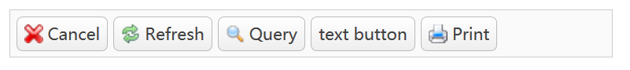

# EasyUI简介和环境搭建

JQuery EasyUI是一组JQuery的UI插件合集，从这个官网上抄下来的描述中，我们就大概知道如何使用EasyUI了。说实话EasyUI的界面比较复古，扩展也并不方便，但是这也是为了保持EasyUI使用的简便性。EasyUI是后台管理系统的首选UI框架之一。

EasyUI的缺点：

* 框架设计过于古老
* UI风格过于古老
* 难扩展
* 难兼容多种屏幕

## 下载EasyUI

EasyUI官方网站国内打开非常慢，但是我们可以在下面网站中查到中文教程等内容：

EasyUI中文网：[http://www.jeasyui.net](http://www.jeasyui.net)

## 引入EasyUI的库

我们需要引入的包含EasyUI的CSS、JS以及JQuery的JS文件。

```html
<link href="easyui-1.6.2/themes/default/easyui.css" type="text/css" rel="stylesheet" />
<link href="easyui-1.6.2/themes/icon.css" type="text/css" rel="stylesheet" />
<script src="jquery-3.3.1/jquery-3.3.1.min.js"></script>
<script src="easyui-1.6.2/jquery.easyui.min.js"></script>
```

其中，`themes`文件夹下包含了许多主题，这里我们使用比较经典的`default`主题，因此引入`easyui-1.6.2/themes/default/easyui.css`。

注意：

1. `easyui.css`是个总的CSS，这个文件比较大，同目录下其他比较小的CSS是用于按需加载的，开发过程中我们可以不考虑。
2. JQuery EasyUI是基于JQuery插件的，引入引入EasyUI的JS前需要先引入JQuery。

## 测试

这里我们写几个按钮（抄的网上的例子）。

```html
<!DOCTYPE html>
<html lang="zh">
<head>
    <meta charset="UTF-8">
    <title>EasyUI Demo</title>
    <link href="easyui-1.6.2/themes/default/easyui.css" type="text/css" rel="stylesheet"/>
    <link href="easyui-1.6.2/themes/icon.css" type="text/css" rel="stylesheet"/>
    <script src="jquery-3.3.1/jquery-3.3.1.min.js"></script>
    <script src="easyui-1.6.2/jquery.easyui.min.js"></script>
</head>
<body>
<div style="padding:5px;background:#fafafa;width:500px;border:1px solid #ccc">
    <a href="#" class="easyui-linkbutton" iconCls="icon-cancel">Cancel</a>
    <a href="#" class="easyui-linkbutton" iconCls="icon-reload">Refresh</a>
    <a href="#" class="easyui-linkbutton" iconCls="icon-search">Query</a>
    <a href="#" class="easyui-linkbutton">text button</a>
    <a href="#" class="easyui-linkbutton" iconCls="icon-print">Print</a>
</div>
</body>
</html>
```

运行结果：


