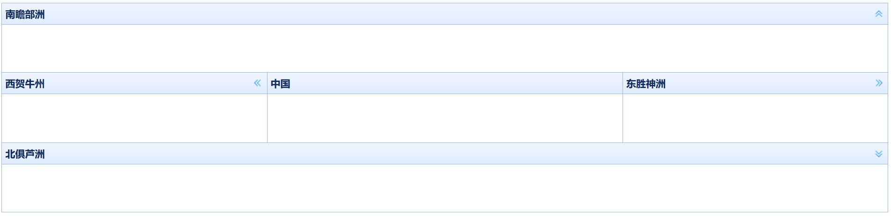

# BorderLayout 边框布局

边框布局（BorderLayout）是个比较常用的概念，实际上在Java的Swing里经常用边框布局。总之用边框布局套来套去，总能套出我们需要的页面结构来。

EasyUI比较古老，没有`栅格系统`这种概念，许多新的UI框架都是用栅格系统布局的，实际上用边框布局或栅格都能实现任何效果，相比之下，栅格系统更难理解但使用更加方便，边框布局理解简单但实际用起来较复杂。

边框布局把一个矩形分为五个区域，`东`、`西`、`南`、`北`、`中`，我们可以选用其中任意个区域。

```html
<div class="easyui-layout" style="width:100%;height:300px;">
    <div region="west" title="西贺牛州" style="width:30%;">
    </div>
    <div region="east" title="东胜神洲" style="width:30%;">
    </div>
    <div region="north" title="南瞻部洲" style="height: 100px;">
    </div>
    <div region="south" title="北俱芦洲" style="height: 100px;">
    </div>
    <div region="center" title="中国">
    </div>
</div>
```

* class="easyui-layout"：通过这个class指定使用边框布局
* region：通过`west`、`east`、`north`、`south`、`center`指定边框布局的区域
* title：边框布局的标题

效果：


