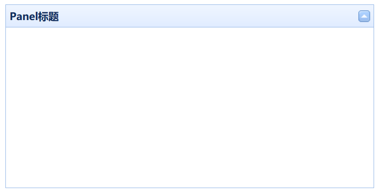

# Panel 面板

Panel在Bootstrap3里经常使用，原则上一个Panel代表一个功能区域，我们的页面经常是一个Panel套一个Panel。Bootstrap4已经用更先进的设计替代了Panel。EasyUI中，我们还是可以用Panel进行页面的布局。

```html
<div class="easyui-panel" title="Panel标题" collapsible="true" style="padding:5px;width:500px;height:250px;">
</div>
```

* class="easyui-panel"：通过这个class使用面板组件
* title：面板的标题
* collapsible：是否为可折叠面板，可折叠面板会在面板右上角显示一个三角按钮

运行效果：


