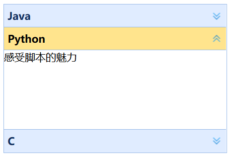

# Accordion 面板

Accordion是一组可折叠的面板组件，和单个可折叠的Panel不同，Accordion是成组出现的，每次只展开一个面板，其余面板保持折叠状态，当点击另一个面板时，另一个面板展开，其余自动折叠。

```html
<div class="easyui-accordion" style="width:300px;height:200px;">
    <div title="Java">
        面向对象思想必学
    </div>
    <div title="Python">
        感受脚本的魅力
    </div>
    <div title="C">
        计算机底层必会
    </div>
</div>
```

* class="easyui-accordion"：指定该div是一组Accordion组件

运行效果：


