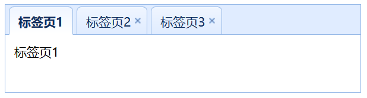

# Tab 标签页

## 静态指定标签页

标签页是个很常用的组件。

```html
<div class="easyui-tabs" style="width:400px;height:100px;">
    <div title="标签页1" style="padding:10px;">
        标签页1
    </div>
    <div title="标签页2" closable="true" style="padding:10px;">
        标签页2
    </div>
    <div title="标签页3" closable="true" style="padding:10px;">
        标签页3
    </div>
</div>
```

* class="easyui-tabs"：指定此div为标签页组
* title：标签页的标签名
* closable：此标签页是否为可关闭，可关闭的标签页会显示一个`x`按钮

运行效果：



## 动态添加标签页

标签页既然能关闭，当然也是能动态添加的。下面代码演示如何使用JavaScript代码动态添加标签页组件。

```html
<!--这是一组用于添加标签页的按钮-->
<div style="margin-bottom:10px">
    <a href="#" class="easyui-linkbutton" onclick="addTab('google','http://www.google.com')">google</a>
    <a href="#" class="easyui-linkbutton" onclick="addTab('jquery','http://jquery.com/')">jquery</a>
    <a href="#" class="easyui-linkbutton" onclick="addTab('easyui','http://jeasyui.com/')">easyui</a>
</div>
<!--标签页组-->
<div id="tt" class="easyui-tabs" style="width:400px;height:250px;">
    <div title="Home">
    </div>
</div>
<script>
    function addTab(title, url) {
        //判断是否存在指定title的标签页
        let tabsDiv = $('#tt');
        if (tabsDiv.tabs('exists', title)) {
            //存在则选中
            tabsDiv.tabs('select', title);
        } else {
            //不存在添加一个新标签页
            let content = '<iframe scrolling="auto" frameborder="0"  src="' + url + '" style="width:100%;height:100%;"></iframe>';
            tabsDiv.tabs('add', {
                title: title,//标签页标题
                content: content,//标签页内部HTML
                closable: true//是否可关闭
            });
        }
    }
</script>
```
