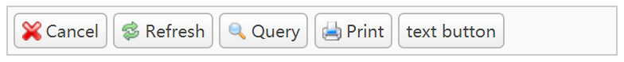

# 按钮

下面例子中，对`<a>`标注了`easyui-linkbutton`的`class`属性，链接就会以按钮的形式展示。

```html
<div style="padding:5px;background:#fafafa;width:500px;border:1px solid #ccc">
    <a href="#" class="easyui-linkbutton" iconCls="icon-cancel">Cancel</a>
    <a href="#" class="easyui-linkbutton" iconCls="icon-reload">Refresh</a>
    <a href="#" class="easyui-linkbutton" iconCls="icon-search">Query</a>
    <a href="#" class="easyui-linkbutton" iconCls="icon-print">Print</a>
    <a href="#" class="easyui-linkbutton">text button</a>
</div>
```



## 禁用按钮

```javascript
$('#btn').linkbutton('disable');
```
