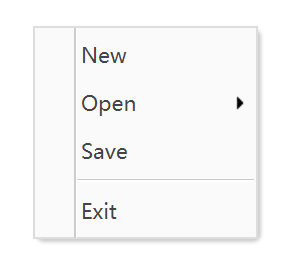
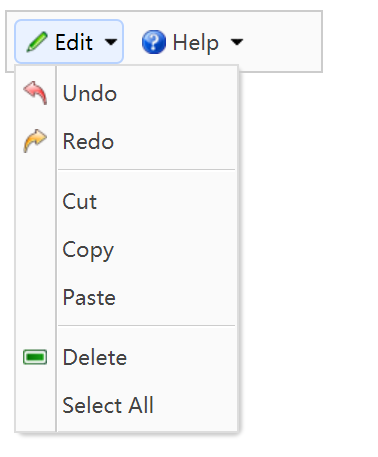

# 菜单

EasyUI中，菜单是若干`div`嵌套实现的，下面是一个简单的例子，页面加载时，在一个固定位置弹出一个菜单。

```html
<div id="mm" class="easyui-menu" style="width:120px;">
    <div onclick="javascript:alert('new')">New</div>
    <div>
        <span>Open</span>
        <div style="width:150px;">
            <div><b>Word</b></div>
            <div>Excel</div>
            <div>PowerPoint</div>
        </div>
    </div>
    <div icon="icon-save">Save</div>
    <div class="menu-sep"></div>
    <div>Exit</div>
</div>
<script>
    $().ready(function () {
        $('#mm').menu('show', {
            left: 200,
            top: 100
        });
    });
</script>
```



## 按钮或菜单栏弹出菜单

一般菜单都会配合菜单栏使用。

### 创建菜单栏按钮

```html
<div style="background:#fafafa;padding:5px;width:200px;border:1px solid #ccc">
    <a href="#" class="easyui-menubutton" menu="#mm1" iconCls="icon-edit">Edit</a>
    <a href="#" class="easyui-menubutton" menu="#mm2" iconCls="icon-help">Help</a>
</div>
```

### 点击菜单栏按钮弹出菜单的例子

```html
<div id="mm1" style="width:150px;">
    <div iconCls="icon-undo">Undo</div>
    <div iconCls="icon-redo">Redo</div>
    <div class="menu-sep"></div>
    <div>Cut</div>
    <div>Copy</div>
    <div>Paste</div>
    <div class="menu-sep"></div>
    <div iconCls="icon-remove">Delete</div>
    <div>Select All</div>
</div>
<div id="mm2" style="width:100px;">
    <div>Help</div>
    <div>Update</div>
    <div>About</div>
</div>
```

注意：菜单的`id`需要和菜单栏的`menu`属性相对应，这样点击菜单栏上相应的按钮时，菜单就能正确弹出了，菜单的位置也是自动计算的。


