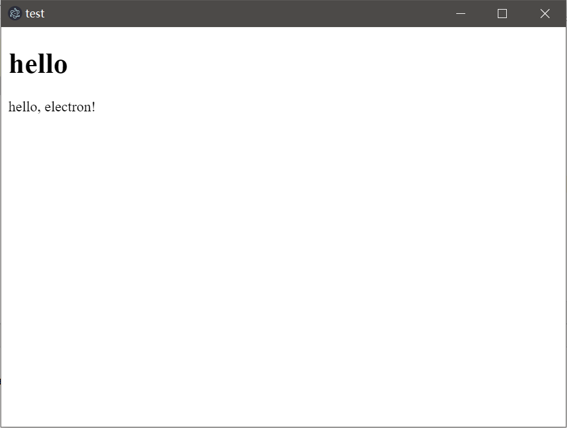
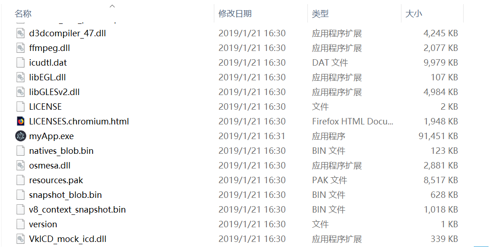

# Electron环境搭建和简单使用

Electron是JavaScript生态中，一个用于制作跨平台的「桌面应用」的框架，用Electron制作的应用程序会基于Chromium运行，开发人员可以用编写Web应用的技术栈直接编写桌面客户端软件，非常方便。

借助JavaScript强大的生态，Electron现在已经得到了广泛的使用，我现在写这篇笔记的Atom编辑器就是Electron开发的。

## Electron的缺点

Electron最明显的缺点就是资源占用极大，一个Hello World程序打包后有145MB，运行占用83MB内存，CPU开销也非常大，如果我们的电脑上全是这种Electron程序，估计以后电脑配置就得i7+16GB起步了。

另一个缺点是作为一个「桌面应用」表现形式太单调，说白了就是起了个浏览器的感觉，多窗口就是多进程，和开好几个浏览器差不多意思，用起来很不灵活。

基于这两点，Electron适用场景也比较明显：开发业务系统等专业软件，或是从Web应用移植过来的软件。

## 环境搭建

和Node工程差不多，Electron工程也是从`npm init`开始的（但是这里我们使用yarn替代npm），输入必要的信息后生成`package.json`。

```
yarn init
```

安装Electron依赖：
```
yarn add --dev electron
```

编辑`package.json`：

```json
{
  "name": "electron-demo01",
  "version": "1.0.0",
  "main": "main.js",
  "author": "CiyaZ",
  "license": "MIT",
  "scripts": {
    "start": "electron ."
  },
  "devDependencies": {
    "electron": "^4.0.1"
  }
}
```

通过`package.json`我们知道这个程序入口是`main.js`，下面我们就创建一个`main.js`。

## Hello World

main.js
```javascript
const { app, BrowserWindow, Menu } = require('electron');

// 该对象代表窗口，必须是全局的
let electronWindow;
function createMainWindow () {
    // 创建窗口
    electronWindow = new BrowserWindow({ width: 640, height: 480 });

    // 加载HTML文件
    electronWindow.loadFile('main.html');

    // 隐藏默认的菜单
    Menu.setApplicationMenu(null);

    // 启动后打开chrome调试工具（也可在菜单中打开）
    // electronWindow.webContents.openDevTools();

    // 关闭窗口时将electronWindow对象置为null
    electronWindow.on('closed', () => {
        electronWindow = null;
    });
}

// 应用加载后创建主窗口
app.on('ready', createMainWindow);

// 当全部窗口关闭时退出
app.on('window-all-closed', () => {
    if (process.platform !== 'darwin') {
        app.quit();
    }
});

app.on('activate', () => {
    if (electronWindow === null) {
        createMainWindow();
    }
});
```

main.html
```html
<!DOCTYPE html>
<html lang="en">
<head>
    <meta charset="UTF-8">
    <title>test</title>
</head>
<body>
<h1>hello</h1>
<p>hello, electron!</p>
</body>
</html>
```

运行
```
yarn run start
```



## 软件分发

我们编写好Electron软件后，不可能要求用户自行安装Electron运行时环境，因此需要一个分发工具，把编写好的代码和Electron、Chromium内核组装到一起。

针对Electron，有许多开源的分发工具可用，这里我们使用`electron-packager`。

全局安装：
```
yarn global add electron-packager
```

package.json的`scripts`中添加一条指令：
```json
"build": "electron-packager . myApp --win --out ./build --arch=x64 --overwrite"
```

注：` --overwrite`表示重新构建的时候会覆盖原来生成的文件

执行
```
yarn run build
```

执行后，会在项目目录生成一个`build`文件夹，里面的东西复制给用户就可以了。


