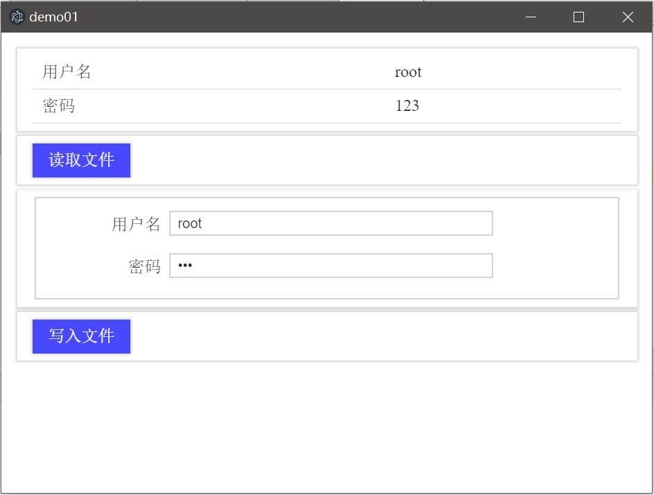

# 实现文件IO

桌面程序的一个最基本需求就是读写文件，下面我们基于Electron，写一个读写JSON文件的程序。

## 文件IO例子

Electron中实现读写文件，可以使用NodeJS的异步读写文件函数。

`main.js`和环境搭建章节的一样，这里就不多说了，主要看渲染进程中，有关界面和渲染逻辑的代码。

main.html
```html
<!DOCTYPE html>
<html lang="zh">
<head>
    <meta charset="UTF-8">
    <title>demo01</title>
    <link href="./silicon-ui.css" type="text/css" rel="stylesheet" />
    <script src="./app.js"></script>
</head>
<body>
<div class="container">
    <div class="si-panel si-bg-white">
        <table class="si-table">
            <tr>
                <td>用户名</td>
                <td id="username-show"></td>
            </tr>
            <tr>
                <td>密码</td>
                <td id="password-show"></td>
            </tr>
        </table>
    </div>
    <div class="si-panel si-bg-white" style="margin-top: 5px">
        <button class="si-btn si-bg-blue si-fg-white" id="read-btn">读取文件</button>
    </div>
    <div class="si-panel si-bg-white" style="margin-top: 5px">
        <form class="si-form">
            <fieldset>
                <div class="si-form-input">
                    <label for="username-input">用户名</label>
                    <input type="text" id="username-input" required />
                </div>
                <div class="si-form-input">
                    <label for="password-input">密码</label>
                    <input type="password" id="password-input" required />
                </div>
            </fieldset>
        </form>
    </div>
    <div class="si-panel si-bg-white" style="margin-top: 5px">
        <button class="si-btn si-bg-blue si-fg-white" id="write-btn">写入文件</button>
    </div>
</div>
</body>
</html>
```

页面中，我们引入了一个`app.js`，这个页面渲染进程的逻辑就在这个文件中。

app.js
```javascript
const fs = require('fs');

// 拼接test.json路径
const path = require('path');
const filePath = path.join(__dirname, 'test.json');

window.onload = function() {

    // 页面加载后读取文件
    readFromFile();

    // 绑定按钮事件
    let readBtn = document.getElementById('read-btn');
    let writeBtn = document.getElementById('write-btn');
    readBtn.addEventListener('click', function () {
        readFromFile();
    }, false);
    writeBtn.addEventListener('click', function () {
        writeToFile();
    }, false);
};

function readFromFile() {
    fs.readFile(filePath, "utf8", function(err, data) {
        let userInfo = JSON.parse(data);
        document.getElementById('username-show').innerText = userInfo.username;
        document.getElementById('password-show').innerText = userInfo.password;
    });
}

function writeToFile() {
    let username = document.getElementById('username-input').value;
    let password = document.getElementById('password-input').value;

    let data = {};
    data.username = username;
    data.password = password;

    fs.writeFile(filePath, JSON.stringify(data), 'utf8', function (err) {
        console.log(err.stack);
    });
}
```

上面代码注释比较详细，这里就不多说了。要注意的是拼接要读写文件的路径，因为打包前后，程序的起始运行位置是不同的，如果不用`path.join(__dirname, 'test.json')`这种形式，打包后可能会出现找不到文件的状况。

## 运行


