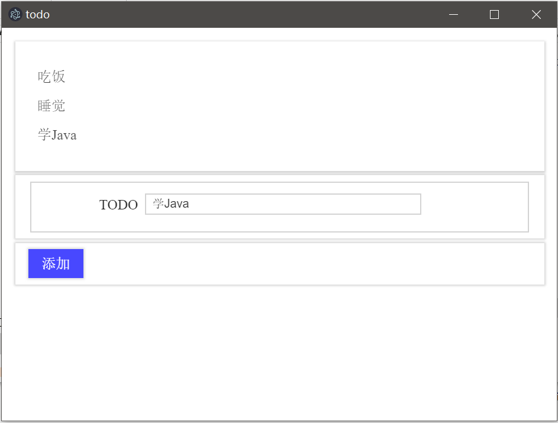

# 使用数据库

由于Electron程序实际上还是运行在Chromium中的，因此我们可以使用IndexedDB保存数据。

下面代码基于IndexedDB实现一个TodoList。

## 例子代码

todo.html
```html
<!DOCTYPE html>
<html lang="zh">
<head>
    <meta charset="UTF-8">
    <title>todo</title>
    <link href="./silicon-ui.css" type="text/css" rel="stylesheet" />
    <script src="./todo.js"></script>
</head>
<body>
<div class="container">
    <div class="si-panel si-bg-white">
        <ul class="si-list" id="todo-list">
        </ul>
    </div>
    <div class="si-panel si-bg-white" style="margin-top: 5px">
        <form class="si-form">
            <fieldset>
                <div class="si-form-input">
                    <label for="todo">TODO</label>
                    <input type="text" id="todo" name="todo"/>
                </div>
            </fieldset>
        </form>
    </div>
    <div class="si-panel si-bg-white" style="margin-top: 5px">
        <button class="si-btn si-bg-blue si-fg-white" id="btn">添加</button>
    </div>
</div>
</body>
</html>
```

todo.js
```javascript
window.onload = function () {

    // 数据库不存在时则新建
    let idbRequest = indexedDB.open('db_todo', 1);
    let db;
    idbRequest.onerror = function (e) {
        console.log('error');
    };
    idbRequest.onupgradeneeded = function (e) {
        db = e.target.result;
        db.createObjectStore('todoList', {autoIncrement: true});
    };

    // 加载数据
    reloadList();

    // 绑定按钮事件
    document.getElementById('btn').addEventListener('click', function () {
        let todoStr = document.getElementById('todo').value;
        add(todoStr);
        reloadList();
    }, false);
};

/**
 * 添加一条todo数据
 *
 * @param todoStr 要添加的字符串
 */
function add(todoStr) {

    let idbRequest = indexedDB.open('db_todo', 1);
    let db;
    idbRequest.onsuccess = function (e) {
        db = e.target.result;

        db.transaction(['todoList'], 'readwrite')
            .objectStore('todoList')
            .add({todo: todoStr});
    };
}

/**
 * 刷新页面上显示的数据
 */
function reloadList() {

    let idbRequest = indexedDB.open('db_todo', 1);
    let db;
    idbRequest.onsuccess = function (e) {
        db = e.target.result;

        let dbRequest = db.transaction(['todoList'], 'readwrite')
            .objectStore('todoList')
            .openCursor();

        // 清空原先数据
        let todoListDom = document.getElementById('todo-list');
        todoListDom.innerHTML = '';

        dbRequest.onsuccess = function (e) {
            // 游标
            let cursor = e.target.result;
            if (cursor) {

                // 将数据添加到DOM节点上
                let li = document.createElement('li');
                li.innerText = cursor.value.todo;
                todoListDom.appendChild(li);

                cursor.continue();
            }
        }
    };
}
```

上面代码中使用了IndexedDB，有关这个浏览器内置数据库的内容，可以在`HTML`相关章节找到，这里就不多做解释了。

## 运行



## IndexedDB的存储位置

虽然IndexedDB是个浏览器内置的功能，但是它不是某种「缓存」，实际上它的数据也是安全存储在磁盘中的，而且基于Electron开发的程序，我们不用担心用户乱操作把IndexedDB的数据给清除的情况。

这里我们的工程名叫`electron-demo01`，在Windows下，我们可以在`~/AppData/Roaming`找到一个`electron-demo01`文件夹，其中就包含IndexedDB的数据。
