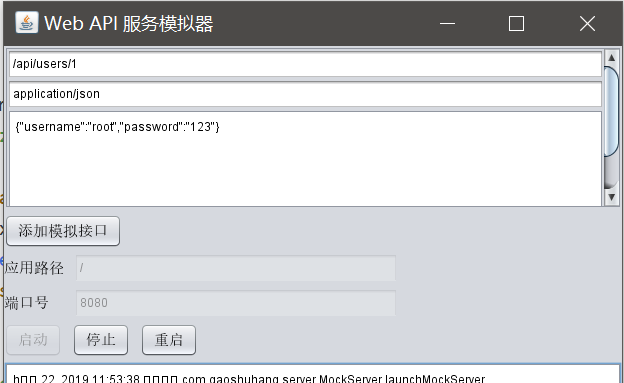
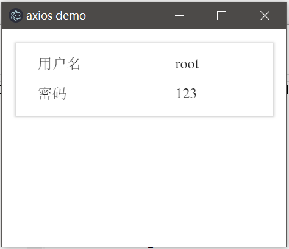

# 发起网络请求

在Electron中，发起HTTP请求或是直接使用Socket，都和Node中一样，下面演示使用`axios`库通过HTTP协议请求数据。经过测试，HTTP请求似乎也不涉及跨域问题。

## HTTP请求例子

安装依赖库：
```
yarn add axios
```

注意：`axios`是项目依赖，而不是开发环境依赖，因此不要用`--dev`。在一般前端工程里，混用这两个选项倒也没什么问题，但`electron-packager`打包不会将开发依赖复制到输出目录，这可能导致找不到库的情况。

取消跨域限制：
```javascript
electronWindow = new BrowserWindow({
    webPreferences: {webSecurity: false}
});
```

这里我们模拟个接口，服务起在本机`8080`端口，请求`/api/users/1`，返回一个包含用户信息的JSON。



main.html
```html
<!DOCTYPE html>
<html lang="zh">
<head>
    <meta charset="UTF-8">
    <title>axios demo</title>
    <link href="./silicon-ui.css" type="text/css" rel="stylesheet" />
    <script src="./app.js"></script>
</head>
<body>
<div class="container">
    <div class="si-panel si-bg-white">
        <table class="si-table">
            <tr>
                <td>用户名</td>
                <td id="username"></td>
            </tr>
            <tr>
                <td>密码</td>
                <td id="password"></td>
            </tr>
        </table>
    </div>
</div>
</body>
</html>
```

app.js
```javascript
const axios = require('axios');

window.onload = function () {
    axios.get('http://127.0.0.1:8080/api/users/1').then((resp) => {
        let user = resp.data;

        document.getElementById('username').innerText = user.username;
        document.getElementById('password').innerText = user.password;
    });
};
```

上面代码比较简单，就是使用Axios请求数据的操作。


