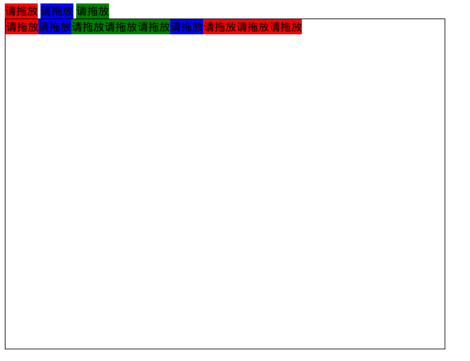

# 拖放API

HTML5中提供了直接的拖放API，而不用复杂的处理鼠标点击事件实现拖放，这大大简化了拖放相关操作的代码。

但是要注意，拖放API兼容性很差，浏览器实现有各种各样的不同bug，因此仅适用于简单的业务逻辑，不可用于过于复杂的交互效果。复杂交互最好使用Canvas，按照类似游戏引擎的形式自行实现。

## 实现拖放步骤

* 将想要拖放的元素属性加上draggable="true"，img和a默认允许拖放
* 对document的dragover和drop事件，阻止其默认处理行为
* 被拖放元素添加dragstart处理函数，将数据存入dataTransfer内
* 阻止目标元素dragend的默认处理行为
* 在目标元素drop处理函数中，编写拖放放置的代码，并阻止其默认处理行为，阻止事件冒泡

## 拖放事件

* dragstart 被拖放的元素开始拖动
* drag 拖放过程中
* dragenter 由拖放过程中鼠标经过的元素触发，表示拖放中的元素进入该元素范围内
* dragover 由拖放过程中鼠标经过的元素触发，表示拖放中的元素正在该元素内
* dragleave 由拖放过程中鼠标经过的元素触发，表示拖放中的元素离开该元素
* drop 由拖放目标元素触发，有其他元素被拖放到这个元素中
* dragend 拖放过程结束

## DataTransfer对象属性和方法

* dataTransfer用于在拖放对象和目标对象之间传递数据。其存放在event中。
* dropEffect 拖放操作的视觉效果，取值在effectAllowed指定的允许范围内，允许指定的值为none、copy、link、move
* effectAllowed 指定拖放时允许的视觉效果，取值none、copy、copyLink、copyMove、link、linkMove、move、all、uninitialize
* types 存入数据的种类，字符串数组
* clearData(type) 清除存入的数据，参数是MIME类型，可选"text/plain"，"text/html"，"text/xml"，"text/url-list"（url列表，每个url为一行）
* setData(type, data) 存入数据
* getData(type) 读取数据
* setDragImage(image, x, y) 用img元素设置图标，img是Element类型，x，y是坐标相对于鼠标指针的偏移量

拖放示例代码
```html
<!DOCTYPE html>
<html lang="zh-CN">
<head>
	<meta charset="UTF-8">
	<title>Demo</title>
</head>
<body>
	<span id="drag_me_1" style="width: 50px; height: 20px; background-color: red;" draggable="true">请拖放</span>
	<span id="drag_me_2" style="width: 50px; height: 20px; background-color: blue;" draggable="true">请拖放</span>
	<span id="drag_me_3" style="width: 50px; height: 20px; background-color: green;" draggable="true">请拖放</span>
	<div id="target" style="width: 640px; height: 480px; border: solid black 1px;"></div>
	<script>
		var drag_me_1 = document.querySelector("#drag_me_1");
		var drag_me_2 = document.querySelector("#drag_me_2");
		var drag_me_3 = document.querySelector("#drag_me_3");
		var target = document.querySelector("#target");

		document.addEventListener("dragover", function(event)
		{
			event.preventDefault();
		});
		document.addEventListener("drop", function(event)
		{
			event.preventDefault();
		});

		drag_me_1.addEventListener("dragstart", function(event)
		{
			var dt = event.dataTransfer;
			dt.effectAllowed = "all";
			dt.setData("text/plain", "1");
		});
		drag_me_2.addEventListener("dragstart", function(event)
		{
			var dt = event.dataTransfer;
			dt.effectAllowed = "all";
			dt.setData("text/plain", "2");
		});
		drag_me_3.addEventListener("dragstart", function(event)
		{
			var dt = event.dataTransfer;
			dt.effectAllowed = "all";
			dt.setData("text/plain", "3");
		});

		target.addEventListener("dragend", function(event)
		{
			event.preventDefault();
		});

		target.addEventListener("drop", function(event)
		{
			var dt = event.dataTransfer;
			var text = dt.getData("text/plain");
			var drag_me_copy;
			if(text == "1")
			{
				drag_me_copy = drag_me_1.cloneNode(true);
				target.appendChild(drag_me_copy);
			}
			if(text == "2")
			{
				drag_me_copy = drag_me_2.cloneNode(true);
				target.appendChild(drag_me_copy);
			}
			if(text == "3")
			{
				drag_me_copy = drag_me_3.cloneNode(true);
				target.appendChild(drag_me_copy);
			}

			event.preventDefault();
			event.stopPropagation();
		});
	</script>
</body>
</html>
```

该程序可以拖动三个span进入下方div，拖动时，span的序号存入dataTransfer，拖动完成后读取序号，决定将哪个span显示在下方div中。



## 自定义拖放图标

在被拖放元素dragstart回调时，调用setDragImage()，可以向dataTransfer传入自定义拖放图标，参数是Element类型，实际上拖放图标的img元素不需要在html中定义，直接使用document.createElement()创建元素即可。

为上述代码添加拖放图标例子：
```javascript
drag_me_1.addEventListener("dragstart", function(event)
{
	var icon = document.createElement("img");
	icon.src = "icon.jpg";

	var dt = event.dataTransfer;
	dt.effectAllowed = "all";
	dt.setDragImage(icon, 0, 0);
	dt.setData("text/plain", "1");
});
```
